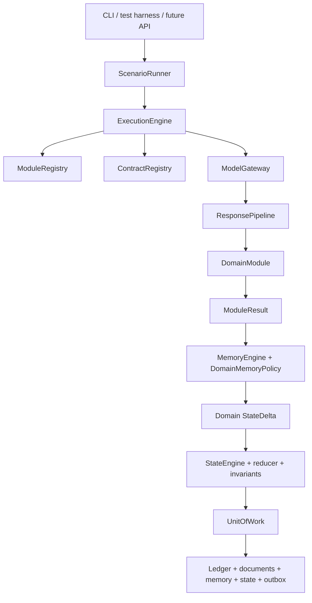

# ACME Project Brief

Status: Approved direction
Last updated: 2026-08-15

## Identity

- Name: ACME
- Expansion: Adaptive Context Memory Engine
- Repository: `acme-engine`
- Phase: Milestones 1 and 2 delivered; experimental live path proven
  (see `docs/CURRENT_STATUS.md`)

## Problem

AI systems commonly combine prompting, provider calls, domain interpretation,
memory, state mutation and persistence in one service layer. This makes domain
logic difficult to replace, model outputs difficult to audit and executions
difficult to replay safely.

ACME will test whether these responsibilities can be separated into a
domain-neutral execution core and interchangeable domain modules.

## Approved Direction

```text
PromptContract controls communication with the model.
DomainModule interprets validated model output.
MemoryEngine manages generic memory mechanics through a domain policy.
StateEngine applies explicit deltas through a domain reducer and invariants.
ExecutionEngine coordinates one task.
Persistence and Ledger make execution durable, traceable and replayable.
```

Narrative is a reference module. It is not the engine.

## Goals

- Execute typed AI tasks through versioned contracts.
- Keep provider details behind a model gateway.
- Treat model outputs as untrusted candidates.
- Separate memory lifecycle mechanics from domain meaning.
- Change state only through explicit, versioned transitions.
- Make executions idempotent, inspectable and replayable.
- Prove the core with at least two meaningfully different domains.
- Support deterministic offline development with mocks and fixtures.

## Non-goals

- Rebuild an existing product backend.
- Import AudioLeaf, Studio, Marketplace, Inngest or Supabase runtime concerns.
- Build a general workflow language in the first version.
- Build dynamic plugin discovery before static composition is insufficient.
- Migrate every existing narrative prompt or book type.
- Call live providers before deterministic scenario tests exist.

## Initial Reference Domains

### NarrativeModule

- Documents: outline and chapter
- Memory: character facts, relationships and world rules
- State: entity/display-name registry, canonical aliases, current scene,
  fixed short-range narrative window and outline progress

### ResearchModule

- Documents: research brief
- Memory: claims, sources, evidence and contradictions
- State: verified claims, contested claims and open questions

These modules must use the same core without domain branches such as:

```ts
if (domain === "narrative") {
  // ...
}
```

## Initial Logical Architecture



## Required Design Corrections

### Task-typed modules

A module has multiple task input/output pairs. The module-level interface must
therefore expose a typed task map rather than one global input/output generic.

### Domain-separated state

Core must use a generic state envelope. Narrative, Research and future domains
own their schemas inside their packages.

### Policy-injected memory

Core may implement storage, retrieval, timestamps, provenance and lifecycle
execution. Domains own identity, equivalence, contradiction, merge, decay,
reinforcement, relevance and promotion rules.

### Evaluator roles

Safety is generally an evaluator or gate rather than a primary document/state
domain. Module composition must support producer, analyzer, evaluator and
transformer roles without conflating ownership.

## Durability Requirement

The first durable adapter should use SQLite and preserve:

- executions
- model calls
- documents
- memory candidates and records
- state snapshots and transitions
- committed domain events
- outbox entries

A crash after a successful model call but before state commit must be
recoverable without calling the provider again.

## First Proof Milestone

Build a replayable ExecutionEngine with:

- model mock
- in-memory stores
- SQLite stores
- `narrative.observe-document`
- `research.observe-evidence`

This milestone must test contracts, output interpretation, memory, state,
ledger, idempotency and replay without importing an existing product runtime.

## Success Test

The first platform version is successful when:

- core contains no Narrative-, Research- or Kids-specific vocabulary
- two different domains use the same execution, memory and state mechanisms
- invalid output cannot change memory or state
- every committed change is traceable to an execution and contract version
- stale state revisions fail safely
- crash recovery avoids duplicate model calls and duplicate state operations
- all core behavior can be tested without network access

## First Product POC

The first real product POC is the **Evidence Integrity Workbench**, accepted by
[ADR-0028](adr/0028-first-poc-evidence-integrity-workbench.md) and defined in
[`docs/design/evidence-integrity-workbench-product-definition.md`](design/evidence-integrity-workbench-product-definition.md).
Its implementation-ready plan is
[`docs/design/evidence-integrity-workbench-technical-specification.md`](design/evidence-integrity-workbench-technical-specification.md),
with Evidence identity/placement fixed by ADR-0030 and the reviewer/view
boundary fixed by ADR-0031.

Its delivered test profile operates over a fixed synthetic evidence corpus.
ADR-0040 accepts a bounded POC #1 live profile over authorized, anonymized real
judicial UTF-8 source text. Both help a non-adjudicative reviewer establish
what each source contains, where an observation occurs, how
accounts and artifacts relate, what the timeline permits, what remains
uncertain and which questions remain unanswered. Every material assessment
must traverse back to accepted source-bound evidence and an exact locator.

The POC keeps source observations, expressed propositions, evidence relations,
versioned assessments and legal conclusions at separate authority levels. It
must not determine credibility, guilt, liability, legal sufficiency,
admissibility or privilege; give tailored legal advice; automate a high-impact
decision; or process confidential, privileged or criminal-offence personal
data under the Stage A authority. Human review is mandatory before an
assessment becomes shareable, and human acceptance does not make an assessment
legally true.

The product remains outside `packages/core`. Evidence meaning belongs to a new
domain module; product workflow belongs to an application; provider,
persistence and object-storage concerns stay behind adapters. Research
Synthesis is the intended POC #2 but is not activated.

## Next Deliverable

The First Proof Milestone is complete in both halves. The bounded single-task
ExecutionEngine, durable SQLite persistence, NarrativeModule and
ResearchModule are implemented; both reference domains reach committed
canonical state and replay offline through the same core with no domain branch
in it; and the live half landed as a provider adapter behind a transport port,
a ScenarioRunner over `acme-scenario/1` and `acme-scenario/2`, a domain-neutral
post-execution quality-evaluation layer and a CLI composition root.

The durability requirement above is also met. A crash after a successful model
call is recoverable without calling the provider again, an interrupted
transaction is proven to leave no partial state, and committed events can
leave the outbox.

ACME-0077 through ACME-0087, with corrective child ACME-0089, delivered
Evidence Integrity slices 0–8: the fixed synthetic corpus, observation,
relation, timeline and assessment tasks, the complete primary reviewer journey,
optional technical audit, PostgreSQL persistence and a hosted multi-process
shell. ACME-0089 re-sealed pre-late E-A01 without forward question references;
post-import E-A02 retains all three sealed questions. ADR-0035 decides the
authenticated-principal and organization-authorization architecture:
self-hosted Supabase Auth behind a product-API BFF, opaque server-side sessions
and deny-by-default product roles. ACME-0091 implements this boundary across
the hosted composition, browser and durable identity/session store. The
default callable product remains synthetic-only. ADR-0040 authorizes a
distinct Stage A live profile, ACME-0105 implements its closed composition
capability and ACME-0106 implements the versioned case/import contract plus
authenticated browser path for operator-prepared anonymized judicial text.
The live evidence job is not implemented. The approved
later sequencing plan is
[`evidence-integrity-workbench-product-completion-plan.md`](design/evidence-integrity-workbench-product-completion-plan.md).
ADR-0036 and ACME-0093 add explicit cases, participants, case-first product
navigation, durable object ownership and same-organization cross-case
non-disclosure. ADR-0037 and ACME-0095 add the secure artifact foundation for
the fixed synthetic corpus. ACME-0098 adds Stage 6 reviewer operations and
bounded case search, and ACME-0099 adds Stage 7: a case overview and the
deterministic Case Integrity Report, both pure projections of one authorized
case snapshot in which every reported row names its exact source-bound
observations. ACME-0100 adds Stage 8: deterministic JSON/Markdown/DOCX/PDF
assessment output from one citation-complete document, a per-case export policy,
append-only export audit and product backup/restore verification. Stages 1–8 are
delivered. ADR-0040 accepts the first Slice 9 class:
`stage-a-anonymized-judicial-text/1`. ACME-0105 now enforces the fail-closed
versioned live-profile tuple: durable PostgreSQL, live provider,
authorized-external source origin and authorized-live execution. Stage A case
creation/import now requires that capability and stores exact external PDF
provenance without ingesting the PDF. No product route invokes the provider
yet. Stage B FUP material and every broader data path remain unauthorized.

ADR-0038 decides the bounded Stage 5 workflow without widening that authority,
and ACME-0097 implements it end to end.
Only strict, size-limited synthetic UTF-8 plain text is eligible; accepted
imports preserve exact original bytes and create a separate LF/NFC canonical
representation. Redaction creates a new immutable version from exact UTF-8
byte ranges and an append-only content-free log. PDF/DOCX/OCR/media and all
non-synthetic data remain prohibited on this synthetic import contract. Stage
A requires its separate ADR-0040 contract and live profile.

ADR-0037 now decides the next secure artifact foundation: immutable
original/canonical representations, application envelope encryption, a
server-only S3-compatible hosted object store, key rotation, reconciliation,
deletion tombstones, security audit and coordinated restore. ACME-0095
implements those boundaries end to end for existing synthetic canonical text,
including filesystem/S3 conformance and file/PostgreSQL metadata. It remains
synthetic-only and exposes no arbitrary byte-input path.
