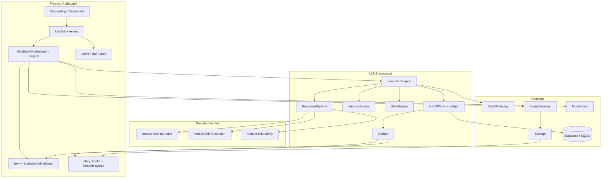

# AudioLeaf Kids × ACME — architecture draft

date: 2026-08-02  
updated at: 2026-08-02  
owner: design sketch (session)  
status: **concept only** — not decided architecture, not roadmap, not scope

## 1. Purpose

Describe a concrete structure for running a **complete AudioLeaf Kids book
creation path** on ACME: which packages exist, what ACME core owns, what kids
domain modules own, what stays product, and how the verified end-to-end flow
maps onto those boundaries.

This is a **target sketch**, not a migration plan that rewrites production in
one step.

## 2. ACME in one page

ACME (Adaptive Context Memory Engine) separates concerns that product code
usually blends:

```text
PromptContract controls communication with the model.
DomainModule interprets validated model output.
MemoryEngine manages generic memory mechanics through a domain policy.
StateEngine applies explicit deltas through a domain reducer and invariants.
ExecutionEngine coordinates one task.
Persistence and Ledger make execution durable, traceable and replayable.
```

Fixed guardrails relevant to Kids:

| Guardrail | Implication for Kids |
| --- | --- |
| Core is domain-neutral | No “chapter”, “vibe”, “Labbfigur”, “godnattsaga” in `@acme/core` |
| Model output is untrusted | Outline/chapter/safety/continuity/briefs are candidates until validated + applied |
| ExecutionEngine = one task | Multi-chapter book flow is product orchestration (or ScenarioRunner offline) |
| ScenarioRunner is linear data | No branching, parent-review wait, or image fallback policy inside ScenarioRunner |
| Safety is evaluator/gate | Not the primary state owner |
| Adapters never decide domain | Kie/OpenAI/Inngest do not decide “block vs revise” |
| Static composition | Modules registered at composition root; no dynamic plugin discovery required |

## 3. Product flow to preserve (SSOT of behavior)

From AudioLeaf Kids E2E (2026-07-23), the locked path:

```text
onboarding draft
  → POST /api/kids/init
  → story_vault.current_state
  → kids_text_jobs2 + illustration_jobs2
  → Inngest text / analysis / image pipeline
  → materializer
  → story_books + story_book_chapters
  → ReaderPayload
  → dashboard / library / reader / player / share / export
```

Three distinct “done” notions (must remain separated):

1. **Project exists** — vault/entity + first book projection created  
2. **Preview ready** — chapter 1 text + chapter 1 primary image + cover  
3. **Book complete** — all expected chapters and primary images materialised  

Layer ownership today:

| Store | Owns |
| --- | --- |
| `story_vault.current_state` | Narrative canon, outline, characters, knowledge, snapshot, continuity |
| `story_vault.config` | Frozen creation config (not job runtime) |
| `kids_text_jobs2` | Text job status, claims, attempts, step metadata |
| `illustration_jobs2` | Image job status, provider payload, prompts, refs, storage URL |
| `story_audit_runs` | Narrative / continuity / safety evaluations |
| `story_books` / `story_book_chapters` | Read model for library and reader |
| `characters` / anchors | Reusable visual identity outside a single story |

Jobs are never the book read model. That rule survives ACME.

## 4. Target layering

```text
apps / composition root / workers
  → product adapters (Supabase, Inngest, image providers, voice, moderation)
  → domain modules + pure kids-policies
  → @acme/core
```

Forbidden reverse edges (same as ACME):

```text
core → kids vocabulary
module → concrete adapter / provider SDK / DB driver
adapter → domain policy decisions
anything product → packages/core internals (public API only)
```

### 4.1 Package map (proposed)

```text
# Existing ACME (unchanged role)
packages/core
packages/adapter-memory
packages/adapter-sqlite
packages/adapter-model-mock
packages/adapter-model-openai
packages/module-narrative          # generic reference domain — keep separate
packages/module-research
packages/testing
apps/cli
apps/test-ui

# Proposed kids / product packages (names illustrative)
packages/kids-policies             # pure: framework, architecture, profiles, safety policy
packages/module-kids-narrative     # outline, chapter, continuity, kids state/memory
packages/module-kids-illustration  # brief/cover extraction (+ optional visual state)
packages/module-kids-safety        # safety audit task + pure gate helpers
packages/kids-ports                # product port types: ImageGateway, Storage, Moderation, Voice
packages/adapter-image-*           # Kie, OpenAI Images, fallbacks
packages/adapter-moderation-openai
packages/adapter-storage-supabase
packages/adapter-repo-supabase     # optional later; hybrid first
packages/adapter-queue-inngest     # thin event emit / worker glue

apps/audioleaf-kids-api            # composition root for HTTP
apps/audioleaf-kids-worker         # Inngest handlers → orchestrator
apps/audioleaf-kids-web            # onboarding, reader UI
```

`module-narrative` is **not** extended into product kids. Kids has age bands,
frameworks, safety revision loops, illustration coupling and fact-book
profiles that would pollute the generic reference domain.

## 5. Role of ACME core

### Core owns

| Responsibility | Kids example |
| --- | --- |
| PromptContract + ResponsePipeline | Strict JSON for outline, chapter, continuity, safety, briefs |
| ModelGateway port | Creative / analysis / safety text models |
| ExecutionEngine | One run of `kids.generate-chapter@1` |
| MemoryEngine + domain policy hook | Facts, clues, comfort anchors as records |
| StateEngine | Revisioned `KidsNarrativeState` |
| ExecutionRepository / UnitOfWork | Idempotent commit, model-call retention, crash resume |
| Hashing / replay evidence | Offline fixtures, digests, Test UI series |
| Outbox | “chapter committed” → project / enqueue image |

### Core does not own

- Onboarding draft, Leafs, subscription, email verification  
- Inngest concurrency and job claim semantics  
- `story_books` / `ReaderPayload` shape  
- Image bytes, bucket paths, provider fallback chains  
- Parent-PIN review UX  
- Framework scoring copy and age-adaptation wording (domain policy packages)

**One-sentence role:** core runs each AI step as a replayable, validated,
state/memory transaction; it is not the book factory.

## 6. Domain modules

### 6.1 `@acme/module-kids-narrative` (primary state owner)

Maps conceptually to `story_vault.current_state` + chapter history, split into
ACME’s three tracks:

| ACME track | Content |
| --- | --- |
| **State** | Outline progress, scene snapshot, narrative window, frozen production profile refs, character registry / visual baseline |
| **Memory** | Knowledge facts, character facts, relationships, clues, comfort anchors, Chekhov tags — domain identity & lifecycle |
| **Documents** | Outline, chapter prose, continuity analysis artifacts (immutable) |

Tasks (see `02-package-api.md` for signatures):

- `bootstrap-story` — deterministic (no model), seeds state from normalised init  
- `generate-outline` — producer  
- `generate-chapter` — producer  
- `analyze-continuity` — analyzer  

Apply path is **not** a separate model task: MemoryEngine + `projectState` +
StateEngine after interpretation.

### 6.2 `@acme/module-kids-illustration`

Splits LLM extraction from pixel generation:

| Concern | Home |
| --- | --- |
| Chapter → illustration briefs | Module task `extract-illustration-briefs` |
| Cover brief extraction | Module task `extract-cover-brief` |
| Anchor reuse vs generate | Pure policy + product orchestrator |
| Provider image call | `ImageGateway` adapter |
| Bucket upload | `StorageGateway` adapter |
| `illustration_jobs2` | Product job ledger |

Optional minimal visual state (styleId, character/story anchors, slot asset
refs) may live in this module **or** only in product projection. Prefer:
modules produce **briefs as documents**; product materialises pixels.

### 6.3 `@acme/module-kids-safety` (gate)

Maps to the three-layer safety stack:

| Layer | Implementation sketch |
| --- | --- |
| A — forbidden-word regex | Pure policy in `kids-policies` / pre-gateway composition hook |
| B — OpenAI Moderation | `ModerationGateway` adapter |
| C — Kids Safety LLM audit | PromptContract + ExecutionEngine task |
| Parent review | Product workflow only (`story_parent_reviews`, PIN) |

Safety never writes narrative canon. Orchestrator branches:

```text
pass  → continue
revise → re-run generate-chapter with revision note (max 2)
block → product parent-review wait
```

`suggested_fix` is an instruction to a revisor, **not** replacement chapter
content (product rule already in production).

### 6.4 Pure `kids-policies` package

No I/O. Callers: modules (for projection helpers) and product (for init).

Examples migrated from `acme-domain_kids/policies and functions/`:

- framework resolver  
- story architecture briefs  
- generation profiles (`godnattsaga` / `bildsaga` / `veckosaga` / faktabok)  
- illustration style resolution  
- chapter safety revision policy  
- coping-signal filters  
- cast / premise builders  

## 7. Product layer (outside ACME modules)

| Area | Owner |
| --- | --- |
| Onboarding draft v9, voice, fact-book entry | Web + API |
| Characters CRUD, wizard, photo-traits | API + optional one-shot assist task |
| Voice STT/TTS + deterministic slot interpret | API + adapters |
| Economy, consent, auth, init purchase | API gates |
| Inngest functions | Worker composition |
| Job ledgers | Product tables |
| ReaderPayload / library | Projector |
| Cost usage rows | Product / sysadmin (as today) |

## 8. Orchestration

### Offline / CI

`acme-scenario/1` + ScenarioRunner: linear sequence of execute/assert/replay
with mock gateway. Proves contracts, memory, continuity, digests.

### Production

Inngest (or equivalent) remains **durable multi-step** outside core:

```text
claim job
  → ExecutionEngine(generate-chapter)
  → ExecutionEngine(safety-audit) [loop in orchestrator]
  → branch parent review | continue
  → parallel:
       ExecutionEngine(analyze-continuity)
       ExecutionEngine(extract-illustration-briefs)
  → ImageGateway + Storage
  → materialise projections
  → enqueue next chapter
```

**Idempotence layers:**

1. Product: `request_id`, atomic job claim  
2. ACME: operation key + model-call resume (no second provider call after crash)

That second layer is a primary engineering reason to put LLM steps on ACME
given Inngest retries and expensive image/text calls.

## 9. End-to-end ownership diagram



## 10. Init mapping (`POST /api/kids/init`)

| Production step | Sketch owner |
| --- | --- |
| Auth, consent, email | Product gates |
| Character ownership / normalise | Product + pure mappers |
| Input safety / moderation | Gates + ModerationGateway |
| Subscription / Leafs / idempotent purchase | Product |
| Framework resolve | `kids-policies` pure |
| Vault init + outline LLM | `bootstrap-story` + `generate-outline` via ExecutionEngine |
| Seed text/image jobs | Product orchestrator |
| Seed `story_books` | Product projector (outbox: `StoryBootstrapped`) |

## 11. Per-chapter mapping

| Step | Owner |
| --- | --- |
| Claim job | Product ledger |
| RAG query generation | Optional analyzer task or product preflight |
| Memory retrieve | MemoryEngine + optional vector adapter |
| Prompt assembly | Task `project()` |
| Chapter generate | ExecutionEngine + ModelGateway |
| Safety A/B/C | Policy + Moderation + safety task |
| Continuity + apply | Analyzer task + Memory/State engines |
| Scenographer | Illustration module task |
| Anchors + image gen | Policy + ImageGateway |
| Materialise text/image | Outbox → projector |
| Audits | Documents / evaluation evidence / product audit table |

## 12. Contracts

Templates under `acme-domain_kids/contracts/` become versioned
`PromptContract`s in module packages, for example:

```text
module-kids-narrative/src/contracts/
  outline-standard@1
  outline-faktabok@1
  chapter-standard@1
  chapter-faktabok@1
  continuity-analysis@1
module-kids-illustration/src/contracts/
  illustration-extraction@1
  cover-extraction@1
module-kids-safety/src/contracts/
  chapter-safety-audit@1
```

Semantic validation (input-bound) should encode hard product rules already
documented: exact chapter counts, fact-book non-duplication of teaching goals,
language lock, safety `suggested_fix` not accepted as full chapter, image
slot counts matching story mode.

## 13. Persistence strategy (decision sketch)

| Option | Note |
| --- | --- |
| A Dual write | ACME ledger for engine evidence + Supabase product tables |
| B Full Supabase UoW | Implements `ExecutionRepository` against product DB (heavy) |
| **C Hybrid (recommended start)** | ACME ledger for replay/test; product job ledgers + vault/projection via outbox consumers |

Hybrid preserves “jobs ≠ read model” and avoids boiling the ocean.

## 14. Known product boundaries to keep explicit

From production notes (do not “fix” by accident in ACME design):

- Fact book: no external retrieval/fact-check yet  
- No generic fallback illustration image  
- Projection write after vault is not the same transaction today — outbox makes the gap explicit  
- `premise_mode` server enforcement weak; custom premise wins when non-empty  
- Cost tracking exists at DB/sysadmin level without a single usage facade  

## 15. Suggested build order (if ever activated)

1. Extract pure policies (`kids-policies`) with unit tests  
2. `module-kids-narrative` v0: schemas + outline/chapter/continuity + mock gateway fixtures  
3. Safety as separate task + orchestrator loop tests  
4. Illustration extraction tasks (no pixels)  
5. Product composition path for chapter 1 in staging beside old pipeline  
6. Outbox → materialiser  
7. Offline multi-chapter scenario + digests  
8. Image/anchors last on the ACME path  

## 16. Open questions (non-blocking for this sketch)

1. Does illustration need its own revisioned state, or only documents + product tables?  
2. Is RAG query generation a first-class task or product preflight?  
3. Entity identity: one ACME `entityId` per story, separate namespaces for narrative vs illustration?  
4. When does a Supabase `ExecutionRepository` become worth it?  
5. Should parent-review resume be modelled as a new task input provenance or pure product enqueue?

## 17. Summary

**ACME core runs each AI step as a replayable, validated state/memory
transaction. Kids modules own child-book domain meaning. Product owns
onboarding, economy, durable workflow, image providers and ReaderPayload —
and sequences core without becoming another god-service.**
