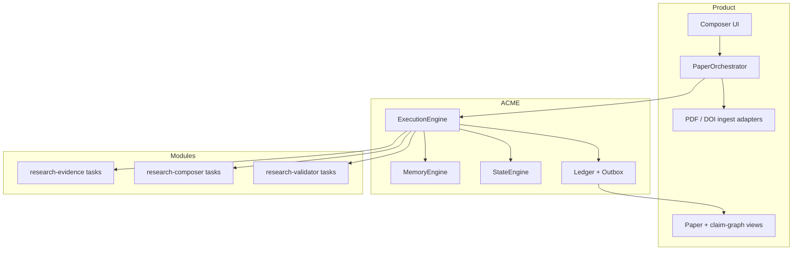

# Research Paper Composer / Validator × ACME — architecture draft

date: 2026-08-02  
updated at: 2026-08-02  
owner: design sketch (session)  
status: **concept only** — not decided architecture, not roadmap, not scope

## 1. Purpose

Sketch a complete **research paper product** on ACME: compose structured
scientific (or technical) papers from a research question and source corpus,
validate claims against evidence, and revise without silent overwrite — using
the **same unchanged core** as Kids and Legal.

This is a product sketch, not an expansion of the reference
`@acme/module-research` alone. The reference module remains a thin proof of
observe-evidence + corroboration/contest. The product adds composition,
citation graph, paper documents, validation gates and a multi-step
orchestrator.

## 2. Domain character (why it stresses ACME differently)

| Dimension | Kids | Research paper | Legal / evidence |
| --- | --- | --- | --- |
| Primary output | Story + images | Paper + claim graph | Case file + assessments |
| Generation | High (creative prose) | Medium–high (structured prose) | Low–medium (structured analysis) |
| Evidence | Soft continuity | Citations, studies, data | Testimony, docs, media with time/scope |
| Contradiction | Plot / fact continuity | Competing results | Competing testimony + exhibits |
| Uncertainty | Soft | Explicit confidence / strength of evidence | Mandatory + audit trail |
| Overwrite rule | Continuity apply | Never silent; supersede only with stronger support | Never silent; contest / coexist by scope |

Research is the **bridge**: still generative (outline, sections, abstract) but
accountable to a memory of **propositions backed by sources**.

## 3. Problem the product solves

Researchers (or automated pipelines) need to:

1. Frame a **research question** and constraints (scope, audience, venue).  
2. Ingest **sources** (papers, notes, datasets metadata) as immutable documents.  
3. Extract **claims / findings** with locators and quotes (observe-evidence style).  
4. Maintain a **proposition graph**: support, contradict, refine, supersede.  
5. Compose a **paper structure** (IMRaD or custom) from state + memory.  
6. **Validate** each drafted assertion against the graph (validator).  
7. **Revise** when new evidence arrives — previous conclusions retained as
   history, not deleted.

Without ACME-style separation, products usually either (a) regenerate the whole
paper from a chat transcript, or (b) treat embeddings as truth. This sketch
rejects both as canon.

## 4. Target layering

```text
apps/research-composer-api | worker | web
  → product adapters (PDF parse, DOI, vector index, OpenAI/Anthropic/…, storage)
  → domain modules + pure research-policies
  → @acme/core
```

Same forbidden edges as Kids:

```text
core → paper / DOI / citation vocabulary
module → PDF SDK / provider SDK
adapter → “is this claim verified?”
```

### 4.1 Package map (proposed)

```text
# Unchanged ACME core + reference research module (substrate)
packages/core
packages/module-research              # keep as conformance reference OR fold
                                      # observe-evidence into product module
packages/adapter-model-*
packages/adapter-sqlite | memory
packages/testing

# Product packages
packages/research-policies            # pure: venue profiles, IMRaD templates,
                                      # claim strength rules, citation style
packages/module-research-composer     # paper state, outline, section draft,
                                      # revise conclusions
packages/module-research-evidence     # optional split: observe/classify evidence
                                      # (or re-export / wrap module-research)
packages/module-research-validator    # gate: assertion → support check
packages/research-ports               # DocumentIngest, CitationResolve, VectorSearch
apps/research-composer-*
```

**Relation to `@acme/module-research`:**

| Approach | Note |
| --- | --- |
| **A. Extend product module, keep reference** | Product modules are separate namespaces; reference stays for engine conformance |
| **B. Product depends on reference** | Product tasks call same identity helpers if extracted to shared pure package |
| **C. Extract identity to `@acme/research-identity`** | Cleanest long-term; not required for sketch |

Sketch preference: **A + shared pure identity later**. Product does not import
Kids. Core stays unaware of both.

## 5. Role of ACME core

| Core capability | Research use |
| --- | --- |
| PromptContract + ResponsePipeline | Extract claims, outline, section draft, validation report JSON |
| ExecutionEngine | One observe, one draft-section, one validate-assertion |
| MemoryEngine + domain policy | Proposition lifecycle: create / reinforce / contest / supersede |
| StateEngine | Paper outline progress, open questions, verified/contested sets |
| Ledger + replay | Reproducible “why does section 3 claim X?” |
| Outbox | “evidence applied” → re-validate sections; “section drafted” → projector |

Core does **not** own: PDF parsing, DOI resolution, venue submission, UI,
billing, multi-author collaboration workflow, bibliography file formats
(those are ports/product).

## 6. Domain split

### 6.1 Evidence submodule / tasks (analyzer)

Ingest and interpret **sources** into memory candidates:

- sources (URI, publisher, retrieval time, independence key)  
- claims / findings (proposition + polarity + quote + locator)  
- open questions  
- methodology notes (optional)

Align with ADR-0009-style identity (already in reference research):

- `research-proposition-key-1`  
- `research-source-key-1`  
- `research-source-independence-key-1`  

Memory resolutions (same engine ops as Legal, different policy rules):

| Operation | Research meaning |
| --- | --- |
| create | First observation of a proposition |
| reinforce | Independent source supports same proposition |
| contest | Contradicting finding; both retained |
| supersede | Stronger/later study replaces standing **if policy allows** with explicit prior link |
| reject / ignore | Invalid quote, off-scope, duplicate non-independent source |

### 6.2 Composer submodule / tasks (producer)

- `bootstrap-paper` — research question, constraints, venue profile  
- `plan-outline` — section tree + intended claims per section  
- `draft-section` — prose from allowed claims + outline slot  
- `draft-abstract` / `draft-related-work` — specialised producers  
- `revise-section` — input: validation failures + new evidence summary  

**Critical rule:** model output is candidate prose. Canon paper body becomes a
**document** only after optional validation gate passes product policy.

### 6.3 Validator (gate / analyzer)

Not a state owner. Answers:

```text
For assertion A in section S:
  - supporting memory ids
  - contradicting memory ids
  - missing citation
  - overclaim (stronger wording than evidence strength)
  - orphan citation (cited source not in graph)
  verdict: pass | revise | block
```

Same pattern as Kids safety: orchestrator loops revise; validator never
silently rewrites memory.

### 6.4 Pure `research-policies`

- venue / length profiles  
- claim strength vocabulary (anecdote → RCT → meta-analysis, domain-specific)  
- supersession rules (what may replace what)  
- citation style formatting (CSL-like pure helpers)  
- independence heuristics (same lab / same dataset → not independent)

## 7. State / memory / documents ownership

| Track | Owns |
| --- | --- |
| **State** | Research question, outline tree + status, section lock flags, standing verified/contested **refs** (ids), open questions list, venue constraints |
| **Memory** | Propositions, source records, claim evidence payloads, strength, status |
| **Documents** | Source blobs/metadata snapshots, outline, section drafts, validation reports, compiled paper snapshot |

State must **not** duplicate full evidence payloads (mirror Research reference
module design: verified/contested point at memory ids).

## 8. Orchestration

### Offline (ScenarioRunner)

```text
bootstrap → observe source A → observe source B (corroborate)
  → observe source C (contest) → plan-outline → draft-section
  → validate-section → assert digests
```

Must match fixed digests when fixtures are pinned (same as Kids offline path).

### Production

Product orchestrator (queue/worker):

```text
ingest PDFs → observe-evidence per source (EE)
  → (optional) embedding index for retrieval only
  → plan-outline (EE)
  → for each section: draft (EE) → validate (EE) → revise loop
  → compile bibliography from memory
  → project paper read model
  → on new source: observe → re-validate affected sections
```

Retrieval is **not** canon. Vector hits feed `project()` context; only
validated claims in memory support assertions.

## 9. End-to-end diagram



## 10. Proof criteria (product contributes to platform proof)

When this product runs on **unmodified** core:

1. Same ExecutionEngine / MemoryEngine / StateEngine / ledger / replay as Kids.  
2. Zero research vocabulary in core.  
3. Contest does not delete prior support; supersede is explicit and linked.  
4. Replay of observe+compose sequence yields identical digests.  
5. Provider swap behind ModelGateway leaves policies and reducers unchanged.  
6. New paper types (review vs empirical) = new contracts/policies, not core forks.

## 11. Suggested build order (if ever activated)

1. Lift/align with `module-research` identity + golden vectors.  
2. `observe-evidence` multi-source scenario (already M1-style) as product seed.  
3. Paper state + `plan-outline` + `draft-section` with mock gateway.  
4. Validator task + revise loop.  
5. PDF ingest adapter + offline fixtures from real papers (redacted).  
6. Re-validation on new evidence event.  
7. Cross-link ACME-CM-001 conflict benchmark as conformance suite for policy.

## 12. Open questions

1. One namespace `research.composer` vs split evidence/composer/validator modules?  
2. Is bibliography a derived document only, or first-class state?  
3. Multi-author merge: separate product CRDT vs ACME entity per paper?  
4. How much of claim-strength taxonomy is domain-universal vs field-specific?  
5. Live web search: product tool port only, never unvalidated memory write.

## 13. Summary

**Research paper composer on ACME = generative paper pipeline whose every
assertable sentence is accountable to a proposition memory with create /
reinforce / contest / supersede — validated by a gate, revised by an
orchestrator, never silently overwritten by the model.**
