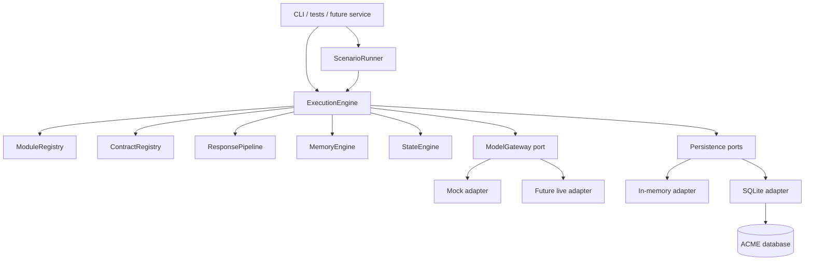
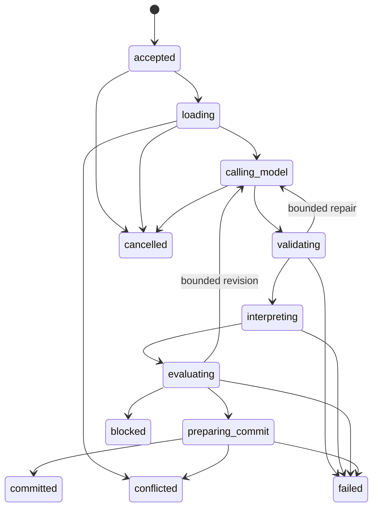

# ACME Design and Development Specification

Status: Approved implementation baseline

Specification version: 1.0.0

Last updated: 2026-07-29

Owner: ACME maintainers

Task: ACME-0003

## 1. Purpose and authority

This document is the technical source of truth for bootstrapping and building
ACME, the Adaptive Context Memory Engine. It turns the approved direction in
[`PROJECT_BRIEF.md`](../PROJECT_BRIEF.md) into implementable contracts,
package boundaries, persistence semantics, reference vertical slices and
delivery gates.

The intended readers are:

- maintainers making cross-package decisions
- implementers of core, adapters and domain modules
- reviewers verifying domain neutrality and replay safety
- evaluators adding deterministic or live-model scenarios

Normative terms use the meanings from RFC 2119:

- **MUST** and **MUST NOT** are required for conformance.
- **SHOULD** and **SHOULD NOT** require a documented reason to deviate.
- **MAY** is optional.

If this specification conflicts with an accepted ADR, the newer decision
supersedes the conflicting section and both documents MUST link to each other.
Implemented reality belongs in [`CURRENT_STATUS.md`](../CURRENT_STATUS.md);
this specification does not by itself claim that code exists.

## 2. Design basis

### 2.1 Goals

ACME MUST:

1. execute typed, versioned, model-backed tasks
2. keep model providers behind a capability-aware gateway
3. treat all model output as untrusted candidate data
4. keep generic memory lifecycle mechanics separate from domain meaning
5. change domain state only through typed deltas, reducers and invariants
6. commit documents, memory, state, events and ledger entries atomically
7. make retries and replay observable and idempotent
8. run deterministic tests and scenarios without network access
9. prove domain neutrality with Narrative and Research modules
10. preserve provenance from input and contract through committed result

### 2.2 Non-goals

Version 1 does not include:

- an existing product backend, UI, subscription model or job system
- a general workflow language
- runtime plugin discovery
- distributed transactions or multi-writer production deployment
- vector infrastructure as a mandatory dependency
- automatic prompt migration from another repository
- live model access as a prerequisite for development or CI
- provider-specific types in core contracts

### 2.3 Assumptions

- A single execution operates on one `(namespace, entityId)` state stream.
- One process owns the first SQLite database, although concurrent executions
  can contend through optimistic revisions.
- Task registration is static at the composition root.
- Contract inputs and outputs are JSON-compatible values.
- Timestamps are UTC ISO-8601 strings and are injected through a `Clock`.
- IDs are generated through an injected `IdGenerator`.
- Provider responses can contain sensitive content and require configurable
  retention.
- A model result is reusable only when its durable call key and all
  compatibility fingerprints match.

### 2.4 Quality attributes

| Attribute | Required behavior | Initial measurable gate |
| --- | --- | --- |
| Determinism | Same fixtures, clock, IDs and mock responses produce the same commit | Golden scenario digest is stable across two runs |
| Safety | Invalid or blocked candidates cannot mutate canonical data | Fault tests show zero canonical writes |
| Durability | A recorded model result survives a crash before domain commit | Recovery scenario makes zero additional gateway calls |
| Idempotency | Repeating one request key does not duplicate effects | Exactly one commit and one returned result |
| Auditability | Every committed object traces to execution and contract | Conformance query finds no orphan provenance |
| Domain neutrality | Core contains no reference-domain vocabulary | Boundary and forbidden-vocabulary checks pass |
| Portability | Core tests require no database or provider SDK | Core suite runs with in-memory ports |
| Evolvability | Contracts and schemas change through explicit versions | Compatibility suite rejects unsupported versions |
| Operability | Failure class, stage and retry decision are inspectable | Structured execution trace exists for every terminal run |

## 3. Glossary

| Term | Definition and owner |
| --- | --- |
| Execution | One attempt to perform one registered task. Owned by `ExecutionEngine`. |
| Request key | Caller-supplied idempotency identifier within a namespace. |
| Task | A named input/output operation owned by a domain module. |
| Contract | Versioned model communication protocol: input schema, request builder, output schema and semantic validator. |
| Candidate | Validated enough to inspect, but not canonical or committed. |
| Module result | Domain interpretation containing candidate documents, memories, delta, events and diagnostics. |
| State stream | Revisions for one `(namespace, entityId)` pair. |
| Snapshot | Complete validated domain state at one revision. |
| Delta | Domain-owned explicit description of an intended state transition. |
| Memory candidate | Proposed knowledge before memory policy resolves it. |
| Memory record | Canonical stored memory with identity, lifecycle and provenance. |
| Evaluator | A producer-independent gate or score that can allow, block or request revision. |
| Ledger | Durable executions, attempts, calls and diagnostic facts. |
| Replay | Reprocessing recorded durable inputs/results without a live provider call. |
| Resume | Continuing an incomplete execution from its last durable stage. |
| Retry | Repeating a failed operation according to a bounded policy. |
| Unit of Work | One atomic canonical commit across all ACME stores. |
| Outbox | Events committed atomically and delivered separately. |
| Scenario | Ordered test harness instructions; not a core workflow abstraction. |
| Fingerprint | Stable SHA-256 digest of canonical JSON and relevant versions. |

## 4. Ownership and trust

### 4.1 Ownership matrix

| Concern | Sole semantic owner | May coordinate | MUST NOT decide |
| --- | --- | --- | --- |
| execution lifecycle | `ExecutionEngine` | adapters, registries | domain meaning |
| task definitions | `DomainModule` | contract registry | provider transport |
| prompt/model protocol | `PromptContract` | response pipeline | persistence |
| provider transport | `ModelGateway` adapter | execution engine | domain state |
| parsing and schema checks | `ResponsePipeline` | contract | canonical writes |
| document meaning | domain module | evaluator | core |
| memory identity/merge/decay | `DomainMemoryPolicy` | memory engine | adapter |
| generic memory timestamps/provenance | `MemoryEngine` | stores | domain equivalence |
| state transition meaning | domain reducer/invariants | state engine | provider |
| revision/CAS mechanics | `StateEngine` and Unit of Work | state store | domain rules |
| event meaning | domain module | execution engine | outbox publisher |
| atomic persistence | Unit of Work adapter | execution engine | business interpretation |
| safety decision | registered evaluators | composition root | producer module |
| scenario ordering | `ScenarioRunner` | CLI | `ExecutionEngine` |
| retention/secrets | application policy and adapters | ledger | contracts |

### 4.2 Trust pipeline

```mermaid
flowchart LR
  raw["Raw provider bytes"] --> normalized["Normalized response"]
  normalized --> parsed["Parsed JSON"]
  parsed --> schema["Runtime schema"]
  schema --> semantic["Contract semantics"]
  semantic --> interpreted["Domain interpretation"]
  interpreted --> evaluated["Evaluators"]
  evaluated --> policies["Memory policy + state invariants"]
  policies --> commit["Atomic commit"]
  commit --> canonical["Canonical records"]
```



Only the right side of a successful atomic commit is canonical. Logs, model
calls, parsed output, candidates and evaluator reports remain evidence.

## 5. System architecture

### 5.1 System context



`ExecutionEngine` runs exactly one task. `ScenarioRunner` may sequence tasks,
capture outputs and assert state. A future workflow runtime MUST be a separate
layer and MUST NOT enlarge the engine contract implicitly.

### 5.2 Package layout

The first implementation MUST use a pnpm workspace:

```text
acme-engine/
├── apps/
│   └── cli/
├── packages/
│   ├── core/
│   ├── testing/
│   ├── adapter-memory/
│   ├── adapter-sqlite/
│   ├── adapter-model-mock/
│   ├── adapter-model-openai/
│   ├── module-narrative/
│   └── module-research/
├── scenarios/
│   ├── narrative/
│   └── research/
├── tooling/
│   ├── eslint/
│   ├── typescript/
│   └── boundaries/
└── docs/
```

Package responsibilities:

- `@acme/core`: contracts, ports and pure orchestration; no SDKs or SQL.
- `@acme/testing`: conformance kits, fixture clock/IDs and ScenarioRunner.
- `@acme/adapter-memory`: deterministic store and Unit of Work.
- `@acme/adapter-sqlite`: schema, migrations and durable implementation.
- `@acme/adapter-model-mock`: exact finite call scripts and normalized model
  outcomes with no external dependencies.
- `@acme/adapter-model-openai`: first optional live provider adapter.
- `@acme/module-narrative`: narrative schemas, tasks, policies and fixtures.
- `@acme/module-research`: research schemas, tasks, policies and fixtures.
- `@acme/cli`: composition root and human-facing commands.

### 5.3 Dependency rules

Allowed direction:

```text
apps → adapters → core
apps → modules → core
testing → core
adapter conformance tests → testing
module conformance tests → testing
```

Forbidden:

- `core` importing any module, provider SDK, SQLite library or CLI
- one reference module importing another
- a module importing a concrete adapter
- an adapter deciding domain equivalence, contradiction or invariants
- a prompt contract writing to a store
- barrel exports that hide a forbidden package dependency

Model adapters MAY depend on core. The deterministic model mock MUST NOT
depend on another adapter, provider SDK, network, environment, filesystem,
clock or random source.

`dependency-cruiser` MUST enforce package rules in CI. A separate source scan
MUST reject `narrative`, `research`, `chapter`, `character`, `claim` and other
reference-domain vocabulary under `packages/core/src`, excluding tests that
assert the guard itself.

## 6. Toolchain and repository policy

The implementation baseline is:

- Node.js 24 LTS, pinned to an exact patch in `.node-version`
- pnpm 10, pinned through `packageManager` and Corepack
- TypeScript 6 in strict ESM mode
- Zod 4 for public runtime schemas
- Vitest 4 for unit, conformance and integration tests
- `tsx` for local TypeScript commands
- `tsup` for package builds only when package distribution begins
- `better-sqlite3` behind `@acme/adapter-sqlite`
- ESLint flat config, `typescript-eslint`, Prettier and dependency-cruiser
- Changesets only when package publication/version automation begins

Exact patch versions MUST be recorded in the first lockfile and updated by a
dedicated dependency task. Production code MUST import workspace packages by
package name, not relative cross-package paths. TypeScript project references
and `composite` builds SHOULD be used once packages exist.

The choice follows the official status of Node 24 as LTS and TypeScript 6 as
the current stable language line at design time. Sources:
[Node release status](https://nodejs.org/en/about/previous-releases),
[TypeScript 6 release notes](https://www.typescriptlang.org/docs/handbook/release-notes/typescript-6-0.html),
and [Vitest requirements](https://vitest.dev/guide/).

## 7. Common types and deterministic primitives

All public input crosses a Zod schema. Opaque IDs MAY use branded TypeScript
types internally, but storage and serialized APIs use strings.

```ts
import type { z } from "zod";

export type JsonPrimitive = string | number | boolean | null;
export type JsonValue =
  | JsonPrimitive
  | JsonValue[]
  | { readonly [key: string]: JsonValue };

export type Schema<T> = z.ZodType<T>;

export type ExecutionId = string;
export type ModelCallId = string;
export type EntityId = string;
export type Namespace = string;
export type RequestKey = string;
export type IsoTimestamp = string;

export interface Clock {
  now(): IsoTimestamp;
}

export interface IdGenerator {
  next(kind: "execution" | "call" | "document" | "memory" | "event"): string;
}

export interface Hashing {
  canonicalJson(value: JsonValue): string;
  sha256(value: string | Uint8Array): string;
}

export interface DiagnosticFact {
  readonly code: string;
  readonly severity: "debug" | "info" | "warning" | "error";
  readonly value?: JsonValue;
}

export interface StoredDocument {
  readonly documentId: string;
  readonly executionId: ExecutionId;
  readonly namespace: Namespace;
  readonly entityId: EntityId;
  readonly key: string;
  readonly kind: string;
  readonly schemaVersion: string;
  readonly value: JsonValue;
  readonly contentHash: string;
  readonly createdAt: IsoTimestamp;
}
```

Canonical JSON MUST recursively sort object keys, preserve array order,
normalize neither numbers nor Unicode, and reject non-JSON values. The
canonicalization algorithm has identifier `acme-cjson-1`.

## 8. Contracts and registries

### 8.1 Contract reference and model capabilities

```ts
export interface ContractRef {
  readonly id: string;
  readonly version: string;
}

export interface ModelCapabilities {
  readonly structuredOutput: boolean;
  readonly tools: boolean;
  readonly vision: boolean;
  readonly maxInputTokens?: number;
  readonly maxOutputTokens?: number;
}

export interface ModelMessage {
  readonly role: "system" | "user" | "assistant" | "tool";
  readonly content: readonly ModelContentPart[];
}

export type ModelContentPart =
  | { readonly type: "text"; readonly text: string }
  | { readonly type: "image"; readonly mediaType: string; readonly dataRef: string }
  | { readonly type: "tool-result"; readonly toolCallId: string; readonly value: JsonValue };

export interface ModelRequest {
  readonly messages: readonly ModelMessage[];
  readonly output: {
    readonly mode: "json";
    readonly schemaName: string;
    readonly jsonSchema: JsonValue;
  };
  readonly temperature?: number;
  readonly maxOutputTokens?: number;
  readonly stop?: readonly string[];
}
```

### 8.2 Prompt contract

```ts
export interface SemanticIssue {
  readonly code: string;
  readonly path: readonly (string | number)[];
  readonly message: string;
  readonly severity: "error" | "warning";
}

export interface ContractBuildContext {
  readonly executionId: ExecutionId;
  readonly now: IsoTimestamp;
}

export interface PromptContract<TInput, TOutput> {
  readonly ref: ContractRef;
  readonly inputSchema: Schema<TInput>;
  readonly outputSchema: Schema<TOutput>;
  readonly requiredCapabilities: Partial<ModelCapabilities>;
  readonly retention: "none" | "hash-only" | "encrypted-payload";
  buildRequest(input: TInput, context: ContractBuildContext): ModelRequest;
  validateSemantics(
    output: TOutput,
    input: TInput,
  ): readonly SemanticIssue[];
}
```

A contract version MUST be immutable. Any change to request semantics, output
schema, default generation settings or semantic rules requires a new version.
Formatting-only source edits that produce the identical contract fingerprint
do not. The registry key is `${id}@${version}`.

```ts
export interface ContractRegistry {
  get<TInput, TOutput>(ref: ContractRef): PromptContract<TInput, TOutput>;
  has(ref: ContractRef): boolean;
  fingerprint(ref: ContractRef): string;
  list(): readonly ContractRef[];
}
```

Duplicate keys fail composition before execution. Production registries are
immutable after construction.

## 9. Model gateway and response pipeline

### 9.1 Provider-neutral gateway

```ts
export interface ModelSelection {
  readonly profile: string;
  readonly providerHint?: string;
  readonly modelHint?: string;
}

export interface GatewayCallContext {
  readonly executionId: ExecutionId;
  readonly callKey: string;
  readonly selection: ModelSelection;
  readonly requiredCapabilities: Partial<ModelCapabilities>;
  readonly timeoutMs: number;
  readonly signal: AbortSignal;
}

export interface NormalizedUsage {
  readonly inputTokens?: number;
  readonly outputTokens?: number;
  readonly totalTokens?: number;
  readonly estimatedCostMinor?: number;
  readonly currency?: string;
}

export interface NormalizedModelResponse {
  readonly provider: string;
  readonly model: string;
  readonly providerResponseId?: string;
  readonly receivedAt: IsoTimestamp;
  readonly finishReason: "stop" | "length" | "tool" | "content-filter" | "unknown";
  readonly text: string;
  readonly usage: NormalizedUsage;
  readonly metadata: Readonly<Record<string, JsonValue>>;
}

export interface ModelGateway {
  capabilities(selection: ModelSelection): Promise<ModelCapabilities>;
  generate(request: ModelRequest, context: GatewayCallContext):
    Promise<NormalizedModelResponse>;
}
```

Provider error objects MUST be translated into the ACME error taxonomy.
Core never branches on provider names. Provider choice is resolved before the
call and frozen in the model-call record.

The gateway boundary validates complete closed shapes for selections,
requests, capabilities, call contexts and normalized responses. Model
identities are non-empty, numeric limits and usage counts are safe integers,
and `receivedAt` is a canonical UTC ISO timestamp. Returned capabilities and
responses are detached and deeply frozen.

Capability discovery is deterministic for an exact supplied selection.
Required boolean capabilities constrain the selection only when `true`;
required numeric limits are minimums. A missing requirement is non-retryable
`UNSUPPORTED_CAPABILITY` at `calling-model`. An already-aborted signal is
non-retryable `CANCELLED` before provider invocation.

The deterministic mock uses declared immutable profiles and finite exact call
scripts. Each call has unique `(executionId, callKey)`, exact selection,
expected `acme-model-request-hash-1` and one response or model-stage error.
Cancellation and capability rejection consume nothing. A matching scripted
success or error consumes once. Unexpected, mismatched, repeated or
unconsumed calls are non-retryable `INTERNAL` test-harness failures; no queue,
fallback output or synthesized response field is permitted. Mock invocation
inspection remains outside the core port.

### 9.2 Response pipeline

```ts
export type PipelineResult<T> =
  | {
      readonly ok: true;
      readonly value: T;
      readonly warnings: readonly SemanticIssue[];
      readonly parsedHash: string;
    }
  | {
      readonly ok: false;
      readonly stage: "input" | "empty" | "parse" | "schema" | "semantic";
      readonly issues: readonly SemanticIssue[];
      readonly repairable: boolean;
    };

export interface ResponsePipeline {
  process<TInput, TOutput>(
    response: NormalizedModelResponse,
    contract: PromptContract<TInput, TOutput>,
    input: TInput,
  ): PipelineResult<TOutput>;
}
```

The pipeline performs, in order: input schema validation, input
canonical-value preservation, non-empty check, JSON extraction, strict parse,
output schema parse and input-bound semantic validation. Invalid input fails
non-repairably at `input` before response text is inspected. Both validated
input and output are canonical-JSON-cloned, detached and deeply frozen before
`validateSemantics(output, input)`. The pipeline MUST NOT silently coerce a
semantically different input or output value. Deterministic syntax cleanup MAY
remove a single Markdown JSON fence and byte-order mark; every cleanup is
recorded. See
[ADR-0010](../adr/0010-input-bound-validation-and-interpretation.md).

Repair is an execution policy, not a parser feature. A repair request is a new
logged model call with its own deterministic call key and a bounded attempt
number. The original response remains immutable.

## 10. Task-typed domain modules

### 10.1 Task contracts

```ts
export type ModuleRole = "producer" | "analyzer" | "transformer";

export interface ExecutionReadContext<TState> {
  readonly executionId: ExecutionId;
  readonly entityId: EntityId;
  readonly now: IsoTimestamp;
  readonly state: StateSnapshot<TState> | null;
  readonly memories: readonly MemoryRecord[];
  readonly documents: readonly StoredDocument[];
}

export interface TaskDefinition<
  TInput,
  TContractInput,
  TContractOutput,
  TState,
  TDelta
> {
  readonly role: ModuleRole;
  readonly inputSchema: Schema<TInput>;
  readonly contract: ContractRef;
  project(
    input: TInput,
    context: ExecutionReadContext<TState>,
  ): Promise<TContractInput> | TContractInput;
  interpret(
    output: TContractOutput,
    input: TInput,
    context: ExecutionReadContext<TState>,
  ): Promise<ModuleResult<TDelta>> | ModuleResult<TDelta>;
  projectState(
    input: StateProjectionInput<TDelta>,
    context: ExecutionReadContext<TState>,
  ): StateDelta<TDelta> | undefined;
}

export type AnyTaskDefinition<TState, TDelta> =
  TaskDefinition<any, any, any, TState, TDelta>;

export type TaskMap<TState, TDelta> = Readonly<
  Record<string, AnyTaskDefinition<TState, TDelta>>
>;

export interface DomainModule<
  TState,
  TDelta,
  TTasks extends TaskMap<TState, TDelta>
> {
  readonly namespace: Namespace;
  readonly stateSchemaVersion: string;
  readonly deltaSchemaVersion: string;
  readonly stateSchema: Schema<TState>;
  readonly deltaSchema: Schema<TDelta>;
  readonly tasks: TTasks;
  readonly memoryPolicy: DomainMemoryPolicy;
  initialState(context: { entityId: EntityId; now: IsoTimestamp }): TState;
  reduce(state: TState, delta: TDelta): TState;
  invariants(next: TState, previous: TState | null): readonly DomainIssue[];
}

export type AnyDomainModule = DomainModule<any, any, TaskMap<any, any>>;

export type TaskName<M extends AnyDomainModule> =
  Extract<keyof M["tasks"], string>;

export type TaskInput<
  M extends AnyDomainModule,
  K extends TaskName<M>,
> = M["tasks"][K] extends TaskDefinition<
  infer TInput,
  any,
  any,
  any,
  any
>
  ? TInput
  : never;

export type TaskContractOutput<
  M extends AnyDomainModule,
  K extends TaskName<M>,
> = M["tasks"][K] extends TaskDefinition<
  any,
  any,
  infer TContractOutput,
  any,
  any
>
  ? TContractOutput
  : never;
```

The public composition helper MUST preserve this inference and demonstrate it
in `packages/core/test-d`. The erased registry below is an internal runtime
boundary, not the typed authoring API.

At runtime, the engine addresses a task by `{ namespace, task }`. The module
registry is static:

```ts
export interface ModuleRegistry {
  get(namespace: Namespace): DomainModule<unknown, unknown, TaskMap<unknown, unknown>>;
  list(): readonly Namespace[];
}
```

The composition helper MAY retain stronger generics than the erased runtime
registry. Runtime schemas remain authoritative at process boundaries.

The future ExecutionEngine validates and immutably retains task input before
both projection and interpretation. `project()` derives typed contract input
from that task input plus read context. Response semantics receive the
validated contract input, while `interpret()` receives the original validated
task input needed to construct exact source documents and domain candidates.
No mutable task-instance closure participates. See
[ADR-0010](../adr/0010-input-bound-validation-and-interpretation.md).

### 10.2 Module result

```ts
export interface CandidateDocument {
  readonly key: string;
  readonly kind: string;
  readonly schemaVersion: string;
  readonly value: JsonValue;
  readonly contentHash: string;
}

export interface CandidateEvent {
  readonly key: string;
  readonly type: string;
  readonly schemaVersion: string;
  readonly payload: JsonValue;
}

export interface StateDelta<TDelta> {
  readonly schemaVersion: string;
  readonly value: TDelta;
}

export interface ModuleResult<TDelta> {
  readonly documents: readonly CandidateDocument[];
  readonly memories: readonly MemoryCandidate[];
  readonly stateIntent?: StateDelta<TDelta>;
  readonly events: readonly CandidateEvent[];
  readonly diagnostics: readonly DiagnosticFact[];
}

export interface StateProjectionMemoryDecision {
  readonly candidate: MemoryCandidate;
  readonly identityKey: string;
  readonly resolution: AppliedMemoryResolution;
  readonly affectedMemoryIds: readonly string[];
}

export interface StateProjectionInput<TDelta> {
  readonly stateIntent?: StateDelta<TDelta>;
  readonly memory: readonly StateProjectionMemoryDecision[];
}
```

Keys are unique within one execution result. The engine validates all
documents, memory candidates, events and state intent before evaluation.
`stateIntent` is typed interpreted intent, not the final state delta.

After evaluation allows a result, MemoryEngine prepares all candidate
decisions. Core then verifies exact candidate/decision key correspondence and
builds a canonical-JSON-cloned, deeply frozen projection input in prepared
decision order. Create, reinforce, merge, contest and supersede decisions are
included with their candidates. Ignore and reject-candidate decisions remain
audit evidence but are excluded from memory-derived state projection.

The task's pure synchronous `projectState()` hook owns domain composition of
direct intent and applied memory decisions. Its result remains untrusted until
StateEngine validates the delta, applies the reducer and invariants, and the
aggregate repository commits every accepted effect atomically. See
[ADR-0008](../adr/0008-post-memory-domain-state-projection.md).

An empty result is valid for analyzer tasks when explicitly allowed by task
conformance tests.

`@acme/testing` exports `domainModuleConformance()` as the executable shared
module boundary. The same suite verifies module/task/registry identity,
runtime input/state/delta schemas, deterministic detached task projection and
interpretation, post-memory state projection, unique effect keys, pure
state/reducer/invariant behavior and caller-supplied memory-policy outcomes.
Testing-owned producer and empty-analyzer fixtures prove the portable suite
without introducing reference-domain semantics. Narrative and Research MUST
run the same suite with their own fixtures in addition to domain-specific unit
tests.

## 11. State model

```ts
export interface StateSnapshot<TState> {
  readonly entityId: EntityId;
  readonly namespace: Namespace;
  readonly schemaVersion: string;
  readonly revision: number;
  readonly value: TState;
  readonly valueHash: string;
  readonly createdAt: IsoTimestamp;
  readonly executionId: ExecutionId;
}

export interface StateTransition<TDelta> {
  readonly transitionId: string;
  readonly operationKey: string;
  readonly entityId: EntityId;
  readonly namespace: Namespace;
  readonly fromRevision: number;
  readonly toRevision: number;
  readonly deltaSchemaVersion: string;
  readonly delta: TDelta;
  readonly previousHash: string | null;
  readonly nextHash: string;
  readonly executionId: ExecutionId;
  readonly createdAt: IsoTimestamp;
}

export interface DomainIssue {
  readonly code: string;
  readonly path: readonly (string | number)[];
  readonly message: string;
}

export interface PreparedState<TState, TDelta> {
  readonly snapshot: StateSnapshot<TState>;
  readonly transition: StateTransition<TDelta>;
}

export interface StatePrepareContext {
  readonly entityId: EntityId;
  readonly executionId: ExecutionId;
  readonly operationKey: string;
  readonly now: IsoTimestamp;
}
```

The StateEngine algorithm is:

1. require the execution's expected revision
2. schema-validate current state or obtain module initial state policy
3. schema-validate the delta
4. call the pure domain reducer without mutation
5. schema-validate the resulting state
6. run all domain invariants
7. calculate canonical hash and next revision
8. create a transition candidate
9. let the Unit of Work compare-and-swap the state head

```ts
export interface StateEngine {
  prepare<
    TState,
    TDelta,
    TTasks extends TaskMap<TState, TDelta>,
  >(
    module: DomainModule<TState, TDelta, TTasks>,
    current: StateSnapshot<TState> | null,
    expectedRevision: number,
    delta: StateDelta<TDelta> | undefined,
    context: StatePrepareContext,
  ): PreparedState<TState, TDelta> | null;
}
```

Revision zero means no snapshot exists. The first persisted snapshot is
revision one and uses `module.initialState`. The delta envelope version MUST
equal `module.deltaSchemaVersion`. A stale revision yields
`CONFLICT_STATE_REVISION`; core MUST NOT automatically re-run model calls. A
caller may start a new execution against the new revision. Reducers MUST be
pure and MUST NOT read time, random values, stores or providers.

Transition identity uses the immutable algorithm `acme-transition-id-1`:

```ts
transitionId =
  "transition_" +
  sha256(
    canonicalJson({
      algorithm: "acme-transition-id-1",
      executionId: context.executionId,
      operationKey: context.operationKey,
      namespace: module.namespace,
      entityId: context.entityId,
    }),
  );
```

Revision, delta content, timestamps, previous/next hashes and retry order MUST
NOT participate in this identity. `IdGenerator` MUST NOT allocate transition
IDs. Divergent transition content under one derived identity is a repository
conflict. See
[ADR-0004](../adr/0004-deterministic-transition-identity.md).

Schema migrations are explicit functions from one state schema version to the
next. A migration never rewrites history in place; it creates a transition
whose provenance identifies the migration.

## 12. Memory model

```ts
export interface ProvenanceRef {
  readonly executionId: ExecutionId;
  readonly contract: ContractRef;
  readonly modelCallId?: ModelCallId;
  readonly documentKeys: readonly string[];
}

export interface MemoryCandidate {
  readonly key: string;
  readonly kind: string;
  readonly schemaVersion: string;
  readonly value: JsonValue;
  readonly confidence?: number;
  readonly source: ProvenanceRef;
}

export interface MemoryRecord {
  readonly memoryId: string;
  readonly namespace: Namespace;
  readonly entityId: EntityId;
  readonly identityKey: string;
  readonly kind: string;
  readonly schemaVersion: string;
  readonly value: JsonValue;
  readonly strength: number;
  readonly status: "active" | "superseded" | "contested" | "forgotten";
  readonly firstSeenAt: IsoTimestamp;
  readonly lastSeenAt: IsoTimestamp;
  readonly lastReinforcedAt: IsoTimestamp;
  readonly provenance: readonly ProvenanceRef[];
  readonly recordVersion: number;
}

export interface MemoryQuery {
  readonly namespace: Namespace;
  readonly entityId: EntityId;
  readonly task: string;
  readonly kinds?: readonly string[];
  readonly text?: string;
  readonly limit: number;
}

export interface RankedMemory {
  readonly record: MemoryRecord;
  readonly score: number;
  readonly reasons: readonly string[];
}

export type MemoryLifecycleDecision =
  | { readonly action: "retain" }
  | { readonly action: "update-strength"; readonly strength: number }
  | { readonly action: "forget"; readonly reason: string };

export type MemoryLifecycleHook =
  | "execution-start"
  | "execution-commit"
  | "maintenance";

export type MemoryResolution =
  | {
      readonly candidateKey: string;
      readonly action: "create";
      readonly value: JsonValue;
      readonly strength: number;
    }
  | {
      readonly candidateKey: string;
      readonly action: "reinforce";
      readonly memoryId: string;
      readonly strength: number;
    }
  | {
      readonly candidateKey: string;
      readonly action: "merge";
      readonly memoryId: string;
      readonly value: JsonValue;
      readonly strength: number;
    }
  | {
      readonly candidateKey: string;
      readonly action: "contradict";
      readonly memoryIds: readonly string[];
      readonly disposition: "contest" | "reject-candidate";
    }
  | {
      readonly candidateKey: string;
      readonly action: "contradict";
      readonly memoryIds: readonly string[];
      readonly disposition: "supersede-existing";
      readonly replacement: {
        readonly value: JsonValue;
        readonly strength: number;
      };
    }
  | {
      readonly candidateKey: string;
      readonly action: "ignore";
      readonly reason: string;
    };

export interface MemoryPrepareContext {
  readonly namespace: Namespace;
  readonly entityId: EntityId;
  readonly executionId: ExecutionId;
  readonly now: IsoTimestamp;
}

export interface MemoryLifecycleContext {
  readonly namespace: Namespace;
  readonly entityId: EntityId;
  readonly now: IsoTimestamp;
}

export type MemoryMutation =
  | { readonly action: "create"; readonly record: MemoryRecord }
  | {
      readonly action: "update";
      readonly expectedRecordVersion: number;
      readonly record: MemoryRecord;
    };

export interface PreparedMemoryDecision {
  readonly candidateKey: string;
  readonly identityKey: string;
  readonly resolution: MemoryResolution;
  readonly affectedMemoryIds: readonly string[];
}

export interface PreparedMemory {
  readonly decisions: readonly PreparedMemoryDecision[];
  readonly mutations: readonly MemoryMutation[];
}

export interface PreparedMemoryLifecycleDecision {
  readonly memoryId: string;
  readonly decision: MemoryLifecycleDecision;
}

export interface PreparedMemoryLifecycle {
  readonly decisions: readonly PreparedMemoryLifecycleDecision[];
  readonly mutations: readonly MemoryMutation[];
}

export interface DomainMemoryPolicy {
  validate(candidate: MemoryCandidate): readonly DomainIssue[];
  identity(candidate: MemoryCandidate): string;
  retrieve(
    query: MemoryQuery,
    records: readonly MemoryRecord[],
  ): readonly RankedMemory[];
  resolve(
    candidate: MemoryCandidate,
    existing: readonly MemoryRecord[],
    context: { now: IsoTimestamp },
  ): MemoryResolution;
  lifecycle(
    record: MemoryRecord,
    hook: MemoryLifecycleHook,
    context: { now: IsoTimestamp },
  ): MemoryLifecycleDecision;
}

export interface MemoryEngine {
  prepare(
    policy: DomainMemoryPolicy,
    candidates: readonly MemoryCandidate[],
    existing: readonly MemoryRecord[],
    context: MemoryPrepareContext,
  ): PreparedMemory;
  retrieve(
    policy: DomainMemoryPolicy,
    query: MemoryQuery,
    records: readonly MemoryRecord[],
  ): readonly RankedMemory[];
  applyLifecycle(
    policy: DomainMemoryPolicy,
    records: readonly MemoryRecord[],
    hook: MemoryLifecycleHook,
    context: MemoryLifecycleContext,
  ): PreparedMemoryLifecycle;
}
```

Core owns fetching, stable ordering, timestamps, provenance append,
record-version checks and applying policy decisions. The domain owns identity,
equivalence, contradiction, merge semantics, relevance, reinforcement,
decay and promotion. Domain decisions MUST therefore provide the complete
resulting strength for create, reinforce, merge and supersede replacement;
core MUST NOT invent a generic strength formula. Strengths MUST be finite and
non-negative. Candidate confidence, when supplied, MUST be finite and between
zero and one inclusive.

Candidates are processed by candidate key against an immutable evolving
working set sorted by `identityKey`, then `memoryId`. Later candidates observe
earlier prepared decisions. Creates and supersede replacements consume
`IdGenerator.next("memory")` only after their complete decision validates.
New records start at record version one. Every update carries the previous
version as `expectedRecordVersion` and increments once. Candidate provenance
is appended without an identical duplicate.

Retrieval scores MUST be finite numbers. Core rejects records not present in
the supplied set and duplicate ranked records, then sorts by descending score,
`identityKey` and `memoryId` before applying the query limit. Database return
order never breaks a tie.

Lifecycle hooks run only at explicit deterministic boundaries. Wall-clock
background decay is forbidden in version 1. A maintenance execution MAY
invoke the hook with a recorded timestamp.

Candidate rows are retained for audit even when ignored or rejected. Memory
records are written only inside the canonical Unit of Work.
See [ADR-0005](../adr/0005-pure-memory-decision-application.md).

## 13. Evaluator and safety composition

Evaluators are registered by the application for a task. They do not own the
producer's state or documents.

```ts
export interface EvaluationSubject<TDelta> {
  readonly namespace: Namespace;
  readonly task: string;
  readonly input: JsonValue;
  readonly result: ModuleResult<TDelta>;
}

export type EvaluationDecision =
  | { readonly outcome: "allow"; readonly scores: Readonly<Record<string, number>> }
  | { readonly outcome: "block"; readonly reasons: readonly DomainIssue[] }
  | {
      readonly outcome: "revise";
      readonly reasons: readonly DomainIssue[];
      readonly instruction: JsonValue;
    };

export interface EvaluationContext {
  readonly executionId: ExecutionId;
  readonly attempt: number;
  readonly now: IsoTimestamp;
  readonly signal: AbortSignal;
}

export interface Evaluator {
  readonly id: string;
  readonly version: string;
  evaluate(subject: EvaluationSubject<unknown>, context: EvaluationContext):
    Promise<EvaluationDecision>;
}
```

Composition semantics:

1. evaluators run after module interpretation and before memory preparation
   and state projection
2. all deterministic evaluators run even if one blocks, to preserve evidence
3. any `block` prevents canonical commit
4. `revise` may invoke the producer's revision contract if task policy allows
5. revision attempts are bounded, separately logged calls
6. the revised result re-enters the entire validation and evaluator pipeline
7. evaluator reports are ledger evidence, never silently embedded in state

Safety therefore remains a gate, not a fake document domain. A future
standalone safety analysis task is valid if it produces its own report, but it
still cannot mutate another module's state.

## 14. Execution protocol

### 14.1 Request and result

```ts
export interface ExecutionRequest<TInput = unknown> {
  readonly requestKey: RequestKey;
  readonly namespace: Namespace;
  readonly task: string;
  readonly entityId: EntityId;
  readonly expectedRevision: number;
  readonly input: TInput;
  readonly model: ModelSelection;
  readonly policy?: Partial<ExecutionPolicy>;
}

export interface ExecutionPolicy {
  readonly timeoutMs: number;
  readonly maxModelCalls: number;
  readonly maxRepairCalls: number;
  readonly maxRevisionCalls: number;
  readonly maxInputTokens?: number;
  readonly maxOutputTokens?: number;
  readonly maxEstimatedCostMinor?: number;
  readonly retention: "none" | "hash-only" | "encrypted-payload";
}

export type ExecutionStatus =
  | "accepted"
  | "loading"
  | "calling-model"
  | "validating"
  | "interpreting"
  | "evaluating"
  | "preparing-commit"
  | "committed"
  | "blocked"
  | "conflicted"
  | "cancelled"
  | "failed";

export type ExecutionResult =
  | {
      readonly status: "committed";
      readonly executionId: ExecutionId;
      readonly replayed: boolean;
      readonly revision: number;
      readonly documentKeys: readonly string[];
      readonly eventIds: readonly string[];
    }
  | {
      readonly status: "blocked" | "conflicted" | "cancelled" | "failed";
      readonly executionId: ExecutionId;
      readonly error: AcmeErrorData;
    };

export interface ExecutionEngine {
  execute<TInput>(
    request: ExecutionRequest<TInput>,
    options?: { readonly signal?: AbortSignal },
  ): Promise<ExecutionResult>;
  resume(executionId: ExecutionId, options?: { readonly signal?: AbortSignal }):
    Promise<ExecutionResult>;
  replay(executionId: ExecutionId, mode: ReplayMode): Promise<ReplayReport>;
}

export interface ReplayReport {
  readonly executionId: ExecutionId;
  readonly mode: ReplayMode["kind"];
  readonly status: "match" | "different" | "unavailable" | "forked";
  readonly recordedDigest?: string;
  readonly replayDigest?: string;
  readonly differences: readonly DiagnosticFact[];
  readonly forkExecutionId?: ExecutionId;
}
```

The request fingerprint includes namespace, task, entity, expected revision,
canonical input, contract fingerprint, module state schema version and
effective policy. Reusing `(namespace, requestKey)` with a different
fingerprint yields `CONFLICT_IDEMPOTENCY_KEY`.

### 14.2 Lifecycle



Terminal states are immutable. Stage changes and attempts are append-only
ledger records; the current status is a projection for inspection.

Execution order:

1. validate the request and effective policy
2. atomically create or resolve the execution by request key
3. return the stored terminal result if already terminal
4. resolve module, task and immutable contract
5. load snapshot, documents and memory in one consistent read
6. reject unexpected state revision before a model call
7. project and validate contract input
8. check budgets and resolve/reuse the deterministic model call
9. process the response, using bounded repair when allowed
10. interpret validated output into a module result
11. evaluate and, if permitted, perform bounded revision
12. prepare memory operations
13. build the filtered immutable projection input and run the task's
    domain-owned `projectState()` hook
14. pass the projected delta through StateEngine and prepare documents/events
15. commit the complete prepared result through one Unit of Work
16. return the persisted terminal projection

### 14.3 Error taxonomy

```ts
export type AcmeErrorCode =
  | "INVALID_REQUEST"
  | "NOT_FOUND_MODULE"
  | "NOT_FOUND_TASK"
  | "NOT_FOUND_CONTRACT"
  | "UNSUPPORTED_CAPABILITY"
  | "CONFLICT_IDEMPOTENCY_KEY"
  | "CONFLICT_STATE_REVISION"
  | "CONFLICT_MEMORY_VERSION"
  | "BUDGET_EXCEEDED"
  | "CANCELLED"
  | "TIMEOUT"
  | "MODEL_RATE_LIMIT"
  | "MODEL_AUTH"
  | "MODEL_UNAVAILABLE"
  | "MODEL_CONTENT_FILTER"
  | "MODEL_INVALID_RESPONSE"
  | "DOMAIN_INVALID_RESULT"
  | "EVALUATION_BLOCKED"
  | "PERSISTENCE_TRANSIENT"
  | "PERSISTENCE_CORRUPTION"
  | "INTERNAL";

export interface AcmeErrorData {
  readonly code: AcmeErrorCode;
  readonly message: string;
  readonly stage: ExecutionStatus;
  readonly retryable: boolean;
  readonly details?: JsonValue;
  readonly causeRef?: string;
}
```

Messages exposed by the CLI MUST be safe for logs. Stack traces and raw
provider errors belong in protected diagnostics.

### 14.4 Retry, cancellation, timeout and budget

| Failure | Same execution? | Live model call allowed? | Policy |
| --- | --- | --- | --- |
| transient provider failure before response | yes | yes | exponential backoff with full jitter, max 3 |
| rate limit with retry-after | yes | yes | honor delay within total deadline |
| invalid response | yes | repair only | bounded by `maxRepairCalls` |
| evaluator revision | yes | revision only | bounded by `maxRevisionCalls` |
| state conflict | no | no | terminal; caller creates a new request |
| persistence busy/transient | yes | no new call if recorded | max 5 short retries |
| auth/capability | no | no | terminal |
| cancellation | no automatic retry | no | terminal at safe boundary |

The execution deadline covers waits, calls, validation and commit. Each
gateway call also has a shorter child timeout. Before every external call and
commit, the engine checks `AbortSignal`, deadline, call count, token budget and
estimated cost. Cancellation cannot roll back a committed transaction. If the
signal arrives during commit, the engine reads the terminal execution result
before responding.

Jitter is injected for tests. Retry schedules are ledger facts. No retry may
change contract version, provider selection, request payload or state
revision.

### 14.5 Model-call durability

Each call has a deterministic key:

```text
primary:  model:0
repair:   repair:<invalid-call-index>:<attempt>
revision: revision:<evaluator-id>:<attempt>
```

Before calling a provider, ACME reserves the call key and stores request hash,
selection and status. Immediately after receiving a normalized response, it
durably stores the response or its configured protected payload before
interpretation.

`requestHash` uses immutable `acme-model-request-hash-1`:

```text
sha256(acme-cjson-1({
  algorithm: "acme-model-request-hash-1",
  request: <complete validated ModelRequest>
}))
```

The hash excludes `GatewayCallContext` and `ModelSelection`, which are
separate ledger facts. Object key insertion order is irrelevant; array order
is preserved and significant. Changing any request content changes the
digest. A future hash change requires a new algorithm identifier and
compatibility handling.

On resume:

- a succeeded compatible call is reused
- a failed retryable call may receive a new attempt
- an in-flight call is reconciled using a provider idempotency key or provider
  response lookup when the adapter supports it
- without that provider capability, an in-flight call interrupted between
  provider acceptance and durable response recording is `ambiguous`; ACME
  MUST stop for operator policy rather than silently duplicate it

The guaranteed crash-recovery test point is after response durability and
before canonical commit. At that point resume MUST make zero gateway calls.
This precisely states the boundary that a local transaction cannot extend
across a remote provider.

### 14.6 Replay modes

```ts
export type ReplayMode =
  | { readonly kind: "verify"; readonly compareToCommit: true }
  | { readonly kind: "rebuild-candidates" }
  | { readonly kind: "fork"; readonly newRequestKey: string };
```

- `verify` re-runs parsing, interpretation, policies and reducers against
  recorded inputs and model responses, writes no canonical data, and reports
  digest differences.
- `rebuild-candidates` persists a diagnostic candidate set only.
- `fork` creates a new execution and may commit only with the current expected
  revision; it never changes the original ledger.

Replay never calls a live provider. Missing retained payloads produce
`replay-unavailable`, not fabricated data.

## 15. Persistence model

### 15.1 Ports

Core depends on a single aggregate persistence port so atomicity is explicit:

```ts
export interface AcceptedExecution {
  readonly executionId: ExecutionId;
  readonly request: ExecutionRequest;
  readonly requestFingerprint: string;
  readonly inputHash: string;
  readonly contract: ContractRef;
  readonly contractFingerprint: string;
  readonly effectivePolicy: ExecutionPolicy;
  readonly createdAt: IsoTimestamp;
}

export type AcceptResult =
  | { readonly kind: "created"; readonly execution: ExecutionRecord }
  | { readonly kind: "existing"; readonly execution: ExecutionRecord }
  | { readonly kind: "conflict"; readonly existingExecutionId: ExecutionId };

export interface ExecutionRecord {
  readonly executionId: ExecutionId;
  readonly request: ExecutionRequest;
  readonly requestFingerprint: string;
  readonly inputHash: string;
  readonly contract: ContractRef;
  readonly contractFingerprint: string;
  readonly policy: ExecutionPolicy;
  readonly status: ExecutionStatus;
  readonly currentStage: ExecutionStatus;
  readonly result?: ExecutionResult;
  readonly error?: AcmeErrorData;
  readonly createdAt: IsoTimestamp;
  readonly updatedAt: IsoTimestamp;
}

export interface ExecutionAttempt {
  readonly executionId: ExecutionId;
  readonly attemptNumber: number;
  readonly stage: ExecutionStatus;
  readonly outcome: "started" | "succeeded" | "failed" | "retry-scheduled";
  readonly retryAt?: IsoTimestamp;
  readonly diagnostic?: DiagnosticFact;
  readonly occurredAt: IsoTimestamp;
}

export interface ModelCallReservation {
  readonly modelCallId: ModelCallId;
  readonly executionId: ExecutionId;
  readonly callKey: string;
  readonly attempt: number;
  readonly purpose: "primary" | "repair" | "revision";
  readonly selection: ModelSelection;
  readonly requestHash: string;
  readonly protectedRequest?: string;
  readonly startedAt: IsoTimestamp;
}

export interface ModelCallRecord extends ModelCallReservation {
  readonly status: "reserved" | "in-flight" | "succeeded" | "failed" | "ambiguous";
  readonly response?: NormalizedModelResponse;
  readonly responseHash?: string;
  readonly protectedResponse?: string;
  readonly error?: AcmeErrorData;
  readonly completedAt?: IsoTimestamp;
}

export interface CompletedModelCall {
  readonly modelCallId: ModelCallId;
  readonly response: NormalizedModelResponse;
  readonly responseHash: string;
  readonly protectedResponse?: string;
  readonly completedAt: IsoTimestamp;
}

export interface FailedModelCall {
  readonly modelCallId: ModelCallId;
  readonly error: AcmeErrorData;
  readonly ambiguous: boolean;
  readonly completedAt: IsoTimestamp;
}

export interface ContextQuery {
  readonly namespace: Namespace;
  readonly entityId: EntityId;
  readonly expectedRevision: number;
  readonly memory: MemoryQuery;
  readonly documentKinds?: readonly string[];
}

export interface ExecutionReadSet {
  readonly state: StateSnapshot<JsonValue> | null;
  readonly memories: readonly MemoryRecord[];
  readonly documents: readonly StoredDocument[];
}

export interface PreparedCommit {
  readonly executionId: ExecutionId;
  readonly expectedRevision: number;
  readonly operationDigest: string;
  readonly documents: readonly CandidateDocument[];
  readonly memoryCandidates: readonly MemoryCandidate[];
  readonly memory: PreparedMemory;
  readonly state: PreparedState<JsonValue, JsonValue> | null;
  readonly evaluatorRuns: readonly {
    evaluatorId: string;
    evaluatorVersion: string;
    attempt: number;
    subjectHash: string;
    decision: EvaluationDecision;
  }[];
  readonly events: readonly CandidateEvent[];
  readonly committedAt: IsoTimestamp;
}

export interface CommittedExecution {
  readonly executionId: ExecutionId;
  readonly revision: number;
  readonly documentKeys: readonly string[];
  readonly eventIds: readonly string[];
  readonly operationDigest: string;
}

export interface NonCommitTerminalRecord {
  readonly executionId: ExecutionId;
  readonly status: "blocked" | "conflicted" | "cancelled" | "failed";
  readonly error: AcmeErrorData;
  readonly terminalAt: IsoTimestamp;
}

export interface ExecutionRepository {
  accept(request: AcceptedExecution): Promise<AcceptResult>;
  get(executionId: ExecutionId): Promise<ExecutionRecord | null>;
  appendAttempt(attempt: ExecutionAttempt): Promise<void>;
  reserveModelCall(call: ModelCallReservation): Promise<ModelCallRecord>;
  completeModelCall(call: CompletedModelCall): Promise<void>;
  failModelCall(call: FailedModelCall): Promise<void>;
  loadContext(query: ContextQuery): Promise<ExecutionReadSet>;
  commit(prepared: PreparedCommit): Promise<CommittedExecution>;
  markTerminal(terminal: NonCommitTerminalRecord): Promise<void>;
}
```

The in-memory and SQLite adapters MUST implement the identical conformance
suite. Separate internal stores MAY exist inside an adapter, but core receives
one transaction-capable repository.

`PreparedCommit.operationDigest` uses `acme-operation-digest-1`:

```text
sha256(acme-cjson-1({
  algorithm: "acme-operation-digest-1",
  executionId,
  expectedRevision,
  documents,
  memoryCandidates,
  memory,
  state,
  evaluatorRuns,
  events,
  committedAt
}))
```

The digest field itself is excluded. Documents, memory candidates and events
are sorted by `key`; evaluator runs are sorted by `(evaluatorId, attempt)`.
Memory decisions and mutations retain their prepared order because sequential
mutation order is semantic. Adapters MUST recompute and verify the digest
before commit.

### 15.2 SQLite schema

SQLite uses WAL mode, foreign keys, UTC text timestamps, JSON stored as
canonical UTF-8 text and binary SHA-256 hashes as lowercase hex. The first
migration MUST create:

```sql
CREATE TABLE executions (
  execution_id TEXT PRIMARY KEY,
  namespace TEXT NOT NULL,
  request_key TEXT NOT NULL,
  request_fingerprint TEXT NOT NULL,
  task TEXT NOT NULL,
  entity_id TEXT NOT NULL,
  expected_revision INTEGER NOT NULL CHECK (expected_revision >= 0),
  input_json TEXT,
  input_hash TEXT NOT NULL,
  policy_json TEXT NOT NULL,
  contract_id TEXT NOT NULL,
  contract_version TEXT NOT NULL,
  contract_fingerprint TEXT NOT NULL,
  status TEXT NOT NULL,
  current_stage TEXT NOT NULL,
  result_json TEXT,
  error_json TEXT,
  created_at TEXT NOT NULL,
  updated_at TEXT NOT NULL,
  terminal_at TEXT,
  UNIQUE (namespace, request_key)
);

CREATE TABLE execution_attempts (
  attempt_id INTEGER PRIMARY KEY AUTOINCREMENT,
  execution_id TEXT NOT NULL REFERENCES executions(execution_id),
  attempt_number INTEGER NOT NULL,
  stage TEXT NOT NULL,
  outcome TEXT NOT NULL,
  retry_at TEXT,
  diagnostic_json TEXT,
  occurred_at TEXT NOT NULL,
  UNIQUE (execution_id, attempt_number, stage)
);

CREATE TABLE model_calls (
  model_call_id TEXT PRIMARY KEY,
  execution_id TEXT NOT NULL REFERENCES executions(execution_id),
  call_key TEXT NOT NULL,
  attempt INTEGER NOT NULL,
  purpose TEXT NOT NULL,
  provider TEXT NOT NULL,
  model TEXT NOT NULL,
  request_hash TEXT NOT NULL,
  request_payload TEXT,
  response_hash TEXT,
  response_payload TEXT,
  provider_response_id TEXT,
  usage_json TEXT,
  status TEXT NOT NULL,
  error_json TEXT,
  started_at TEXT NOT NULL,
  completed_at TEXT,
  UNIQUE (execution_id, call_key, attempt)
);

CREATE TABLE documents (
  document_id TEXT PRIMARY KEY,
  execution_id TEXT NOT NULL REFERENCES executions(execution_id),
  namespace TEXT NOT NULL,
  entity_id TEXT NOT NULL,
  document_key TEXT NOT NULL,
  kind TEXT NOT NULL,
  schema_version TEXT NOT NULL,
  value_json TEXT NOT NULL,
  content_hash TEXT NOT NULL,
  created_at TEXT NOT NULL,
  UNIQUE (execution_id, document_key)
);

CREATE TABLE memory_candidates (
  candidate_id INTEGER PRIMARY KEY AUTOINCREMENT,
  execution_id TEXT NOT NULL REFERENCES executions(execution_id),
  candidate_key TEXT NOT NULL,
  kind TEXT NOT NULL,
  schema_version TEXT NOT NULL,
  value_json TEXT NOT NULL,
  decision_json TEXT NOT NULL,
  created_at TEXT NOT NULL,
  UNIQUE (execution_id, candidate_key)
);

CREATE TABLE memory_records (
  memory_id TEXT PRIMARY KEY,
  namespace TEXT NOT NULL,
  entity_id TEXT NOT NULL,
  identity_key TEXT NOT NULL,
  kind TEXT NOT NULL,
  schema_version TEXT NOT NULL,
  value_json TEXT NOT NULL,
  strength REAL NOT NULL,
  status TEXT NOT NULL,
  record_version INTEGER NOT NULL,
  first_seen_at TEXT NOT NULL,
  last_seen_at TEXT NOT NULL,
  last_reinforced_at TEXT NOT NULL,
  provenance_json TEXT NOT NULL,
  UNIQUE (namespace, entity_id, identity_key)
);

CREATE TABLE state_heads (
  namespace TEXT NOT NULL,
  entity_id TEXT NOT NULL,
  revision INTEGER NOT NULL,
  value_hash TEXT NOT NULL,
  PRIMARY KEY (namespace, entity_id)
);

CREATE TABLE state_snapshots (
  namespace TEXT NOT NULL,
  entity_id TEXT NOT NULL,
  revision INTEGER NOT NULL,
  schema_version TEXT NOT NULL,
  value_json TEXT NOT NULL,
  value_hash TEXT NOT NULL,
  execution_id TEXT NOT NULL REFERENCES executions(execution_id),
  created_at TEXT NOT NULL,
  PRIMARY KEY (namespace, entity_id, revision)
);

CREATE TABLE state_transitions (
  transition_id TEXT PRIMARY KEY,
  operation_key TEXT NOT NULL UNIQUE,
  namespace TEXT NOT NULL,
  entity_id TEXT NOT NULL,
  from_revision INTEGER NOT NULL,
  to_revision INTEGER NOT NULL,
  delta_schema_version TEXT NOT NULL,
  delta_json TEXT NOT NULL,
  previous_hash TEXT,
  next_hash TEXT NOT NULL,
  execution_id TEXT NOT NULL REFERENCES executions(execution_id),
  created_at TEXT NOT NULL,
  UNIQUE (namespace, entity_id, to_revision)
);

CREATE TABLE domain_events (
  event_id TEXT PRIMARY KEY,
  execution_id TEXT NOT NULL REFERENCES executions(execution_id),
  event_key TEXT NOT NULL,
  namespace TEXT NOT NULL,
  entity_id TEXT NOT NULL,
  type TEXT NOT NULL,
  schema_version TEXT NOT NULL,
  payload_json TEXT NOT NULL,
  occurred_at TEXT NOT NULL,
  UNIQUE (execution_id, event_key)
);

CREATE TABLE outbox (
  event_id TEXT PRIMARY KEY REFERENCES domain_events(event_id),
  status TEXT NOT NULL,
  attempt_count INTEGER NOT NULL DEFAULT 0,
  available_at TEXT NOT NULL,
  claimed_at TEXT,
  delivered_at TEXT,
  last_error_json TEXT
);

CREATE TABLE evaluator_runs (
  evaluator_run_id TEXT PRIMARY KEY,
  execution_id TEXT NOT NULL REFERENCES executions(execution_id),
  evaluator_id TEXT NOT NULL,
  evaluator_version TEXT NOT NULL,
  attempt INTEGER NOT NULL,
  subject_hash TEXT NOT NULL,
  decision_json TEXT NOT NULL,
  created_at TEXT NOT NULL,
  UNIQUE (execution_id, evaluator_id, attempt)
);

CREATE TABLE schema_migrations (
  version INTEGER PRIMARY KEY,
  name TEXT NOT NULL,
  checksum TEXT NOT NULL,
  applied_at TEXT NOT NULL
);
```

Indexes MUST cover execution by entity/status, active memory by entity,
documents by entity/kind, and pending outbox by status/available time.
Production adapters MUST reject a migration checksum mismatch.

### 15.3 Unit of Work

Every adapter performs the same logical Unit of Work. The in-memory adapter
applies it to a private staged copy and publishes that copy only after every
step succeeds. SQLite opens `BEGIN IMMEDIATE` and commits only after the same
checks and writes succeed:

1. recompute and verify `acme-operation-digest-1`
2. verify execution is non-terminal and fingerprint-compatible
3. return the original projection when the same digest already committed
4. reject a divergent retry or persisted identity reuse as corruption
5. compare the state-head revision even when no state delta exists
6. validate candidate/decision and evaluator correlation
7. validate state scope, revision, hash chain, transition ID and operation key
8. apply memory mutations sequentially with record-version compare-and-swap
9. validate document hashes, then allocate document and event IDs
10. retain candidates/evaluator evidence and promote canonical effects
11. insert domain events and matching pending outbox rows
12. write the terminal execution projection as `committed`
13. publish the staged copy or commit the database transaction

Any failure rolls back all canonical effects. Repeating the identical prepared
commit returns the existing committed result. Repeating an operation key with
a different hash is corruption, not an upsert.

State-head mismatch uses `CONFLICT_STATE_REVISION`. Memory record-version
mismatch uses `CONFLICT_MEMORY_VERSION`. Document and event IDs are
adapter-created only after logical validation and compare-and-swap checks;
their IDs are therefore not part of the operation digest. Memory IDs are
already present in prepared mutations.

An execution with no state delta still compares the expected revision before
committing documents or memory. This prevents attaching effects to a stale
read.

Outbox delivery occurs after commit. Delivery is at least once; consumers
deduplicate by `eventId`. Marking delivery does not alter the domain commit.

## 16. Reference vertical slice: NarrativeModule

Namespace: `narrative`

Initial task: `observe-document`

Role: analyzer

Contract: `narrative.observe-document@1.0.0`

### 16.1 Input, output and state

```ts
interface NarrativeObserveInput {
  documentKey: string;
  title?: string;
  text: string;
}

interface NarrativeCorrectionEvidence {
  targetIdentityKey: string;
  supersedesValue: string;
  evidenceQuote: string;
  sourceLocator?: string;
}

type PreviousDocumentTail =
  | {
      algorithm: "previous-document-tail-1";
      source: "initial";
      text: "";
    }
  | {
      algorithm: "previous-document-tail-1";
      source: "document-content";
      documentKey: string;
      sourceContentHash: string;
      text: string;
      truncated: boolean;
    };

interface NarrativeContractOutput {
  observations: Array<
    | {
        type: "character-fact";
        subject: string;
        predicate: string;
        value: string;
        confidence: number;
        correction?: NarrativeCorrectionEvidence;
      }
    | { type: "relationship"; subject: string; relation: string; object: string; confidence: number }
    | { type: "world-rule"; rule: string; confidence: number }
  >;
  scene: { location?: string; time?: string; summary: string };
  outlineProgress?: { beatId: string; status: "introduced" | "advanced" | "resolved" };
}

interface NarrativeState {
  windowPolicyVersion: "narrative-window-1";
  characters: Record<string, { displayName: string }>;
  entityAliases: Record<string, string>;
  scene: { location?: string; time?: string; summary: string } | null;
  narrativeWindow: Array<{ documentKey: string; summary: string }>;
  outlineProgress: Record<string, "introduced" | "advanced" | "resolved">;
}

type NarrativeDelta = {
  entityAssignments: Array<{ entityKey: string; displayName: string }>;
  aliasAssignments: Array<{ normalizedAlias: string; entityKey: string }>;
  scene: NarrativeContractOutput["scene"];
  outlineProgress?: NarrativeContractOutput["outlineProgress"];
  appendWindow: { documentKey: string; summary: string };
};
```

### 16.2 Behavior

- The document is stored as kind `narrative.source`.
- Character facts, relationships, world rules, contradictions and evidence
  are owned canonically by memory. They become memory candidates and are
  never copied into state as competing facts. State characters retain only
  stable entity identity and display name, not character-fact attributes.
- Canonical `NarrativeState.entityAliases` is the sole alias authority.
  `narrative-entity-key-1` derives a stable key only when no authoritative
  normalized alias exists. Contract output may refer to labels but cannot
  declare alias authority.
- Contradictory character facts become contested unless the output explicitly
  supplies the target identity, prior value and exact source quote required by
  ADR-0009. Interpretation checks the quote against the supplied document;
  policy rechecks identity and prior value before supersession.
- Post-memory projection adds entity and alias assignments only from applied
  decisions. The v1 state has no relationship/world-rule collections or
  read-optimized memory-ID projection.
- `narrative-window-1` fixes the state window at most two summaries ordered
  oldest to newest. The reducer preserves append order then retains the last
  two; invariants reject an oversized window. The limit is not runtime
  configuration.
- Contract projection derives `PreviousDocumentTail` from the previous source
  document using `previous-document-tail-1`: deterministic whitespace
  normalization, the last at most two sentences and the last at most 320
  Unicode code points. It includes document key and content hash, has no
  summary fallback and fails before a model call when required source evidence
  is unavailable.
- Invariants reject alias collisions, aliases targeting unknown entities,
  unknown outline regressions, an invalid narrative window and empty scene
  summaries. Relationship and world-rule identity/contradiction validation is
  memory-policy behavior.
- A deterministic age/tone evaluator MAY be registered by an application,
  but it is not part of core.

Alias normalization, correction placement, identity serialization and the
golden vector are fixed by
[ADR-0009](../adr/0009-reference-domain-identity-and-provenance.md). A future
alias merge/rename is a separate explicit domain task; neither model output
nor module configuration silently rewrites alias authority.

Knowledge/state ownership, `narrative-window-1` and the exact
`previous-document-tail-1` derivation are fixed by
[ADR-0011](../adr/0011-narrative-knowledge-and-context-ownership.md). The
previous tail is projected source-backed context, not state or memory.

This slice deliberately extracts useful ideas from the reference system:
typed facts, explicit narrative window, framework/primitive selection as
domain functions, and a separable safety gate. It MUST NOT reproduce a service
that owns provider selection, database calls, prompts, state mutation and
projection together.

Acceptance scenario:

1. start from narrative revision zero
2. observe a fixture chapter through the model mock
3. commit document, three memory decisions and revision one
4. repeat the request key and observe no additional effects
5. replay verify and obtain identical candidate and state hashes

## 17. Reference vertical slice: ResearchModule

Namespace: `research`

Initial task: `observe-evidence`

Role: analyzer

Contract: `research.observe-evidence@1.0.0`

### 17.1 Input, output and state

```ts
interface ResearchEvidenceInput {
  documentKey: string;
  source: {
    uri: string;
    title?: string;
    retrievedAt: string;
    publisher?: string;
    independence: {
      authority: string;
      basis: "publisher" | "editorial-group" | "origin" | "fixture";
    };
  };
  text: string;
}

interface ResearchContractOutput {
  claims: Array<{
    proposition: string;
    statement: string;
    position: "supports" | "contradicts";
    evidenceQuote?: string;
    confidence: number;
    sourceLocator?: string;
  }>;
  questions: string[];
}

interface ResearchState {
  verifiedClaims: Array<{
    identityKey: string;
    statement: string;
    independentSourceCount: number;
    memoryIds: string[];
  }>;
  contestedClaims: Array<{
    identityKey: string;
    variants: string[];
    memoryIds: string[];
  }>;
  openQuestions: Array<{ identityKey: string; question: string }>;
}

type ResearchDelta = {
  claimDecisions: Array<{
    identityKey: string;
    action: "verify" | "contest" | "defer";
    statement: string;
    independentSourceCount: number;
    memoryIds: string[];
  }>;
  questions: string[];
};
```

### 17.2 Behavior

- The source document is stored as `research.evidence`.
- `research-source-key-1` identifies a normalized absolute HTTP(S) source URI.
  `research-source-independence-key-1` separately identifies the caller's
  explicit authority/basis assertion. Different document IDs, URIs or
  publisher labels alone do not establish independence.
- `research-proposition-key-1` derives identity from the contract's canonical
  proposition. The source-specific statement and its `supports` or
  `contradicts` position remain retained evidence; the pure policy performs no
  fuzzy or model-backed equivalence.
- Source URI, publisher, retrieval time, document key, locator, optional quote
  and both source keys are mandatory domain evidence for every claim memory,
  with optional fields retained when supplied. Generic `ProvenanceRef`
  continues to carry execution, contract, model-call and document links.
- One source cannot by itself create a `verifiedClaim` under the default
  policy; it creates a candidate/deferred claim.
- Semantically equivalent independent sources reinforce a claim. A
  configurable threshold promotes it to verified. In v1, equivalent means
  exact equality under `research-proposition-key-1`; source counts use unique
  independence keys.
- A contradiction creates or updates `contestedClaims`; it never overwrites
  an earlier claim silently.
- The reducer deduplicates questions by policy identity and rejects a claim
  appearing in both verified and contested collections. Verified and
  contested state entries retain stably ordered memory IDs so audit can
  traverse to complete domain evidence and generic provenance.

The exact schemas, normalization, evidence ordering and golden vectors are
fixed by
[ADR-0009](../adr/0009-reference-domain-identity-and-provenance.md).

Acceptance uses the exact same engine and stores as Narrative:

1. observe source A and retain a deferred claim
2. observe independent source B and promote the claim
3. observe source C with a contradiction and mark it contested
4. inject stale expected revision and prove no model call or write occurs
5. replay each execution offline with matching digests

The contrast between story continuity and evidence corroboration is the
minimum proof that memory policy belongs to domains.

## 18. ScenarioRunner, CLI and local workflow

### 18.1 Scenario format

Scenarios are validated YAML files with schema version `acme-scenario/1`:

```yaml
schemaVersion: acme-scenario/1
name: narrative-observe-and-replay
seed:
  clock: "2026-01-01T00:00:00.000Z"
  ids: sequential
composition:
  repository: memory
  gateway: mock
steps:
  - execute:
      as: first
      requestKey: narrative-001
      namespace: narrative
      task: observe-document
      entityId: story-1
      expectedRevision: 0
      fixture: inputs/chapter-1.json
      mockResponse: responses/chapter-1.json
  - assert:
      execution: first
      status: committed
      revision: 1
  - replay:
      execution: first
      mode: verify
  - assertDigest:
      fixture: digests/narrative-001.json
```

ScenarioRunner resolves aliases, executes steps serially and emits a JSON
report. It MUST NOT permit arbitrary JavaScript or shell execution. Includes
must stay below the scenario root and cycles are rejected.

### 18.2 CLI

The CLI uses `node:util.parseArgs` initially:

```text
acme scenario run <file> [--adapter memory|sqlite] [--json]
acme execute --request <file> [--adapter memory|sqlite] [--json]
acme execution inspect <execution-id> [--show-payloads]
acme execution resume <execution-id>
acme execution replay <execution-id> --mode verify
acme state inspect <namespace> <entity-id> [--revision N]
acme memory inspect <namespace> <entity-id> [--status active]
acme db migrate --database <path>
acme db verify --database <path>
```

Destructive database reset is intentionally absent from version 1. Payloads
are redacted unless `--show-payloads` is explicitly supplied in a local
environment. JSON output is versioned and stdout-only; diagnostics go to
stderr.

### 18.3 Developer loop

```text
core contract → pure unit test → adapter/module conformance
→ deterministic scenario using memory adapter
→ same scenario using SQLite
→ optional budgeted live evaluation
```

Typical commands to establish in the bootstrap:

```text
pnpm install --frozen-lockfile
pnpm format:check
pnpm lint
pnpm typecheck
pnpm boundaries
pnpm test:unit
pnpm test:conformance
pnpm test:integration
pnpm test:scenario
pnpm build
```

`pnpm test:live` MUST be excluded from default CI and require explicit
environment opt-in and budget.

## 19. Verification and evaluation strategy

### 19.1 Test layers

| Layer | Scope | Required examples |
| --- | --- | --- |
| unit | pure core/domain behavior | canonical JSON, pipeline stages, reducers, policy decisions |
| type contract | compile-time inference | task name/input mapping, invalid registry examples |
| conformance | every implementation of a port/module | repository idempotency, gateway normalization |
| integration | SQLite and composition root | migrations, CAS, transaction rollback, WAL reopen |
| scenario | complete offline stories | Narrative and Research acceptance flows |
| fault injection | stage-specific crashes/failures | post-call crash, mid-commit rollback, busy DB |
| live evaluation | provider quality/cost | separate opt-in dataset with redacted content |

### 19.2 Mandatory deterministic tests

- invalid request performs no call and no write
- stale revision performs no call and no write
- invalid schema output performs no canonical write
- semantic failure remains ledger evidence
- exhausted repair/revision becomes terminal
- evaluator block commits no domain effects
- identical request key returns identical terminal result
- changed fingerprint under same request key conflicts
- crash after durable call and before commit resumes without a new call
- crash inside Unit of Work leaves no partial canonical records
- two writers on one state revision yield exactly one commit
- replay verification produces equal hashes
- memory tie ordering is stable
- Narrative and Research run through core with no special branches
- migration checksum mismatch stops startup
- outbox delivery can repeat without duplicating consumer effect

Fault injection points MUST be named constants around stage transitions and
transaction statements. Tests use injected failures, never timing races as
their only oracle.

The reusable `ModelGateway` conformance kit MUST run only through the core
port and cover exact capability discovery, required-capability rejection,
pre-call cancellation, normalized success, structured model failure and deep
immutability. Mock-specific tests separately cover full configuration
validation, exact identity/selection/request-hash matching, single
consumption, deterministic invocation order, unconsumed scripts and absence
of nondeterministic fallbacks. Future provider adapters run the same portable
kit with injected fixture transports plus provider-specific normalization
tests.

The reusable `DomainModule` conformance kit MUST run only through public core
contracts. It covers module/task/registry identity, runtime schemas,
deterministic immutable `project()`, `interpret()` and `projectState()`,
unique effect keys, state initialization/reduction/invariants and supplied
memory-policy expectations. Module-specific identity, contradiction, merge,
promotion and invariant meaning remains in each module's unit tests. A
dependency fixture MUST reject module imports of apps, concrete adapters or
runtime test-support packages.

### 19.3 Live evaluation

Live evaluation is not a correctness test. It measures contract adherence,
semantic quality, evaluator outcomes, latency, token use and estimated cost.

Every run requires:

- dataset version and immutable case IDs
- model/provider/profile resolution captured per case
- maximum total calls and cost
- no personal or production data
- a baseline result for comparison
- explicit pass/alert thresholds
- stored hashes even when payload retention is disabled

Results MUST NOT update golden deterministic fixtures automatically. A human
approves fixture changes.

## 20. Observability and diagnostics

Each log record contains:

```text
timestamp, level, executionId, requestKeyHash, namespace, task,
stage, attempt, callKey, contractId, contractVersion, entityIdHash,
errorCode, durationMs
```

Do not log raw inputs, prompts, responses, document values, memory values,
state values, secrets or full entity/request keys by default.

Required metrics:

- executions by terminal status, namespace and task
- stage latency histograms
- model calls, repairs and revisions
- model usage and estimated cost
- validation failures by contract/stage
- evaluator outcomes
- state conflicts
- resume and replay outcomes
- Unit of Work retries and rollbacks
- outbox age and delivery failures

The initial implementation uses structured JSON logs and ledger inspection.
OpenTelemetry is a future adapter, not a core dependency. Diagnostic facts
have stable codes and JSON values, not human strings as machine contracts.

## 21. Security, privacy and retention

### 21.1 Threat boundaries

- model responses and imported documents are untrusted data
- prompt injection inside documents cannot grant tools or persistence access
- scenario paths and data references must resist directory traversal
- SQLite paths come from trusted local configuration, not model output
- provider credentials belong only in adapter process environment
- error serialization must not expose credentials or payloads

No task in the first milestone grants model tools. When tools are added, each
tool requires its own input/output schema, allowlist, authorization context,
timeout, idempotency and ledger entry.

### 21.2 Data classes

| Class | Examples | Default handling |
| --- | --- | --- |
| public metadata | contract ID, schema version | clear text |
| operational metadata | status, hashes, token counts | clear text |
| content | prompts, responses, documents, memory/state | local protected payload |
| secrets | API keys | never persisted |
| direct identifiers | user IDs or personal data | prohibited in fixtures; tokenize before ACME |

Retention modes:

- `none`: persist operational metadata and hashes only
- `hash-only`: same, with structured non-content diagnostics
- `encrypted-payload`: envelope supplied by an application crypto port;
  SQLite stores ciphertext and key reference

The first local adapter MAY store clear-text fixture payloads only when
explicitly configured as `local-fixture`. It MUST refuse that mode when
`ACME_ENV` is not `development` or `test`.

Deletion is a future governed capability because immutable provenance and
privacy deletion can conflict. Until an ADR defines tombstones/redaction,
ACME MUST NOT be marketed as production-ready for personal data.

## 22. CI, versioning and governance

### 22.1 CI gates

Pull requests run, in order:

1. documentation/link/Markdown checks
2. lockfile and generated-file consistency
3. formatting and lint
4. strict typecheck and type-contract tests
5. dependency and forbidden-vocabulary boundaries
6. unit and conformance suites
7. SQLite integration and fault-injection suites
8. deterministic scenarios
9. package builds

Tests use temporary databases inside test-owned directories. CI performs no
provider calls and has no provider secrets.

### 22.2 Compatibility rules

Version independently:

- packages with SemVer
- prompt contracts with immutable semantic versions
- state/delta/document/memory/event schemas with explicit version strings
- scenario files with `acme-scenario/N`
- SQLite through ordered integer migrations

Breaking changes include removing or changing a serialized field, changing
meaning/defaults, changing identity or reducer behavior, and changing replay
digest semantics. Readers SHOULD support the current and immediately previous
schema version during migrations. Writers emit one current version.

Core 0.x may make package API changes with minor releases, but persisted
formats and contract versions still require migrations/new versions. The
project reaches 1.0 only after both reference modules and crash-recovery gates
pass on SQLite.

### 22.3 Decision governance

An ADR is mandatory for:

- public cross-package contracts
- dependency direction
- provider capability or call durability semantics
- state, memory or Unit of Work changes
- persisted schema and migration rules
- compatibility, retention or security boundaries

Contract or schema changes require owner review from core plus the affected
module/adapter. Golden fixtures require a rationale and before/after digest.

## 23. Delivery plan

### Milestone 0 — Repository bootstrap

Work packages:

- root workspace, pinned toolchain and lockfile
- shared TypeScript/ESLint/formatting configuration
- package skeletons for core and testing
- empty CI with documentation, typecheck, test and boundary gates

Acceptance:

- clean clone installs deterministically
- one package imports `@acme/core` through the workspace
- strict ESM typecheck and one Vitest test pass
- forbidden dependency fixture fails the boundary check

Exit gate: no engine behavior is claimed. This milestone only creates a
reliable build substrate.

### Milestone 1 — Pure contracts and in-memory execution

Work packages:

- common types, errors, registries and response pipeline
- task-typed module composition
- StateEngine and MemoryEngine with pure policies
- in-memory repository and model mock
- Narrative `observe-document`

Acceptance:

- Narrative acceptance scenario passes offline
- invalid output and stale revision produce no effects
- idempotency and replay-verify pass in memory
- core forbidden-vocabulary scan passes

Exit gate: all core ports have conformance contracts; persistence durability
is not yet claimed.

### Milestone 2 — SQLite durability

Work packages:

- migration runner and schema
- SQLite repository/Unit of Work
- call reservation and durable response recording
- resume/replay, outbox and fault injection

Acceptance:

- memory adapter conformance suite passes unchanged for SQLite
- post-call crash resumes with zero gateway calls
- transaction crash leaves no partial state
- two-writer CAS test yields one commit
- close/reopen preserves replay digest

Exit gate: local durable execution is supported.

### Milestone 3 — Domain-neutral proof

Work packages:

- Research `observe-evidence`
- domain memory contradiction/promotion policies
- evaluator/safety composition
- full ScenarioRunner and CLI inspection

Acceptance:

- both reference-domain scenario suites pass on memory and SQLite
- core contains no domain branch or vocabulary
- evaluator block/revision tests pass
- research corroboration/contradiction state is deterministic

Exit gate: domain neutrality claim is supported by two different domains.

### Milestone 4 — Optional live adapter and evaluation

Work packages:

- OpenAI adapter behind `ModelGateway`
- capability mapping and normalized errors/usage
- redacted evaluation dataset and budget controls
- provider ambiguity behavior documented and tested

Acceptance:

- adapter conformance passes with mocked HTTP
- opt-in smoke evaluation stays within declared budget
- no secret or content appears in default logs
- provider outage and rate-limit behavior match taxonomy

Exit gate: live model use is experimental, not production readiness.

### Milestone 5 — Hardening and 1.0 readiness

Work packages:

- compatibility/migration matrix
- performance and database integrity tests
- retention/redaction ADR
- operational runbook and release automation

Acceptance:

- all quality attribute gates have recorded evidence
- recovery matrix passes across supported Node/OS combinations
- security/privacy limitations are resolved or explicit blockers
- maintainers approve 1.0 compatibility surface

Exit gate: release readiness is an explicit decision, never inferred from
feature completion.

## 24. Risk register and prohibited patterns

| Risk | Consequence | Mitigation / owner |
| --- | --- | --- |
| generic core leaks domain vocabulary | second module requires branches | boundary scan and dual-domain scenarios / core |
| `JsonValue` weakens typing | invalid state reaches reducer | schema at every boundary / module |
| crash ambiguity around live call | duplicate cost or output | idempotency key/reconciliation; otherwise stop / adapter |
| SQLite single-writer pressure | latency and busy errors | short transactions, WAL, measurements / adapter |
| memory policy becomes opaque scoring | unexplainable canon | explicit decisions and provenance / module |
| prompt/version drift | replay mismatch | immutable contract fingerprints / contract owner |
| repair loops expand cost | runaway calls | frozen bounded budgets / engine |
| raw content in telemetry | privacy breach | allowlisted fields and tests / application |
| fixtures overfit Narrative | false neutrality | symmetric Research conformance / testing |
| premature live integration | nondeterministic development | mock-first milestone gates / maintainers |

The following patterns are prohibited:

- one service function that selects provider, builds prompts, parses output,
  mutates state and writes the database
- direct SDK/database imports in core or modules
- raw `JSON.parse` of model output outside ResponsePipeline
- direct model output assignment to state
- job/event payloads as hidden durable state
- retrying stale state with the old model output
- silent memory overwrite on contradiction
- a catch-all `metadata` object used instead of versioned contract fields
- `if (namespace === "narrative")` in core
- unbounded repair, revision, retry or scenario loops
- live-provider tests in default CI

## 25. ADR set and future decisions

Accepted with this specification:

- [ADR-0001: TypeScript and pnpm workspace](../adr/0001-typescript-pnpm-workspace.md)
- [ADR-0002: Static task-typed module composition](../adr/0002-static-task-typed-module-composition.md)
- [ADR-0003: SQLite revisioned Unit of Work](../adr/0003-sqlite-revisioned-unit-of-work.md)

ADRs required before their feature is implemented:

1. live provider call reconciliation and ambiguity policy
2. encrypted payload crypto port and key lifecycle
3. privacy deletion, tombstones and provenance redaction
4. embedding/vector retrieval, only after lexical retrieval is measured
5. workflow layer, only after ScenarioRunner limitations are demonstrated
6. dynamic module discovery, only after static composition is insufficient
7. production database/hosting, only after local platform proof

## 26. Exact next implementation task

The next task SHOULD be activated as `ACME-0004` with this frozen charter:

**Goal:** Create a deterministic, strict TypeScript workspace in which ACME
packages can be implemented and boundary-tested.

**Primary deliverable:** A bootstrapped pnpm monorepo with `@acme/core`,
`@acme/testing` and `@acme/cli` skeletons plus CI-quality local verification.

**In scope:**

- pin Node 24 LTS patch and pnpm 10 patch
- root `package.json`, `pnpm-workspace.yaml` and lockfile
- shared strict ESM `tsconfig`
- ESLint, Prettier, Vitest and dependency-cruiser
- minimal package manifests and typed exports, without engine behavior
- scripts listed in Milestone 0
- one passing workspace import test
- one automated forbidden-boundary fixture/test
- update docs to implemented reality

**Out of scope:**

- ExecutionEngine, StateEngine or MemoryEngine behavior
- SQLite and model provider packages
- Narrative/Research task implementation
- package publication, live calls or deployment

**Definition of Done:**

- clean install is lockfile-reproducible
- format, lint, typecheck, boundary, unit and build commands pass
- core has zero runtime dependencies on SDKs, databases, apps or modules
- CI definition runs the same commands without secrets
- `CURRENT_STATUS`, `SYSTEMDOC`, `FILESTRUCTURE` and journal are updated

This task must be created from the task template only after explicit
activation. This specification does not authorize implementation.

## 27. Traceability matrix

| Requirement | Design section | Delivery gate |
| --- | --- | --- |
| audience, assumptions, glossary | 1–3 | documentation QA |
| ownership | 4 | M1 review |
| architecture/package boundaries | 5–6 | M0 boundary gate |
| TypeScript contracts/schema ownership | 7–13 | M1 type/conformance |
| retry/cancel/idempotency/commit/replay | 14–15 | M2 fault tests |
| SQLite/Unit of Work | 15 | M2 |
| Narrative and Research | 16–17 | M1 and M3 |
| safety evaluator | 13 | M3 |
| ScenarioRunner/CLI/workflow | 18 | M3 |
| tests and live evaluation | 19 | every milestone; live M4 |
| observability/security/privacy | 20–21 | M4–M5 |
| CI/versioning/governance | 22 | M0 and M5 |
| risks and ADR backlog | 24–25 | milestone reviews |
| exact first task | 26 | ACME-0004 |

## 28. Read-only reference evidence

ACME is greenfield. The following source was inspected only to extract useful
concepts and identify coupling to avoid:

- repository: `https://github.com/zackemannen81/audioleaf_kids-web`
- local read-only path: `C:\code\kids_standalone`
- branch: `main`
- commit: `e1bb69f3a7fccaf4b50d4c7dfdfb0e55d9570312`
- inspection date: 2026-07-29

Evidence map:

| Frozen source reference | Useful evidence | ACME conclusion |
| --- | --- | --- |
| [`types.ts` lines 7–320](https://github.com/zackemannen81/audioleaf_kids-web/blob/e1bb69f3a7fccaf4b50d4c7dfdfb0e55d9570312/src/modules/narrative-engine/types.ts#L7-L320) | facts, state, window and outline are explicit concepts | domain schemas belong in NarrativeModule |
| [`memory-engine.ts` lines 9–165](https://github.com/zackemannen81/audioleaf_kids-web/blob/e1bb69f3a7fccaf4b50d4c7dfdfb0e55d9570312/src/modules/narrative-engine/memory-engine.ts#L9-L165) | create, decay, reinforce and prompt selection are separable | mechanics in core; meaning/lifecycle values in policy |
| [`frameworks.ts`](https://github.com/zackemannen81/audioleaf_kids-web/blob/e1bb69f3a7fccaf4b50d4c7dfdfb0e55d9570312/src/modules/narrative-engine/frameworks.ts) and [`primitives.ts` lines 67–92](https://github.com/zackemannen81/audioleaf_kids-web/blob/e1bb69f3a7fccaf4b50d4c7dfdfb0e55d9570312/src/modules/narrative-engine/primitives.ts#L67-L92) | deterministic narrative selection can be pure | retain as domain functions, never core |
| [`kids-framework-resolver.ts` lines 109–334](https://github.com/zackemannen81/audioleaf_kids-web/blob/e1bb69f3a7fccaf4b50d4c7dfdfb0e55d9570312/src/modules/narrative-engine/kids-framework-resolver.ts#L109-L334) | scoring can be deterministic and explainable | return reasons and stable tie-breaks |
| [`kids-story-architecture.ts` lines 292–372](https://github.com/zackemannen81/audioleaf_kids-web/blob/e1bb69f3a7fccaf4b50d4c7dfdfb0e55d9570312/src/modules/narrative-engine/kids-story-architecture.ts#L292-L372) | domain context construction is separable | use task projection inside module |
| [`prompt-builder.ts` lines 155–418](https://github.com/zackemannen81/audioleaf_kids-web/blob/e1bb69f3a7fccaf4b50d4c7dfdfb0e55d9570312/src/modules/narrative-engine/prompt-builder.ts#L155-L418) | contracts and template variables need explicit ownership | immutable PromptContract registry |
| [`kids-chapter-safety-policy.ts` lines 41–139](https://github.com/zackemannen81/audioleaf_kids-web/blob/e1bb69f3a7fccaf4b50d4c7dfdfb0e55d9570312/src/modules/narrative-engine/safety/kids-chapter-safety-policy.ts#L41-L139) | safety revision can be isolated from transport | evaluator plus bounded revision |
| [`kids-chapter-safety.ts` lines 10–63](https://github.com/zackemannen81/audioleaf_kids-web/blob/e1bb69f3a7fccaf4b50d4c7dfdfb0e55d9570312/src/modules/narrative-engine/safety/kids-chapter-safety.ts#L10-L63) | current adapter/policy seam exists | keep provider call outside evaluator policy |
| [`service.ts` imports at lines 12–70](https://github.com/zackemannen81/audioleaf_kids-web/blob/e1bb69f3a7fccaf4b50d4c7dfdfb0e55d9570312/src/modules/narrative-engine/service.ts#L12-L70) and [mutation at lines 1354–1542](https://github.com/zackemannen81/audioleaf_kids-web/blob/e1bb69f3a7fccaf4b50d4c7dfdfb0e55d9570312/src/modules/narrative-engine/service.ts#L1354-L1542) | orchestration, Supabase, model calls and mutation are co-located | split engine, gateway, module and repository |
| [`narrative-tools.ts` lines 27–57](https://github.com/zackemannen81/audioleaf_kids-web/blob/e1bb69f3a7fccaf4b50d4c7dfdfb0e55d9570312/src/modules/narrative-engine/narrative-tools.ts#L27-L57) | duplicate orchestration and raw parsing create drift risk | one engine and one ResponsePipeline |
| [`ai_gateway.ts` lines 543–925](https://github.com/zackemannen81/audioleaf_kids-web/blob/e1bb69f3a7fccaf4b50d4c7dfdfb0e55d9570312/src/lib/ai_gateway.ts#L543-L925) | provider normalization/capability concerns are real | provider-neutral gateway port |
| [`ai-step-planner.ts` lines 159–305](https://github.com/zackemannen81/audioleaf_kids-web/blob/e1bb69f3a7fccaf4b50d4c7dfdfb0e55d9570312/src/lib/ai-step-planner.ts#L159-L305) | model selection must be frozen per run | persist resolved selection and fingerprint |
| prompt templates | structured output contracts exist but are implicit | version input/output schemas with the prompt |

No code, configuration, database schema, provider selection, product policy or
runtime dependency is imported by this design. Reference line numbers and
hashes are investigation evidence, not stable ACME links. The source
repository remained unmodified during ACME-0003.

## 29. Design completion checklist

Before this document is treated as implementation authority:

- all internal links resolve
- Markdown fences are balanced
- Mermaid blocks are structurally inspected
- TypeScript examples use the same terminology and lifecycle
- every normative owner has exactly one responsibility
- every frozen ACME-0003 requirement maps through section 27
- accepted ADRs match this document
- runtime checks are recorded as not applicable until ACME-0004
