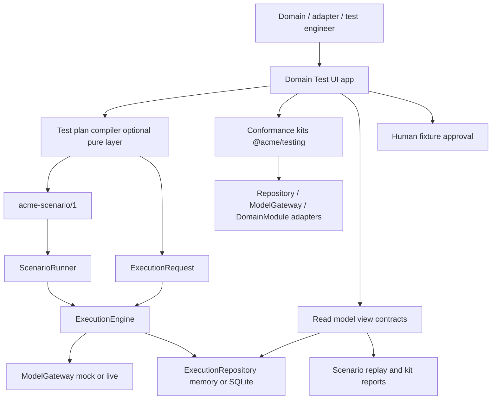

# Domain Test UI — Specification

Status: Activated application specification. Gate freezes accepted and phases
0–3 delivered by ACME-0039, ACME-0040 and ACME-0041 under
[ADR-0019](../adr/0019-domain-test-ui-boundary-and-view-contracts.md) and
[ADR-0020](../adr/0020-acme-test-plan-schema-and-compiler.md);
phases 4–6 remain unimplemented and each needs its own charter.
Audience: ACME maintainers, domain engineers, test engineers and reviewers
Prepared: 2026-07-30
Last revised: 2026-08-02 (ACME-0041 — phase 3 plan compiler implemented)

## Executive summary

ACME's verification model is precise, but today it is expressed as command-line
gates, scenario YAML, conformance kits and prose. A domain or adapter engineer
who wants to configure a run, inspect what the engine actually did and judge an
outcome still has to read raw JSON reports and ledger rows.

This document specifies a **Domain Test UI** (working name: *TestRegistry
Workbench*): a local human surface for configuring and launching module and
adapter tests, and for inspecting, validating and measuring their outcomes.

The interface is a **composition-root application over existing boundaries**.
It introduces no engine behavior, no canonical state and no domain vocabulary
in core. Everything it shows is evidence the ledger, repository ports, scenario
reports and conformance kits already own. Everything it runs is an artifact
`acme-scenario/1`, `ExecutionRequest` or a shared conformance suite already
describe.

> **Presentation takeaway:** the interface is a lens and a launcher, never a
> second source of truth. If a value is not derivable from committed evidence
> or a produced report, the interface must not display it as fact. Deleting the
> app must lose no canonical fact.

A visual mock lives under `docs/concepts_sandbox/` and is **not** authority.
See [Visual mock (non-authority)](#visual-mock-non-authority).

## How to read this guide

- **Approved baseline** restates the normative ACME specification, current
  `@acme/core` contracts and accepted ADRs.
- **Recommended** translates that baseline into interface behavior without
  changing a public contract.
- **Proposed freeze (ACME-0038)** recorded a recommended irreversible decision
  for maintainers. **All seven were accepted unchanged by ACME-0039 in
  ADR-0019**, which remains the authority for them. Gate 3's own ADR
  requirement is discharged by ADR-0020 (ACME-0041).

Each remaining phase still requires its own explicit task charter. Acceptance
of the gates authorized the build order, not the whole application.

## Outcome and boundaries

### The interface owns

- presenting the catalog of registered modules, tasks, contracts, evaluators,
  adapters, scenarios and fixtures
- authoring, validating and versioning a declarative **test plan** that
  compiles into approved run artifacts
- launching **module** runs through the same entry points the CLI uses
  (ScenarioRunner / ExecutionEngine)
- launching **adapter** and **module kit** runs through the same conformance
  suites CI uses
- rendering execution lifecycle, ledger, model-call, memory-decision,
  state-transition and evaluator evidence
- rendering replay and digest comparison outcomes
- aggregating results into measurements against explicitly configured
  thresholds
- routing a proposed golden-fixture change to a human approver
- enforcing redaction, retention and budget rules at the presentation boundary

### The interface does not own

- execution orchestration, retry, cancellation, timeout or budget accounting
- model selection, provider transport or response normalization
- domain identity, equivalence, contradiction, relevance or invariant rules
- memory IDs, timestamps, provenance, record versions or state revisions
- persistence transactions, compare-and-swap or outbox delivery
- the definition of pass or fail for a deterministic test
- canonical storage of results

A deterministic test's verdict is produced by the runner, the engine or the
conformance kit — not by the interface. The interface may **show** a verdict,
**compare** two verdicts and **measure** a series of verdicts. It must never
compute one from partial evidence.

## Architectural position

**Approved baseline.** Dependency direction is
`apps → adapters → core` and `apps → modules → core`.
The interface is an app. It sits beside `@acme/cli`, not inside core.



**Forbidden for this app.**

- importing `@acme/core` internals that are not exported ports or types
- reaching into an adapter's private store instead of the repository port
- deciding domain equivalence, contradiction or invariants
- writing canonical documents, memory, state or events
- introducing reference-domain vocabulary into `packages/core`
- executing arbitrary JavaScript or shell input supplied through the interface

**Recommended.** `dependency-cruiser` gains an explicit rule set for the new
app package at activation time, plus a negative fixture proving a forbidden
import fails.

## Readiness prerequisites

**As of 2026-08-01**, engine-side prerequisites are **satisfied**. Milestone 1
and Milestone 2 are delivered, and the gate freezes below are accepted
(ADR-0019). What remains is product priority and a charter per phase — not
missing ScenarioRunner or durability.

| Prerequisite | Status | Why the interface needs it |
| --- | --- | --- |
| `ExecutionEngine` | Satisfied (ACME-0018) | lifecycle, attempts, terminal results, replay |
| `ScenarioRunner` + `acme-scenario/1` | Satisfied (ACME-0027) | multi-step offline domain tests and JSON reports |
| Reference modules | Satisfied (Narrative + Research) | something domain-specific to configure and measure |
| DomainModule conformance kit | Satisfied (ACME-0015) | module-kit verdicts for adapter/module workbench |
| Repository + gateway conformance kits | Satisfied | adapter workbench without inventing new suites |
| `@acme/adapter-sqlite` | Satisfied (ACME-0021) | durable run history |
| CLI composition root | Satisfied (ACME-0026 / 0032) | same launch paths; live execute exists on CLI |
| Encrypted-payload retention | Satisfied when encryptor supplied (ACME-0030) | honest live-retained payloads |
| Durable resume / rollback / CAS proofs | Satisfied (ACME-0033 / 0034) | interrupted runs stay trustworthy |
| Outbox delivery boundary | Satisfied (ACME-0035) | committed events can leave the ledger when drained |

**Known residuals that affect UI design but do not block a local offline UI:**

- ScenarioRunner has no live provider step (CLI live execute exists separately).
- Live evaluation in the UI remains gated and last in the build plan.
- Outbox is not auto-drained; the UI must not pretend events deliver themselves.

## Visual mock (non-authority)

Path:

`docs/concepts_sandbox/temp/testregistry_workbench_professional_test_engineering_suite.html`

Title in mock: **TestRegistry Workbench — Professional Test Engineering Suite**.

The mock is a static HTML/React sketch. It may inform layout, navigation labels
and visual density. It must **not** be cited as architecture, API shape or
verification authority. Normative behavior lives only in this document, ADRs
and `@acme/core` contracts.

| Mock surface | Maps toward |
| --- | --- |
| Catalog | S1 |
| Test Plans | S2 |
| Run History | S3 list + history index |
| Execution Inspector | S4–S7 |
| Results / analytics | S8 |
| Fixture pending approval + rationale | S9 |
| Status tokens (pass / fail / blocked / ambiguous / warning) | ACME terminal and model-call vocabulary |

## Two workbench modes

One application, two explicit **subjects**. Mixing them in one undifferentiated
"run" confuses domain outcomes with port-conformance outcomes.

### Module workbench

**Question:** does this domain task behave correctly under a pinned composition?

**Runs via:** ScenarioRunner and/or single-task ExecutionEngine (same as CLI).

**Shows:** lifecycle, model calls (including `ambiguous`), trust pipeline,
memory decisions, state revisions, digests, replay reports.

### Adapter workbench

**Question:** does this port implementation pass the shared kit?

**Runs via:** existing conformance suites in `@acme/testing` (repository,
`ModelGateway`, `DomainModule`) against a selected implementation.

**Shows:** per-case kit verdicts and diagnostics. It does **not** narrate a
domain story and does not invent adapter-specific domain UI.

### Shared composition profile

Before any launch, the engineer pins:

| Field | Examples |
| --- | --- |
| Subject | module task *or* adapter kit target |
| Repository | `memory` \| `sqlite` |
| Gateway | `mock` (+ script) \| named live adapter (gated) |
| Retention | mirrors `ExecutionPolicy.retention` |
| Seed | fixture clock + deterministic ID strategy |
| Policy ceilings | timeout, max model/repair/revision calls, optional cost |

Composition is first-class so the same module can be inspected against memory
versus SQLite without UI-owned domain rules.

## Vocabulary

| Interface term | Approved meaning |
| --- | --- |
| Catalog | immutable contract/module registries plus discovered scenarios, fixtures and adapter targets |
| Test plan | declarative configuration that compiles into scenario files and `ExecutionRequest` values |
| Composition profile | repository + gateway + retention + seed + policy for a run |
| Seed | fixture clock and deterministic ID strategy |
| Run | one execution of a plan or kit suite, producing one report |
| Case | one `execute` step (module) or one kit case (adapter) |
| Evidence | ledger records the repository already owns |
| Verdict | pass/fail/blocked/conflicted (or kit equivalent) from runner/engine/kit |
| Measurement | aggregate over verdicts and evidence against a configured threshold |
| Baseline | previously approved run used for comparison |
| View contract | versioned JSON shape for a surface; asserted without rendering |

## Test-layer coverage

| Layer | Interface role |
| --- | --- |
| unit | read-only health strip; never configure or re-run as the primary path |
| type contract | read-only health strip |
| conformance | **adapter workbench primary:** select implementation, run kit, show cases |
| integration | configure durable composition; show CAS/rollback/migration outcomes when evidence exists |
| scenario | **module workbench primary:** author, execute, inspect, measure |
| fault injection | select a named injection point when the engine exposes one |
| live evaluation | gated, budgeted, visually separated; never feeds deterministic verdicts |

## Surface map

| ID | Surface | Primary question |
| --- | --- | --- |
| S1 | Catalog | what modules, contracts, adapters, scenarios and fixtures exist? |
| S2 | Test plan designer | what exactly will run, against what composition? |
| S3 | Run console and history | what is running / what ran, and how far did it get? |
| S4 | Execution inspector | what did the engine do, stage by stage? |
| S5 | Memory decision inspector | which candidates became which decisions, and why? |
| S6 | State inspector | what changed in canonical state, at which revision? |
| S7 | Replay and digest comparison | is this execution reproducible? |
| S8 | Results and measurement | across runs, is quality moving the right way? |
| S9 | Fixture review | should this proposed golden change be accepted? |
| S10 | Live evaluation | what did a budgeted provider run cost and score? |

Every surface exposes a **versioned machine-readable view contract** before
(or without) rich rendering. Screenshots are not the verification deliverable.

### S1 — Catalog

**Reads.** Contract and module registries (deterministic order, fingerprints);
discovered scenario and fixture trees under a configured root; registered
adapter targets for conformance.

**Shows.** Namespace, tasks, contract ID/version/fingerprint, required
capabilities, evaluators, scenarios/fixtures that reference them, and adapter
kit entry points.

**Rules.**

- Registry order is registry order, not cosmetic re-sort.
- Fingerprints are shown in full and are copyable.
- Discovery stays below the configured root; reject traversal and include
  cycles.

**Implemented by ACME-0040.** Two constraints the specification did not
anticipate are recorded here rather than worked around:

- Core registers no evaluators. It owns `EvaluationDecision` and records
  `PreparedEvaluatorRun` evidence per run, but nothing enumerates evaluators,
  so the catalog's evaluator section is `unavailable`. An empty list would
  claim the system has none.
- Nothing registers adapter implementations either; the CLI composition root
  hard-codes them. Adapter targets are therefore declared by the caller, and
  the catalog validates only the kit name against the kits `@acme/testing`
  publishes.

Cycles are excluded by never following symbolic links, which also keeps the
walk inside the root.

### S2 — Test plan designer

**Purpose.** Turn intent into an approved artifact (module workbench).

**Configurable groups (summary):** identity metadata; seed; composition;
target (namespace, task, entity, expected revision); input fixture reference;
mock script references when gateway is mock; policy; evaluators; expectations;
ordered steps (`execute`, `assert`, `replay`, `assertDigest`).

**Rules.**

- Fields validate against the same runtime schemas the engine uses.
- The designer shows the **compiled** `acme-scenario/1` (and request summary)
  before launch.
- Plans are content-addressed: identical compiled artifacts ⇒ same plan.
- No executable fields, no `eval`, no shell escape.

### S3 — Run console and history

**Reads.** Live stage projection plus historical run index and scenario/kit
reports.

**Shows.** Queue/progress, elapsed vs deadline, `ExecutionStatus`, attempts,
model calls vs ceiling, cost vs ceiling; historical list with stable ordering.

**Rules.**

- Status is a projection over an append-only log, not a field the UI owns.
- Cancellation only where the engine accepts it; never rolls back a commit.
- The console never retries on the user's behalf.

### S4 — Execution inspector

**Panels:** header (IDs, fingerprints, policy, terminal status); attempt
timeline; model calls (including distinct **ambiguous**); read set; trust
pipeline (`normalize → parse → schema → semantics → interpret → evaluate →
memory → projection → state → commit`); prepared commit; `AcmeErrorData`.

**Rules.**

- Non-repairable input failures are distinct from response validation.
- Contract input and task input are separate values.
- Permitted BOM/fence cleanups surface as warnings; coercion is failure.
- Payloads redacted by default.

### S5 — Memory decision inspector

Three-column correlation:

```text
MemoryCandidate  →  decision + domain reason  →  prepared mutation
```

Ignored and rejected candidates remain visible as audit evidence and are not
silently dropped from the inspector.

### S6 — State inspector

Revision lineage, value hashes, schema versions, and the delta the reducer
accepted. Domain field meaning stays in the module; the UI renders structure
and identity, not domain policy.

### S7 — Replay and digest comparison

Distinct outcomes in the engine's exact vocabulary, with hash/digest diffs.
Never invent a match from partial evidence.

**Resolved by ADR-0019.** `ReplayReport.status` is `match | different |
unavailable`. The implemented view uses exactly those three and adds no
`forked` outcome, because the engine cannot produce one and the interface must
not compute a verdict. "No replay was run" is a missing section
(`REPLAY_NOT_RUN`), which is distinct from the engine's own `unavailable`.

### S8 — Results and measurement

Aggregates only against configured thresholds and baselines. No baseline ⇒ no
regression claim. Case counts always stated. Live and deterministic series are
never mixed into one deterministic score.

### S9 — Fixture review

Human approval of a proposed golden change. Approve/reject requires an
approver identity (local config) and a non-empty rationale. No automatic
acceptance. Produces a reviewable repo change path, not a silent fixture write.

### S10 — Live evaluation

Absent unless environment opt-in. Confirmation names provider, case count and
cost ceiling. Credentials never enter the UI. Live results are visually
separated and never feed deterministic verdicts. Prefer CLI live execute until
this phase ships.

## Test plan configuration model

**Freeze accepted; schema shipped (ACME-0041).** `acme-test-plan/1` is
exported from `@acme/test-ui` and governed by
[ADR-0020](../adr/0020-acme-test-plan-schema-and-compiler.md), which discharges
the gate-3 ADR requirement. Two deviations from the sketch below are recorded
there rather than hidden: a plan carries no `measurements` block, because
nothing enforces a threshold until S8 in phase 5; and a plan names no model,
because `acme-scenario/1` reads the `ModelSelection` from the mock-response
fixture. The illustrative shape below is retained as intent.

```yaml
schemaVersion: acme-test-plan/1
name: narrative-observe-baseline
seed:
  clock: "2026-01-01T00:00:00.000Z"
  ids: sequential
composition:
  repository: memory
  gateway: mock
policy:
  timeoutMs: 30000
  maxModelCalls: 1
  maxRepairCalls: 1
  maxRevisionCalls: 0
  retention: hash-only
cases:
  - id: chapter-1-revision-0
    namespace: narrative
    task: observe-document
    entityId: story-1
    expectedRevision: 0
    input: inputs/chapter-1.json
    mockResponse: responses/chapter-1.json
    expect:
      status: committed
      revision: 1
      digest: digests/narrative-001.json
    replay:
      mode: verify
measurements:
  replayMatchRate:
    min: 1
```

Compilation rules:

- Compiles only to `acme-scenario/1` and `ExecutionRequest` (and kit launch
  descriptors where applicable). Nothing else.
- Deterministic and pure; byte-identical for identical plans.
- The compiled artifact is the reviewable unit; the plan is convenience.
- References resolve under the scenario root; no credentials, no absolute
  machine paths, no personal data.

**Alternative rejected for default.** Editing only `acme-scenario/1` in the UI
removes a contract but leaves measurement identity and human plan ergonomics
underspecified. Scenarios stay canonical; the plan stays thin.

## Engine read and write contract

| Interface need | Allowed source |
| --- | --- |
| execution header and terminal result | `ExecutionRepository` load APIs |
| attempt timeline | stored attempts |
| model-call evidence | stored model-call records |
| loaded context | recorded read set |
| prepared effects and digest | recorded prepared commit |
| current state and memory | repository port reads |
| replay outcome | `ExecutionEngine.replay` / stored replay evidence |
| scenario outcome | ScenarioRunner JSON report |
| conformance verdicts | kit report output |

**Writes the interface may perform:**

1. **Launch** a compiled run or kit through existing entry points.
2. **Persist interface-owned artifacts** (plans, history index, baselines,
   thresholds, approval records) in storage clearly separate from the ledger.
3. **Record human approval** of a fixture proposal as a reviewable change.

**Never:** `commit`, `markTerminal`, append/reserve/complete model calls, or
any direct mutation of snapshots, memory, documents or events.

**Proposed freeze (gate 4).** Interface-owned artifacts live as **files under a
configured workspace root** (plans, baselines, approval records) plus an
optional **separate SQLite file** for run-history index if file-only listing is
insufficient. They must **not** share tables with the ACME canonical ledger.
Run evidence continues to live in the execution repository the composition
already selected.

## Determinism, safety and privacy

| Data class | Interface default |
| --- | --- |
| public metadata (contract ID, versions) | shown |
| operational metadata (status, hashes, tokens) | shown |
| content (prompts, responses, documents, values) | redacted until explicit reveal |
| secrets | never handled |
| direct identifiers / personal data | prohibited in fixtures |

**Rules (summary).**

- Reveal mirrors local development/test only; not a production browser habit.
- Retention mode displayed per run; `none` / `hash-only` state that payloads
  were never stored rather than looking empty-by-bug.
- Fixture clock and deterministic IDs only; no wall-clock injection into runs.
- Model text is inert data, never an instruction to the UI.
- No destructive database reset in v1.

## Non-functional requirements

- **Local-first** and **offline** for every deterministic surface.
- **Machine-readable first:** view contracts asserted as JSON.
- **Bounded reads** and **stable ordering** with documented tie-breakers.
- **Accessible:** every state has a text label, not color alone.
- **No hidden mutation:** every write control states what it writes.

## Proposed package structure

**Proposed freeze (gate 2).** Local static SPA + thin local composition process
that wraps the same ports and entry points as `@acme/cli`. Not a remote
multi-tenant service in v1.

```text
apps/test-ui/
├── package.json
├── tsconfig.json
├── src/
│   ├── index.ts                 # process entry / composition root
│   ├── composition.ts
│   ├── plan/
│   │   ├── schema.ts
│   │   └── compile.ts
│   ├── read-model/
│   │   ├── execution.ts
│   │   ├── memory.ts
│   │   ├── state.ts
│   │   ├── replay.ts
│   │   ├── catalog.ts
│   │   └── measurement.ts
│   ├── kits/                    # launch wrappers for conformance suites
│   ├── redaction.ts
│   └── web/                     # SPA views; no business verdicts here
└── test/
    ├── plan-compile.test.ts
    ├── read-model.test.ts
    ├── redaction.test.ts
    └── view-contract.test.ts
```

Pure read model and plan compiler stay testable without a browser. The package
depends on `@acme/core`, `@acme/testing` and composed adapters. Nothing imports
the app package back.

## Ordered build plan

Each phase has an exit condition. Each phase needs its own activated charter.

### Phase 0 — Gate freeze and package skeleton (docs + boundaries only) — **done (ACME-0039)**

1. Accept or amend the proposed freezes in an implementation charter.
2. Add `apps/test-ui` skeleton and dependency-cruiser rules (no UI chrome
   required).

**Exit:** gates recorded as accepted in the charter; boundaries enforced.

**Met.** ADR-0019 accepts all seven gates. `apps/test-ui` exists with two
dependency-cruiser rules and a negative fixture for each: the app may not
import a package internal, and nothing may import the app.

### Phase 1 — Read model over fixture evidence — **done (ACME-0039)**

1. Versioned view contracts for S4, S5, S6 and S7.
2. Read model against recorded evidence fixtures (no live engine required).
3. Redaction and retention-mode presentation rules.

**Exit:** every view contract asserted by tests with no network and no browser.

**Met.** `acme-view-execution/1`, `acme-view-memory-decisions/1`,
`acme-view-state/1` and `acme-view-replay/1` are built by pure functions and
asserted as JSON. Absence renders as an `unavailable` section with a reason
code; `none` and `hash-only` model payloads render `not-retained`; content is
redacted unless a build reveals it. An integration test proves the same
contracts over evidence a real offline engine run recorded.

### Phase 2 — Catalog and adapter kit listing — **done (ACME-0040)**

1. S1 over registries + scenario discovery + adapter kit targets.
2. Optional read-only health strip for unit/type (external report ingest only).

**Exit:** catalog is complete and deterministically ordered in tests.

**Met for item 1.** `acme-view-catalog/1` renders modules and contracts in
registry order with task declaration order preserved, full fingerprints,
contract-to-task cross-links, discovered scenarios classified by the runner's
own `parseScenario`, fixture references resolved or refused, orphan fixtures
labelled and declared adapter targets validated against the published kits.
Discovery is bounded, refuses symlinks and lives on a separate entry point.

**Item 2 deliberately not built.** The health strip is optional in this
specification and depends on ingesting an external unit/type report that
nothing in the repository produces. Building a strip with no report to read
would mean inventing the report, which the boundary forbids.

### Phase 3 — Plan schema and compiler — **done (ACME-0041)**

1. `acme-test-plan/1` schema + ADR at activation.
2. Pure deterministic compile to `acme-scenario/1` / `ExecutionRequest`.
3. Golden-test compiled output.

**Exit:** valid plans compile byte-identically; invalid plans cannot compile.

**Met.** [ADR-0020](../adr/0020-acme-test-plan-schema-and-compiler.md) governs
the schema. The compiler is pure and total, a golden pins the compiled bytes,
and unknown fields, missing seeds, bad policies, duplicate identities, an
invalid request hash and traversing references all refuse before emitting.
A compiled plan equivalent to the Narrative Phase 5 scenario runs through the
existing CLI path and reaches the digest the hand-written acceptance test
pins.

### Phase 4 — Authoring, launch and history (offline)

1. S2/S3 over mock gateway + memory/SQLite composition.
2. Launch via ScenarioRunner / engine entry points only.
3. History index from interface storage + evidence from repository.

**Exit:** a domain engineer can configure, launch and inspect an offline module
run end to end.

### Phase 5 — Measurement, fixture review

1. S8 thresholds and baselines.
2. S9 approval with mandatory rationale.

**Exit:** measurements reproducible from stored evidence; no silent golden
updates.

### Phase 6 — Gated live evaluation (optional)

1. S10 behind env opt-in, confirmation and budget.
2. Visual separation from deterministic results.

**Exit:** live runs impossible without explicit opt-in; credentials never in UI.

> **Why not plan-compiler first?** After Milestone 2 the expensive missing
> piece is human inspection of evidence, not the ability to run scenarios (CLI
> and ScenarioRunner already do that). View contracts unlock the inspector and
> make the mock's Execution Inspector honest before inventing another YAML
> dialect.

## Verification plan for the interface

| Area | Required cases |
| --- | --- |
| Plan schema | valid minimal/full; missing seed; unknown field; bad policy; traversal |
| Compilation | deterministic bytes; uncompilable rejected |
| Read model | every view shape; missing evidence ⇒ unavailable, not zero |
| Ordering | memory decision order; registry order; stable ties |
| Redaction | content hidden by default under every retention mode |
| Trust pipeline | reached/passed/failed/not-reached; distinct non-repairable input codes |
| Replay | match/different/unavailable/forked distinct |
| Measurement | no baseline ⇒ no regression claim |
| Fixture review | no auto-accept; rationale required |
| Live gating | composition absent without opt-in |
| Safety | no shell/script surface; no credentials; model text inert |
| Boundaries | app imports no core internal; nothing imports the app |
| Kits | adapter workbench only launches existing kits; no parallel suite |

- View-contract tests assert JSON, not markup.
- Injected clocks and IDs only.
- No network in default package tests.

## Proposed gate freezes

These replaced the open "decision gates" list from the 2026-07-30 draft. All
seven were **accepted unchanged** by ACME-0039 and are now recorded in
[ADR-0019](../adr/0019-domain-test-ui-boundary-and-view-contracts.md), which is
their authority. The table is retained as the rationale.

| # | Gate | Proposed freeze |
| --- | --- | --- |
| 1 | Exist in version 1? | **Yes, as a local-only developer/test workbench**, not as a required CI path. CI remains CLI and `pnpm` gates. Priority still competes with other residuals; activation is explicit. |
| 2 | Runtime and shape | **Local static SPA + thin local composition process** wrapping CLI-equivalent entry points. No remote multi-user service in v1. |
| 3 | `acme-test-plan/1` | **Adopt** a thin compilable plan; **ADR required** when the schema is first exported. Scenarios remain the canonical executable artifact. |
| 4 | Interface storage | **Files under a workspace root** for plans/baselines/approvals; optional **separate** SQLite for history index. **Never** share ledger tables. |
| 5 | Live runs in UI | **Allowed only in a late phase**, behind env opt-in, confirmation and budget. Until then CLI live execute is the supported live path. |
| 6 | Authorization | **Localhost / local process only** in v1. Any network exposure requires a new ADR and is out of v1. |
| 7 | Relationship to CLI | **CLI remains the sole supported CI and automation entry point.** The UI is a human lens and launcher, not a second automation surface. |

## Team review checklist

- [ ] Does every surface read only evidence the ledger, report or kit already owns?
- [ ] Can the interface be deleted without losing a single canonical fact?
- [ ] Is every displayed verdict produced by engine, runner or kit — not the UI?
- [ ] Are module and adapter workbenches clearly separated?
- [ ] Are ignored/rejected memory candidates visible as audit evidence?
- [ ] Is prepared memory decision order preserved?
- [ ] Are content payloads redacted by default?
- [ ] Is a live run impossible without explicit opt-in, confirmation and budget?
- [ ] Is automatic golden-fixture acceptance impossible?
- [ ] Does the plan compile only into approved artifacts?
- [ ] Does the app introduce no domain vocabulary into core?
- [ ] Is the concepts_sandbox mock treated as non-authority?

## References

- [ACME project brief](../PROJECT_BRIEF.md)
- [ACME design and development specification](acme-design-and-development-spec.md)
- [Current status](../CURRENT_STATUS.md)
- [System documentation](../SYSTEMDOC.md)
- [Backlog proposal — Domain test UI implementation](../backlog/domain-test-ui-implementation.md)
- [Concepts sandbox README](../concepts_sandbox/README.md)
- [ADR-0002 Static task-typed module composition](../adr/0002-static-task-typed-module-composition.md)
- [ADR-0005 Pure memory decision application](../adr/0005-pure-memory-decision-application.md)
- [ADR-0006 Aggregate in-memory Unit of Work](../adr/0006-aggregate-in-memory-unit-of-work.md)
- [ADR-0007 Deterministic model mock and gateway conformance](../adr/0007-deterministic-model-mock-and-gateway-conformance.md)
- [ADR-0008 Post-memory domain state projection](../adr/0008-post-memory-domain-state-projection.md)
- [ADR-0010 Input-bound validation and interpretation](../adr/0010-input-bound-validation-and-interpretation.md)
- [ADR-0014 Live provider boundary](../adr/0014-live-provider-boundary-and-transport-port.md)
- [ADR-0016 Encrypted payload retention](../adr/0016-encrypted-payload-retention.md)
- [ADR-0017 Durable execution resume](../adr/0017-durable-execution-resume.md)
- [ADR-0018 Outbox delivery boundary](../adr/0018-outbox-delivery-boundary.md)
- [ADR-0019 Domain Test UI boundary and view contracts](../adr/0019-domain-test-ui-boundary-and-view-contracts.md)
- Narrative / Research module build plans in this directory
