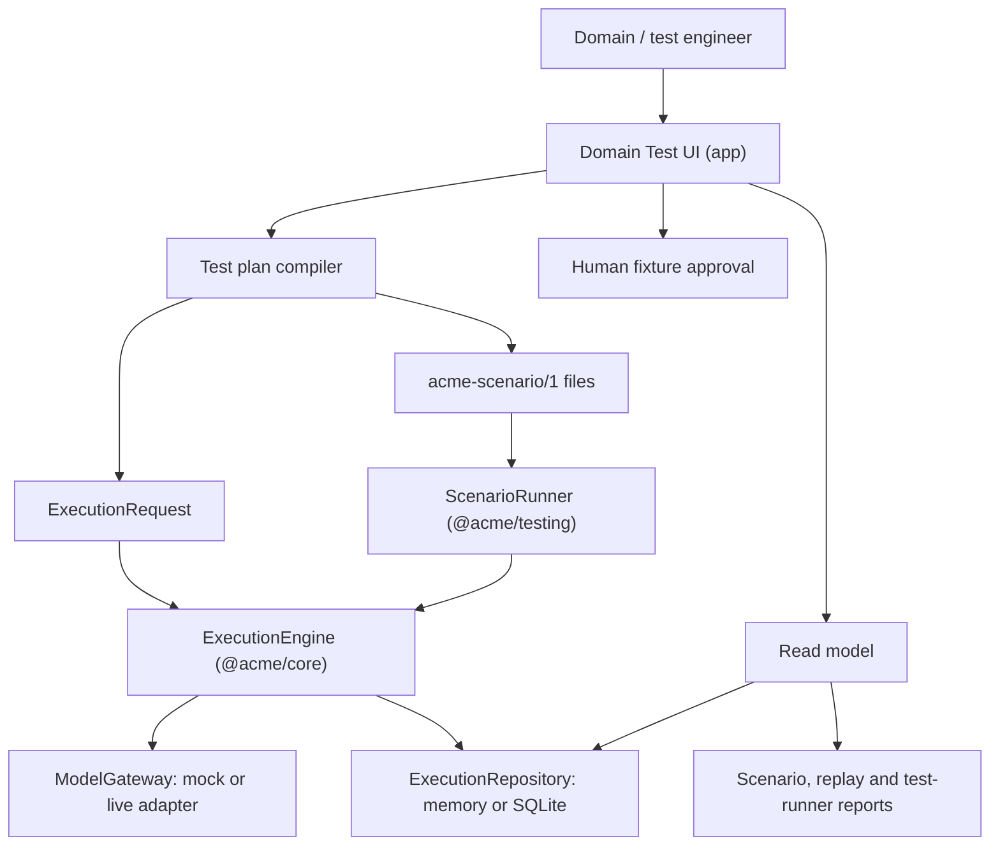

# Domain Test UI — Specification

Status: Proposed application specification, not activated  
Audience: ACME maintainers, domain engineers, test engineers and reviewers  
Prepared: 2026-07-30

## Executive summary

ACME's verification model is already precise, but it is only expressed as
command-line gates, scenario YAML and prose test matrices. A domain engineer
who wants to configure a reference-module test, watch what the engine actually
did and judge whether the outcome is acceptable currently has to read raw JSON
reports and ledger rows.

This document specifies a **Domain Test UI**: a human surface for setting up,
configuring and executing domain tests, and for inspecting, validating and
measuring their outcomes.

The interface is a **composition-root application over existing boundaries**.
It introduces no engine behavior, no canonical state and no domain vocabulary
in core. Everything it shows is evidence that the ledger, repository ports and
existing report types already own. Everything it runs is an artifact the
approved `acme-scenario/1` format and `ExecutionRequest` already describe.

> **Presentation takeaway:** the interface is a lens and a launcher, never a
> second source of truth. If a value is not derivable from committed evidence
> or a produced report, the interface must not display it as fact.

## How to read this guide

- **Approved baseline** restates the normative ACME specification, current
  `@acme/core` contracts and accepted ADRs.
- **Recommended** translates that baseline into interface behavior without
  changing a public contract.
- **Decision gate** marks an unresolved boundary that must be approved before
  the affected implementation begins.

This document is a specification for review. Nothing in it is implemented, and
nothing in it authorizes implementation. See
[Readiness prerequisites](#readiness-prerequisites) and
[Decision gates](#decision-gates).

## Outcome and boundaries

### The interface owns

- presenting the catalog of registered modules, tasks, contracts, evaluators,
  scenarios and fixtures
- authoring, validating and versioning a declarative **test plan** that
  compiles into approved run artifacts
- launching runs through the same entry points the CLI uses
- rendering execution lifecycle, ledger, model-call, memory-decision,
  state-transition and evaluator evidence
- rendering replay and digest comparison outcomes
- aggregating results into measurements against explicitly configured
  thresholds
- routing a proposed golden-fixture change to a human approver
- enforcing redaction, retention and budget rules at the presentation boundary

### The interface does not own

- execution orchestration, retry, cancellation, timeout or budget accounting
- model selection, provider transport or response normalization
- domain identity, equivalence, contradiction, relevance or invariant rules
- memory IDs, timestamps, provenance, record versions or state revisions
- persistence transactions, compare-and-swap or outbox delivery
- the definition of pass or fail for a deterministic test
- canonical storage of results

The last two matter most. A deterministic test's verdict is produced by the
test runner and the engine, not by the interface. The interface may **show**
a verdict, **compare** two verdicts and **measure** a series of verdicts. It
must never compute one from partial evidence.

## Architectural position

**Approved baseline.** The allowed dependency direction is
`apps → adapters → core` and `apps → modules → core`
([specification §5.3](acme-design-and-development-spec.md#53-dependency-rules)).
The interface is an app. It sits beside `@acme/cli`, not inside core.



**Approved baseline — forbidden for this app.**

- importing `@acme/core` internals that are not exported ports or types
- reaching into an adapter's private store instead of the repository port
- deciding domain equivalence, contradiction or invariants
- writing canonical documents, memory, state or events
- introducing `narrative`, `research` or any other reference-domain vocabulary
  into `packages/core`
- executing arbitrary JavaScript or shell input supplied through the interface
  ([specification §18.1](acme-design-and-development-spec.md#181-scenario-format))

**Recommended.** `dependency-cruiser` gains an explicit rule set for the new
app package at activation time, plus a negative fixture proving that a
forbidden import fails, mirroring `tooling/boundaries/`.

## Readiness prerequisites

**As of 2026-08-01** (see [`docs/CURRENT_STATUS.md`](../CURRENT_STATUS.md)),
the engine-side prerequisites below are **satisfied**. This specification was
written when none of them existed; that historical claim is obsolete. What
still blocks activation is the set of **decision gates** later in this
document (runtime shape, `acme-test-plan/1`, storage, v1 scope), not missing
ExecutionEngine or ScenarioRunner.

| Prerequisite | Status | Why the interface needs it |
| --- | --- | --- |
| `ExecutionEngine` | Satisfied (ACME-0018) | produces lifecycle stages, attempts, terminal results and replay reports |
| `ScenarioRunner` in `@acme/testing` | Satisfied (ACME-0027) | executes a multi-step domain test and emits the JSON report the interface renders |
| Reference modules | Satisfied (Narrative + Research) | give a domain test something domain-specific to configure and measure |
| Reusable DomainModule conformance kit | Satisfied (ACME-0015) | supplies the module-level verdicts the results view aggregates |
| `@acme/adapter-sqlite` | Satisfied (ACME-0021) | gives run history a durable home |
| CLI composition root | Satisfied (ACME-0026) | selects adapters outside the test suite |
| Encrypted-payload retention | Satisfied when encryptor supplied (ACME-0030) | any live-retained payload path must not store cleartext |

Phases 1 and 2 of the [build plan](#ordered-build-plan) can still begin against
fixture reports rather than a live engine, once the decision gates they depend
on are resolved.

## Vocabulary

The interface introduces no new engine concept. Its vocabulary maps one to one
onto approved terms.

| Interface term | Approved meaning |
| --- | --- |
| Catalog | the immutable contract and module registries plus discovered scenario and fixture files |
| Test plan | a declarative, validated configuration that compiles into scenario files and `ExecutionRequest` values |
| Composition profile | the `composition` block: which repository and gateway adapter a run uses |
| Seed | the fixture clock and deterministic ID strategy the run is pinned to |
| Run | one execution of a test plan, producing one report |
| Case | one `execute` step inside a run, resolving to one `executionId` |
| Evidence | ledger records the repository already owns: execution, attempts, model calls, read set, prepared commit, terminal record |
| Verdict | a pass/fail/blocked/conflicted outcome produced by the runner or engine |
| Measurement | an aggregate over verdicts and evidence, compared against a configured threshold |
| Baseline | a previously approved run whose measurements a new run is compared against |

## Test-layer coverage

**Approved baseline.**
[Specification §19.1](acme-design-and-development-spec.md#191-test-layers)
defines seven test layers. The interface does not drive all of them equally.

| Layer | Interface role |
| --- | --- |
| unit | read-only: show the latest verdict and history; never configure |
| type contract | read-only: show whether the compile-time gate passed |
| conformance | configure which adapter or module implementation the shared kit runs against; show per-case verdicts |
| integration | configure the durable composition profile; show migration, CAS and rollback outcomes |
| scenario | full authoring, execution, inspection and measurement |
| fault injection | select a named injection point and show the resulting evidence |
| live evaluation | gated authoring and execution under an explicit budget; measurement only |

The **scenario layer is the interface's primary subject**. Unit and type
verdicts appear only as an aggregated health strip, because their source of
truth is `pnpm test:unit` and `pnpm typecheck`.

## Surface map

| ID | Surface | Primary question it answers |
| --- | --- | --- |
| S1 | Catalog | what modules, tasks, contracts, evaluators and fixtures exist? |
| S2 | Test plan designer | what exactly will run, against what composition? |
| S3 | Run console | what is running now, and how far did it get? |
| S4 | Execution inspector | what did the engine actually do, stage by stage? |
| S5 | Memory decision inspector | which candidates became which decisions, and why? |
| S6 | State inspector | what changed in canonical state, at which revision? |
| S7 | Replay and digest comparison | is this execution reproducible? |
| S8 | Results and measurement | across runs, is quality moving in the right direction? |
| S9 | Fixture review | should this proposed golden change be accepted? |
| S10 | Live evaluation | what did a budgeted provider run cost and score? |

Every surface must expose its data as a **versioned machine-readable view
contract** before it is rendered. Screenshots are not the deliverable of a
verification tool; a stable JSON shape that a test can assert against is.

### S1 — Catalog

**Reads.** The immutable contract and module registries, their deterministic
ordering and contract fingerprints; the scenario and fixture directories under
the configured scenario root.

**Shows.** Namespace, task names with their inferred input/output types,
contract ID and version, contract fingerprint, declared required
capabilities, registered evaluators with `id` and `version`, and the scenario
and fixture files that reference each of them.

**Rules.**

- Registry order is deterministic and must be presented in registry order, not
  re-sorted for cosmetic reasons.
- A contract fingerprint is shown in full and is copyable; a truncated hash is
  a display convenience, never the value a reviewer compares.
- File discovery must stay below the configured scenario root, must reject
  traversal and must reject include cycles
  ([specification §21.1](acme-design-and-development-spec.md#211-threat-boundaries)).

### S2 — Test plan designer

**Purpose.** Turn intent into an approved artifact. This is the "set up and
configure" half of the interface.

**Configurable groups.**

| Group | Fields | Constraint |
| --- | --- | --- |
| Identity | plan name, description, owner | free text, no effect on execution |
| Seed | fixture clock instant, ID strategy | required; a run without a pinned seed is not a domain test |
| Composition | repository `memory` or `sqlite`, gateway `mock` or a named live adapter | live selection is gated, see S10 |
| Target | namespace, task, entity ID, expected revision | must resolve in the catalog |
| Input | fixture reference | a file reference below the scenario root, never inline model-authored text |
| Model script | mock profile and call script references | required whenever the gateway is `mock` |
| Policy | `timeoutMs`, `maxModelCalls`, `maxRepairCalls`, `maxRevisionCalls`, optional token and cost ceilings, `retention` | mirrors `ExecutionPolicy` exactly |
| Evaluators | which registered evaluators participate | order does not change the verdict; all deterministic evaluators run |
| Expectations | expected status, revision, digest fixture, expected memory decisions | compiles to `assert` and `assertDigest` steps |
| Steps | ordered `execute`, `assert`, `replay`, `assertDigest` | serial, alias-resolved |

**Rules.**

- Every field is validated against the same runtime schema the engine uses. A
  plan that cannot compile cannot be launched.
- The designer must show the compiled artifact before launch. A user who
  cannot read the generated `acme-scenario/1` YAML cannot review what they are
  about to run.
- The plan is content-addressed. Two plans that compile to identical artifacts
  are the same plan.
- No field accepts executable input. There is no scripting hook, no `eval`
  surface and no shell escape
  ([specification §18.1](acme-design-and-development-spec.md#181-scenario-format)).

### S3 — Run console

**Reads.** Live run progress plus, for each case, the execution's current
stage projection.

**Shows.** Queue position, elapsed time against the configured deadline, the
current `ExecutionStatus` per case, attempt count, model calls consumed
against `maxModelCalls`, and estimated cost against the configured ceiling.

**Approved baseline.** The lifecycle is
`accepted → loading → calling-model → validating → interpreting → evaluating →
preparing-commit → committed`, with `blocked`, `conflicted`, `cancelled` and
`failed` as the other terminal states
([specification §14.2](acme-design-and-development-spec.md#142-lifecycle)).
Stage changes and attempts are append-only ledger records; the current status
is a projection for inspection. The console must present it that way — as a
projection over an append-only log, never as a mutable field it owns.

**Rules.**

- Cancellation is offered only where the engine accepts it, and the interface
  must state plainly that cancellation cannot roll back a committed
  transaction.
- Budget exhaustion is displayed with the `BUDGET_EXCEEDED` code, not as a
  generic failure.
- The console never retries on the user's behalf. Retry is engine policy.

### S4 — Execution inspector

**Purpose.** The core "inspect the outcome" surface: what the engine did, in
order, with the evidence for each step.

**Reads.** `ExecutionRecord`, the `ExecutionAttempt` sequence, every
`ModelCallRecord`, the `ExecutionReadSet` loaded for the run, the
`PreparedCommit` and the `CommittedExecution` or `NonCommitTerminalRecord`.

**Panels.**

1. **Header** — execution ID, namespace, task, entity, request fingerprint,
   input hash, contract ref and fingerprint, effective policy, terminal status.
2. **Timeline** — one row per attempt: stage, outcome
   (`started`, `succeeded`, `failed`, `retry-scheduled`), scheduled retry time,
   diagnostic fact, timestamp.
3. **Model calls** — call key (`model:0`, `repair:<n>:<attempt>`,
   `revision:<evaluator-id>:<attempt>`), purpose, selection, request hash,
   status (`reserved`, `in-flight`, `succeeded`, `failed`, `ambiguous`),
   response hash, completion time.
4. **Read set** — the state snapshot, memory records and documents the run
   actually loaded, so a reviewer can see what the prompt could have seen.
5. **Trust pipeline** — the stage-by-stage view of
   `normalize → parse → schema → semantics → interpret → evaluate → memory →
   projection → state → commit`, each stage marked reached, passed, failed or
   not reached, with its diagnostics.
6. **Prepared commit** — documents, memory candidates, prepared memory,
   prepared state, evaluator runs, events and the `operationDigest`.
7. **Error** — `AcmeErrorData` with `code`, `stage`, `retryable`, details and
   `causeRef`.

**Rules.**

- The `ambiguous` model-call status must be visually distinct. It is the state
  that decides whether a resumed execution may call a provider again.
- The `input` stage precedes any response reading and is non-repairable
  ([ADR-0010](../adr/0010-input-bound-validation-and-interpretation.md)). Its
  three outcomes — `CONTRACT_INPUT_SCHEMA`,
  `CONTRACT_INPUT_NON_JSON_VALUE` and `CONTRACT_INPUT_SCHEMA_COERCION` — are
  shown with their own codes, and the surface must state that no response
  cleanup, parsing or semantic callback ran. Presenting them as ordinary
  validation failures would imply a repair that cannot happen.
- Contract input and task input are distinct and are displayed as separate
  values. Conflating them hides where `project()` sits.
- The permitted BOM and Markdown JSON-fence cleanups are surfaced as explicit
  warnings, never silently hidden. Schema coercion is a failure, not a fix.
- Payload panels are redacted by default. See
  [Determinism, safety and privacy](#determinism-safety-and-privacy).

### S5 — Memory decision inspector

**Purpose.** Make domain memory auditable, which is the hardest thing to read
in raw JSON.

**Approved baseline.** The MemoryEngine resolves candidates against an
evolving working set and produces `create`, `reinforce`, `merge`, `contest`,
`supersede-existing`, `reject-candidate` and `ignore` decisions
([ADR-0005](../adr/0005-pure-memory-decision-application.md)). Applied
decisions flow into task-owned state projection; `ignore` and
`reject-candidate` remain repository audit evidence and are absent from
projection input ([ADR-0008](../adr/0008-post-memory-domain-state-projection.md)).

**Shows.** A three-column correlation:

```text
MemoryCandidate  →  decision + domain reason  →  prepared mutation
                                                 (expected record version)
```

with the resulting record version, strength, status, provenance append and
affected memory IDs.

**Rules.**

- Prepared decision order is semantic and must be preserved in the display.
  Sorting the list by any other column is a view state that must be visibly
  marked and reversible.
- Ignored and rejected candidates are shown in the same list, marked as
  audit-only and explicitly labelled as excluded from state projection. Hiding
  them by default would defeat the point of retaining them.
- Contested memories are never rendered as settled truth.
- The domain reason comes from the module's policy result. The interface must
  not paraphrase or invent it.
- Domain identity keys are deterministic, versioned and reviewer-comparable
  ([ADR-0009](../adr/0009-reference-domain-identity-and-provenance.md)). Values
  such as `narrative-entity-key-1`, `research-proposition-key-1`,
  `research-source-key-1` and `research-source-independence-key-1` are
  displayed verbatim with their algorithm name. The interface never
  re-normalizes, truncates as the copyable value or prettifies a key, because
  the key is exactly what a reviewer diffs against a golden vector.
- Research source identity and declared source independence are separate keys
  and must be shown separately. Rendering them as one "source" field would
  imply that independence was derived rather than asserted by the caller.

### S6 — State inspector

**Reads.** The `StateSnapshot` before and after, the prepared transition, the
projected delta and any invariant diagnostics.

**Shows.** Entity, namespace, schema version, revision before and after, the
canonical value hash of each snapshot, the transition ID derived by
`acme-transition-id-1`, the typed delta, and a structural diff of the state
value.

**Rules.**

- The diff is computed over canonical JSON so it is stable and reviewable.
- Revision, hash and transition ID are engine facts and are shown verbatim.
- A `CONFLICT_STATE_REVISION` outcome must be presented as a terminal,
  non-retryable result for that execution, with the guidance that the caller
  creates a new request.
- Revision zero is labelled as initialization through
  `module.initialState({ entityId, now })`, not as a delta.

### S7 — Replay and digest comparison

**Reads.** `ReplayReport`.

**Shows.** Mode, status (`match`, `different`, `unavailable`, `forked`), the
`recordedDigest` and `replayDigest` side by side, the list of
`DiagnosticFact` differences, and the `forkExecutionId` when the replay forked.

**Rules.**

- Replay never invokes a live provider. The interface must state the replay
  mode's source of model results.
- Replay reuses the recorded validated task input, reproduces contract
  projection and re-invokes interpretation with that same recorded input
  ([ADR-0010](../adr/0010-input-bound-validation-and-interpretation.md)). When
  a replay reports `different`, the surface must make clear which of those
  reproduced stages diverged, because the input itself is not a variable.
- `different` is a first-class result requiring investigation, not an error
  toast. The difference list is the payload.
- Digest comparison uses `acme-operation-digest-1` values recomputed by the
  adapter, never a hash the interface computes itself.

### S8 — Results and measurement

**Purpose.** The "validate, check and measure outcome" half of the request,
across runs rather than within one.

**Approved baseline.**
[Specification §20](acme-design-and-development-spec.md#20-observability-and-diagnostics)
already defines the required metrics. The interface presents exactly these,
plus a determinism view derived from S7:

| Measurement | Source |
| --- | --- |
| executions by terminal status, namespace and task | ledger |
| stage latency distribution | attempt timestamps |
| model calls, repairs and revisions | model-call records |
| model usage and estimated cost | normalized response usage |
| validation failures by contract and stage | pipeline diagnostics |
| evaluator outcomes | `evaluatorRuns` decisions |
| state conflicts | `CONFLICT_STATE_REVISION` terminal records |
| memory conflicts | `CONFLICT_MEMORY_VERSION` outcomes |
| resume and replay outcomes | replay reports |
| Unit of Work retries and rollbacks | adapter evidence |
| outbox age and delivery failures | outbox rows |
| deterministic-test coverage | the mandatory list in §19.2 |
| replay match rate | S7 status distribution |

**Mandatory deterministic coverage.**
[Specification §19.2](acme-design-and-development-spec.md#192-mandatory-deterministic-tests)
lists seventeen behaviors that must be covered. The results surface shows each
one as covered or not covered, with a link to the covering case. This is a
**coverage** display, not a quality score: a behavior is covered when a named
test asserts it, and the interface must not infer coverage from a passing run
that happened to exercise the path.

**Rules.**

- Every threshold is explicitly configured in the test plan. The interface must
  not invent a pass bar.
- A measurement without a baseline is displayed as a value, never as a
  regression or an improvement.
- Aggregations state their case count. A rate over three cases is presented as
  a rate over three cases.
- Nothing on this surface changes a stored verdict.

### S9 — Fixture review

**Approved baseline.** Results must not update golden deterministic fixtures
automatically; a human approves fixture changes
([specification §19.3](acme-design-and-development-spec.md#193-live-evaluation)).
The reference-module guides require a before/after digest rationale for every
fixture update.

**Shows.** The proposed change, the old and new digests, the run that produced
it, the diff of the affected canonical values and a required written
rationale.

**Rules.**

- Approval is an explicit human action with an identified approver. There is no
  bulk-accept, no auto-accept and no "accept all differences" control.
- The interface proposes a change; it does not write the fixture. Writing is a
  reviewed repository change like any other.
- An unapproved proposal never affects a measurement or a baseline.

### S10 — Live evaluation

**Approved baseline.** Live evaluation is not a correctness test. Every run
requires a dataset version with immutable case IDs, captured
model/provider/profile resolution per case, a maximum total call count and
cost, no personal or production data, a baseline for comparison, explicit
pass/alert thresholds and stored hashes even when payload retention is
disabled ([specification §19.3](acme-design-and-development-spec.md#193-live-evaluation)).
`pnpm test:live` is excluded from default CI and requires explicit environment
opt-in and budget.

**Rules.**

- The live composition profile is unavailable unless the environment opts in.
  The control is absent, not merely disabled with a tooltip.
- Launching a live run requires an explicit confirmation that names the
  provider, the case count and the configured maximum cost.
- Live results are visually separated from deterministic results everywhere.
  They never contribute to a deterministic verdict.
- Provider credentials are never entered, displayed, stored or echoed by the
  interface. They belong only in the adapter process environment.

## Test plan configuration model

**Decision gate.** The interface needs a persisted, reviewable configuration
object. Introducing one is a versioned contract decision and requires an ADR at
activation time.

**Recommended.** A validated, schema-versioned `acme-test-plan/1` document
that is a *pure input* to compilation:

```yaml
schemaVersion: acme-test-plan/1
name: narrative-observe-baseline
seed:
  clock: "2026-01-01T00:00:00.000Z"
  ids: sequential
composition:
  repository: memory
  gateway: mock
policy:
  timeoutMs: 30000
  maxModelCalls: 1
  maxRepairCalls: 1
  maxRevisionCalls: 0
  retention: hash-only
cases:
  - id: chapter-1-revision-0
    namespace: narrative
    task: observe-document
    entityId: story-1
    expectedRevision: 0
    input: inputs/chapter-1.json
    mockResponse: responses/chapter-1.json
    expect:
      status: committed
      revision: 1
      digest: digests/narrative-001.json
      memoryDecisions: expected/chapter-1-decisions.json
    replay:
      mode: verify
measurements:
  replayMatchRate:
    min: 1
  evaluatorBlocks:
    max: 0
```

Compilation rules:

- A plan compiles to `acme-scenario/1` files and `ExecutionRequest` values and
  to nothing else. Any field that cannot compile into an approved artifact does
  not belong in the plan.
- Compilation is deterministic and pure. The same plan compiles to
  byte-identical artifacts.
- The compiled artifact is the reviewable unit; the plan is a convenience over
  it.
- References resolve below the scenario root, reject traversal and reject
  cycles.
- The plan carries no credential, no absolute machine path and no personal
  data.

**Alternative considered.** Skip the plan format entirely and have the
interface edit `acme-scenario/1` directly. This removes a contract but pushes
measurement configuration and run identity into a format that does not model
them. The recommendation keeps scenarios canonical and adds one thin,
compilable layer above them.

## Engine read and write contract

**Approved baseline.** Core depends on a single aggregate persistence port so
atomicity is explicit
([specification §15.1](acme-design-and-development-spec.md#151-ports),
[ADR-0006](../adr/0006-aggregate-in-memory-unit-of-work.md)).

| Interface need | Allowed source |
| --- | --- |
| execution header and terminal result | `ExecutionRepository.get()` |
| attempt timeline | stored `ExecutionAttempt` records |
| model-call evidence | stored `ModelCallRecord` values |
| loaded context | the recorded `ExecutionReadSet` for the run |
| prepared effects and digest | the recorded `PreparedCommit` |
| current state and memory | `loadContext()` through the repository port |
| replay outcome | `ExecutionEngine.replay()` returning `ReplayReport` |
| scenario outcome | the ScenarioRunner JSON report |
| unit, type and conformance verdicts | the test runner's own report output |

The interface performs exactly three categories of write, and no others:

1. **Launch** a compiled run through the engine or ScenarioRunner entry point.
2. **Persist its own artifacts** — test plans, run history index, baselines,
   thresholds and approval records — in storage that is clearly separate from
   the canonical ledger.
3. **Record a human approval** of a proposed fixture change, which produces a
   reviewable repository change rather than a direct fixture write.

**Rules.**

- The interface never calls `commit()`, `markTerminal()`, `appendAttempt()`,
  `reserveModelCall()`, `completeModelCall()` or `failModelCall()`.
- The interface never mutates a snapshot, memory record, document or event.
- Interface storage is disposable. Deleting it must lose no canonical fact.

**Decision gate.** Where interface-owned artifacts live — a separate SQLite
database, files under the scenario root, or a table set inside the ACME
database — is unresolved. Sharing a database with the ledger risks blurring the
boundary this section exists to protect.

## Determinism, safety and privacy

**Approved baseline —
[specification §21](acme-design-and-development-spec.md#21-security-privacy-and-retention).**

| Data class | Examples | Interface default |
| --- | --- | --- |
| public metadata | contract ID, schema version | shown |
| operational metadata | status, hashes, token counts | shown |
| content | prompts, responses, documents, memory and state values | redacted |
| secrets | API keys | never handled |
| direct identifiers | user IDs, personal data | prohibited in fixtures |

**Rules.**

- Content payloads are hidden until an explicit, per-view reveal action, which
  mirrors the CLI's `--show-payloads` and is available only in a local
  development or test environment.
- Retention mode is displayed for every run. Under `none` and `hash-only` the
  interface shows hashes and states plainly that payloads were never stored,
  rather than rendering an empty panel that looks like a defect.
- `local-fixture` clear-text payloads are refused unless `ACME_ENV` is
  `development` or `test`.
- Log and diagnostic views follow the §20 field list. Raw inputs, prompts,
  responses, document values, memory values, state values, secrets and full
  entity or request keys are not logged by default; the interface displays the
  hashed forms.
- Every run is pinned to a fixture clock and a deterministic ID strategy. The
  interface must never inject wall-clock time or a random value into a run.
- All file references resolve below the scenario root. Database paths come from
  trusted local configuration, never from a plan field a model could influence.
- Model output is never treated as an interface instruction. Text that arrives
  through a response, document or memory value is displayed as inert data.
- The interface exposes no destructive database action. Destructive reset is
  intentionally absent from version 1 of the CLI and stays absent here.

## Non-functional requirements

- **Local-first.** The default deployment is a local developer tool against a
  local composition. No remote service is required to inspect a run.
- **Offline.** Every deterministic surface works with no network access.
- **Machine-readable first.** Each surface's view model is a versioned JSON
  contract that can be asserted in a test without rendering.
- **Bounded reads.** Ledger and memory views paginate deterministically by a
  stable key. A large execution must not require loading its full evidence set.
- **Stable ordering.** Every list has a documented deterministic order. Ties
  resolve by a stable identity, matching core's tie-ordering discipline.
- **Accessible.** Verdicts and diffs never rely on color alone; every state has
  a text label.
- **No hidden mutation.** Any control that writes anything states what it
  writes before it acts.

## Proposed package structure

**Recommended**, subject to the runtime decision gate:

```text
apps/test-ui/
├── package.json
├── tsconfig.json
├── src/
│   ├── index.ts
│   ├── composition.ts
│   ├── plan/
│   │   ├── schema.ts
│   │   └── compile.ts
│   ├── read-model/
│   │   ├── execution.ts
│   │   ├── memory.ts
│   │   ├── state.ts
│   │   ├── replay.ts
│   │   └── measurement.ts
│   ├── redaction.ts
│   └── views/
└── test/
    ├── plan-compile.test.ts
    ├── read-model.test.ts
    ├── redaction.test.ts
    └── view-contract.test.ts
```

The package depends on `@acme/core`, `@acme/testing` and the composed adapters.
It must not be imported by `@acme/core`, an adapter, a module or `@acme/cli`.

**Recommended split.** The read model and plan compiler are pure and testable
without any rendering technology. Keeping them separate from `views/` is what
makes the interface verifiable at all.

## Ordered build plan

Each phase has an explicit exit condition. No phase begins before its
prerequisites in [Readiness prerequisites](#readiness-prerequisites) exist.

### Phase 1 — Plan schema and compiler

1. Define the `acme-test-plan/1` schema and its runtime validation.
2. Implement pure, deterministic compilation to `acme-scenario/1` and
   `ExecutionRequest`.
3. Golden-test compiled output byte-for-byte.

**Exit:** a plan compiles deterministically and an invalid plan cannot compile.

### Phase 2 — Read model over fixture evidence

1. Define the versioned view contracts for S4, S5, S6 and S7.
2. Implement the read model against recorded evidence fixtures.
3. Implement redaction and retention-mode presentation.

**Exit:** every view contract is asserted by a test with no engine running.

### Phase 3 — Catalog and inspection surfaces

1. Render S1, S4, S5, S6 and S7 over the in-memory composition.
2. Prove deterministic ordering and pagination.

**Exit:** a completed offline execution is fully inspectable.

### Phase 4 — Authoring and execution

1. Render S2 and S3 with compiled-artifact preview.
2. Launch runs through the ScenarioRunner and engine entry points.
3. Enforce budget, cancellation and terminal-state presentation.

**Exit:** a domain test can be configured, launched and inspected end to end,
offline.

### Phase 5 — Measurement, fixture review and gated live evaluation

1. Render S8 against configured thresholds and baselines.
2. Implement S9 approval with mandatory rationale.
3. Implement S10 behind environment opt-in, confirmation and budget.

**Exit:** measurements are reproducible from stored evidence, no fixture
changes without human approval, and live runs are impossible without explicit
opt-in.

## Verification plan for the interface

The interface is a verification tool, so its own verification bar is higher
than a typical application's, not lower.

| Area | Required cases |
| --- | --- |
| Plan schema | valid minimal and full plans; missing seed; unknown field; invalid policy bound; traversal in a file reference |
| Compilation | deterministic byte-identical output; identical plans compile identically; uncompilable field rejected |
| Read model | every view contract shape; missing evidence renders as unavailable, not as zero |
| Ordering | prepared memory decision order preserved; registry order preserved; stable tie ordering |
| Redaction | content hidden by default under every retention mode; reveal refused outside development and test |
| Trust pipeline | each stage rendered as reached, passed, failed or not reached; each of the three non-repairable `input` codes rendered distinctly; contract input and task input shown separately |
| Identity keys | algorithm-named keys rendered verbatim; Research source and independence keys rendered as separate fields |
| Replay | `match`, `different`, `unavailable` and `forked` each render distinctly with their differences |
| Measurement | threshold comparison only with a configured threshold; no baseline means no regression claim; case counts stated |
| Fixture review | no automatic acceptance; approval requires an approver and a rationale |
| Live gating | live composition absent without opt-in; confirmation names provider, case count and cost ceiling |
| Safety | no shell or script surface; no credential handling; no destructive action; model text rendered inert |
| Boundaries | the app imports no core internal; no other package imports the app |

**Rules.**

- View-contract tests assert JSON, not rendered markup.
- Tests use injected fixture clocks and IDs, never wall-clock time.
- No test in this package performs a network call.

## Decision gates

These must be approved before an implementation task is chartered.

1. **Should this exist in version 1?** The approved delivery plan does not
   include a UI. Adding one competes with ExecutionEngine, SQLite durability
   and the reference modules. This gate is about priority, not feasibility.
2. **Runtime and shape.** Local static app, local server process, or an
   extension of `@acme/cli` output. This determines the package layout and the
   entire non-functional profile.
3. **`acme-test-plan/1`.** Adopt the recommended plan schema, or edit
   `acme-scenario/1` directly. Adopting it means a new versioned contract with
   compatibility obligations.
4. **Interface storage location.** Separate store versus shared database, per
   the [engine read and write contract](#engine-read-and-write-contract).
5. **May the interface launch live runs at all,** or is live evaluation
   permanently CLI-only? Restricting it removes an entire class of accidental
   spend.
6. **Authorization.** If the interface is ever served beyond localhost, who may
   launch a run and who may approve a fixture change. Until this is answered,
   the interface must remain local-only.
7. **Relationship to the CLI.** Whether the CLI stays the sole supported entry
   point for CI, with the interface strictly a human lens. The recommendation
   is yes.

## Team review checklist

- [ ] Does every surface read only evidence the ledger or a report already
      owns?
- [ ] Can the interface be deleted without losing a single canonical fact?
- [ ] Is every displayed verdict produced by the engine or the runner rather
      than by the interface?
- [ ] Are ignored and rejected memory candidates visible as audit evidence?
- [ ] Is prepared memory decision order preserved everywhere?
- [ ] Are content payloads redacted by default under every retention mode?
- [ ] Is a live run impossible without explicit opt-in, confirmation and a
      budget?
- [ ] Is automatic golden-fixture acceptance impossible?
- [ ] Does the plan format compile only into approved artifacts?
- [ ] Does the app introduce no domain vocabulary into core?

## References

- [ACME project brief](../PROJECT_BRIEF.md)
- [ACME design and development specification](acme-design-and-development-spec.md)
- [Specification §14 — Execution protocol](acme-design-and-development-spec.md#14-execution-protocol)
- [Specification §15 — Persistence model](acme-design-and-development-spec.md#15-persistence-model)
- [Specification §18 — ScenarioRunner, CLI and local workflow](acme-design-and-development-spec.md#18-scenariorunner-cli-and-local-workflow)
- [Specification §19 — Verification and evaluation strategy](acme-design-and-development-spec.md#19-verification-and-evaluation-strategy)
- [Specification §20 — Observability and diagnostics](acme-design-and-development-spec.md#20-observability-and-diagnostics)
- [Specification §21 — Security, privacy and retention](acme-design-and-development-spec.md#21-security-privacy-and-retention)
- [NarrativeModule build and test plan](narrative-module-build-and-test-plan.md)
- [ResearchModule build and test plan](research-module-build-and-test-plan.md)
- [ADR-0002 — Static task-typed module composition](../adr/0002-static-task-typed-module-composition.md)
- [ADR-0005 — Pure memory decision application](../adr/0005-pure-memory-decision-application.md)
- [ADR-0006 — Aggregate in-memory Unit of Work](../adr/0006-aggregate-in-memory-unit-of-work.md)
- [ADR-0007 — Deterministic model mock and gateway conformance](../adr/0007-deterministic-model-mock-and-gateway-conformance.md)
- [ADR-0008 — Post-memory domain state projection](../adr/0008-post-memory-domain-state-projection.md)
- [ADR-0009 — Reference-domain identity and provenance](../adr/0009-reference-domain-identity-and-provenance.md)
- [ADR-0010 — Input-bound validation and interpretation](../adr/0010-input-bound-validation-and-interpretation.md)
- [Current status](../CURRENT_STATUS.md)
- [System documentation](../SYSTEMDOC.md)
- [Backlog proposal — Domain test UI implementation](../backlog/domain-test-ui-implementation.md)
