# Evidence Integrity Workbench — Product Definition

Status: Accepted product direction

Date: 2026-08-09

Decision: [ADR-0028](../adr/0028-first-poc-evidence-integrity-workbench.md)

Task: ACME-0074

This document is the normative product definition for ACME's first real POC.
It is a software-product and evaluation specification, not legal advice, a
compliance opinion or authorization to process real case data.

## Executive Decision

ACME POC #1 is the **Evidence Integrity Workbench**: a bounded review product
that turns a fixed evidence corpus into a traceable ledger of what sources say,
how assertions relate, what the timeline permits, what remains uncertain and
which questions remain unanswered.

The product does **not** determine whether a person is truthful, guilty or
legally liable. It does not decide whether evidence is admissible, reliable or
legally sufficient. It does not give tailored legal advice. It preserves the
difference between:

1. a source-bound observation such as “A said X in interview 2, page 4”;
2. the proposition X expressed by that observation;
3. a reviewable relation such as “document B appears to contradict X within
   this time scope”; and
4. a legal or credibility conclusion, which is outside V1.

Research Synthesis is the intended POC #2. That order is deliberate: Evidence
Integrity first subjects ACME BASE to a hostile, contradiction-heavy corpus
whose expected behavior is largely verifiable against the corpus itself;
Research later tests transfer to scientific material with appropriate domain
expert review.

## Product Thesis

Evidence review is expensive partly because facts, quotations, source
locations, actors, dates, changed accounts and contradictions must be tracked
across many artifacts. A language model can propose structure, but must not
become the authority that silently turns a proposed interpretation into fact.

The workbench creates value by reducing the effort required to:

- find every source behind an assertion;
- compare multiple accounts without overwriting any of them;
- construct and revise a source-bound timeline;
- identify contradictions, scope mismatches and missing information;
- see exactly what changed when new evidence arrives; and
- reproduce why a particular assessment existed at a particular revision.

The differentiator is not “AI reads legal files.” It is **auditable evidence
reconciliation under change**.

## First Consumer and Pilot Context

The first consumer is a **non-adjudicative evidence reviewer** operating a
synthetic golden case corpus. The role may later map to an investigator,
claims reviewer, compliance analyst, journalist, paralegal or litigation-
support analyst, but V1 does not claim fitness for any regulated professional
workflow.

The POC operator must be able to inspect the complete corpus and its ground
truth. The initial pilot is single-organization and invitation-only. External
multi-tenant use and real case material require a separate product, privacy,
security and legal readiness decision.

### Job to Be Done

> Given a bounded set of evidence artifacts, help me establish who said or
> recorded what, where and when; show relationships and uncertainty; preserve
> every version; and let me verify every assessment against the underlying
> source.

### Buyer and Business Hypotheses

The future economic buyer is expected to be the leader of a team that performs
high-cost document and evidence review. The hypotheses to test are:

- reviewers reach a usable evidence map faster;
- fewer source and locator checks are repeated manually;
- changed accounts and contradictory evidence are surfaced earlier;
- adding evidence requires less rework than rebuilding a case brief; and
- reviewers trust the tool more when every statement is reversible to source.

No revenue, market-size or regulated-market claim is accepted by this
definition. Those require customer discovery.

## V1 Product Promise

For a fixed synthetic corpus, the workbench will:

- ingest versioned text artifacts and supplied metadata;
- preserve the exact source version and stable locators;
- propose atomic statement occurrences, exhibit assertions and events;
- bind accepted occurrences to exact source excerpts and locators;
- represent exact, ranged, approximate and unknown time explicitly;
- retain multiple accounts from the same or different actors;
- propose typed evidence relations with both endpoints and rationale;
- build a deterministic timeline from accepted temporal observations;
- create a versioned assessment containing support, conflict, uncertainty and
  open questions;
- require an explicit human review decision before an assessment is shareable;
- mark an accepted assessment stale when relevant new evidence arrives; and
- expose ACME execution, provenance, state history and replay evidence.

The POC is successful only when a reviewer can move from an assessment to the
exact corpus location that supports each material assertion.

## Immutable V1 Boundaries

The following are prohibited product behaviors, not merely omitted features:

- “this person is lying,” deceptive or credible classifications;
- guilt, liability, charging, sentencing or case-outcome recommendations;
- legal sufficiency, admissibility, privilege or evidentiary-weight decisions;
- tailored legal advice without the separately established involvement of an
  appropriately licensed professional;
- criminal-risk prediction, personality profiling or sensitive-attribute
  inference;
- autonomous high-impact decisions or publication without human review;
- unrestricted web research or automatic acquisition of external case data;
- silent entity merges, evidence deletion or replacement of an earlier account
  by a later account;
- presenting lack of supporting material as proof that a proposition is false;
  and
- processing confidential, privileged or real criminal-offence personal data
  during V1.

These boundaries cannot be weakened by prompt text or UI disclaimers. A future
change requires a new ADR, qualified legal review and a new validation plan.

## Authority Ladder

| Level | Object | Authority | V1 rule |
| --- | --- | --- | --- |
| L0 | Source artifact version | Corpus authority | Bytes/text, metadata and locator scheme are immutable after registration. |
| L1 | Source-bound observation | Canonical record of what the source contains | Quote or source span, actor attribution and locator must validate. This does not make the expressed proposition true. |
| L2 | Proposition, actor match, event or time candidate | Model or deterministic candidate | Never canonical directly; may be rejected, accepted, contested or left unresolved. |
| L3 | Evidence relation | Domain decision over two or more L1/L2 records | Must retain endpoints, comparable scope, rationale, provenance and review status. |
| L4 | Assessment version | Reviewable synthesis | Must cite accepted evidence, expose conflicts and uncertainty and remain versioned. Human acceptance makes it shareable, not legally true. |
| L5 | Credibility, guilt or legal conclusion | Excluded authority | The product must not produce or operationalize it. |

The word **canonical** in V1 means “the system has durably accepted this
source-bound record or decision with provenance.” It never means “the real-
world proposition has been proven true.”

## Candidate → Domain Decision → Canonical Evidence

```mermaid
flowchart LR
  source["Immutable source artifact + locator"]
  candidate["Untrusted structured candidates"]
  validate["Runtime + source-bound semantic validation"]
  decide["Evidence-domain decision"]
  canonical["Canonical source-bound observations"]
  relate["Typed support / conflict / scope relations"]
  assess["Versioned assessment + uncertainty"]
  review["Human accept / reject / revise"]

  source --> candidate --> validate --> decide --> canonical
  canonical --> relate --> assess --> review
  review -. "new evidence marks stale" .-> assess
```



The model proposes candidates. The Evidence domain interprets them, verifies
source binding, applies identity and temporal policy and emits explicit memory
and state intent. ACME's MemoryEngine and StateEngine apply only validated
decisions at an expected revision. The aggregate repository commits evidence,
state, events and outbox atomically.

## Canonical Domain Concepts

The product definition fixes meanings, not final TypeScript schemas.

| Concept | Required meaning and invariants |
| --- | --- |
| `CaseWorkspace` | Product-owned container and access boundary; not an assertion about a legal proceeding. |
| `SourceArtifactVersion` | Immutable registered text and metadata, content hash, locator scheme and predecessor when corrected. |
| `EvidenceLocator` | Stable page, paragraph, line, section or timecode address within one exact artifact version. |
| `ActorReference` | Source-supplied or reviewer-supplied identity reference. Ambiguous matches remain unresolved; the model cannot merge identities. |
| `StatementOccurrence` | Immutable record that an actor expressed raw text at a source locator; includes utterance time when supplied or explicitly unknown. |
| `ExhibitAssertion` | Immutable record of what a document or described artifact states or depicts, without converting it into world truth. |
| `PropositionCandidate` | Context-complete normalized meaning proposed for comparison. Deterministic equality is conservative; semantic equivalence is an explicit decision. |
| `TemporalBound` | `exact`, `range`, `approximate` or `unknown`, plus provenance and whether it is utterance time, document time or claimed event time. |
| `EventOccurrence` | Source-bound candidate event with participants, temporal bound and supporting observation IDs. |
| `EvidenceRelation` | Versioned edge between explicit endpoints and scopes: `supports`, `contradicts`, `qualifies`, `scope-mismatch`, `duplicate`, `correction` or `unresolved`. |
| `OpenQuestion` | Missing or ambiguous information linked to the evidence that exposed the gap. It is not a factual assertion. |
| `AssessmentVersion` | Immutable synthesis citing accepted observations and relations, with uncertainty and unresolved questions. |
| `ReviewDecision` | Product-owned append-only accept, reject or request-revision record with reviewer, rationale and time. |

### Statement and Truth Separation

The record:

```text
A said “the door was open” at interview time T1
```

can be accepted as a correct `StatementOccurrence` while the proposition “the
door was open” remains unsupported, contradicted or unresolved. This
separation is mandatory in storage, APIs and user-facing language.

### Corrections Are Not Changed Accounts

- A corrected transcript version may `supersede` an extraction from the same
  underlying occurrence only when explicit artifact lineage and source-bound
  correction evidence exist.
- A later interview in which the same person says something different is a new
  occurrence. Both accounts remain active and may receive a contradiction
  relation.
- A reviewer correction creates an auditable decision; it never rewrites the
  original artifact.

### Time Is Typed, Not Guessed

The product distinguishes:

- when the artifact was created or registered;
- when a statement was uttered;
- when the speaker claims an event occurred; and
- the workbench execution time.

Missing precision remains missing. The model may propose a `TemporalBound` but
must not invent an exact clock time from vague language.

### Relations Are Scoped

A contradiction requires incompatible propositions and sufficiently
comparable actor, entity, location and time scopes. Otherwise the relation is
`qualifies`, `scope-mismatch` or `unresolved`. Relations never delete their
endpoints. “No evidence found” is an open question, not a contradiction.

## V1 User Journey

1. The operator opens a synthetic case workspace and imports a manifest plus
   versioned text artifacts.
2. The product validates hashes, locator schemes, file bounds and metadata
   before any model call.
3. The operator launches bounded extraction jobs per artifact.
4. The API returns a durable job identity; the workbench reports progress and
   cooperative cancellation without holding the original request open.
5. Candidates failing schema, exact-quote, locator, actor or time rules are
   rejected or held for review; they cannot enter canonical evidence.
6. The operator reviews statement occurrences and exhibit assertions beside
   their source spans.
7. The system proposes cross-source relations. The operator can accept,
   reject or leave them unresolved.
8. A deterministic builder orders accepted temporal observations and renders
   ambiguity and gaps rather than manufacturing an order.
9. The system proposes an assessment version with explicit support, conflict,
   uncertainty and open questions.
10. The operator accepts, rejects or requests revision with a rationale.
11. Adding a new artifact repeats the bounded path and marks affected accepted
    assessments stale; prior versions remain inspectable.
12. The operator can inspect execution evidence and run replay without another
    provider call.

## Product Surfaces

| Surface | Purpose | Mutation authority |
| --- | --- | --- |
| Corpus | Register and inspect artifact versions and locators | Product commands only; no model authority |
| Source viewer | Show exact text and every linked observation | Read-only |
| Observation ledger | Review statements, exhibit assertions, actors and times | Explicit domain decisions |
| Relation workspace | Compare endpoints and review support/conflict/scope proposals | Append-only review decisions |
| Timeline | Display deterministic order, ranges, ambiguity and gaps | Derived view; no independent truth |
| Assessment | Review versioned synthesis and citations | Human accept/reject/revise |
| Audit and replay | Inspect candidates, decisions, state transitions and digests | Read-only verification |

## Communication Contract

The browser communicates only with the product API. It never accesses ACME
tables, object storage or a model provider directly.

- Commands that start work return `202 Accepted` plus a durable `jobId`.
- Queries return versioned read models and stable evidence identifiers.
- Server-Sent Events provide one-way progress; polling remains a fallback.
- Cancellation is cooperative and never rolls back already committed evidence.
- Review decisions are named commands with actor and rationale, never generic
  record updates.
- Committed domain events leave through ACME's outbox with at-least-once
  delivery; consumers must be idempotent.
- Every rendered assessment citation resolves through the API to the exact
  artifact version and locator.

## Ownership

| Owner | Responsibilities | Must not own |
| --- | --- | --- |
| Corpus owner/operator | Rights to use the corpus, manifest truth, source metadata and final review judgment | Hidden model or infrastructure policy |
| Product application | Workspace, identity, authorization, jobs, review workflow, budgets, retention, export and UX | Evidence semantics or direct ledger mutation |
| Evidence domain module | Statement identity, source binding, temporal semantics, relation policy, reducers and invariants | Authentication, storage SDKs or legal conclusions |
| ACME core | Generic candidate/decision mechanics, state, memory, execution, provenance, idempotency and replay | Evidence, witness, case or legal vocabulary |
| Adapters | Provider, PostgreSQL, object-storage and transport semantics | Domain policy or human review decisions |
| Model provider | Candidate generation under a contract | Canonical evidence, identity authority or final assessment authority |
| Human reviewer | Relation and assessment disposition for the POC | Rewriting immutable source artifacts |
| Operations owner | Deployment, monitoring, backup, incident response and key lifecycle | Product or evidence meaning |

## Technology and Persistence Baseline

The accepted POC design baseline is:

- existing pnpm, strict ESM TypeScript, Node 24 LTS and Zod contracts;
- React + Vite browser application;
- Fastify product API;
- a logically separate Node worker using the same modular-monolith codebase;
- the existing OpenAI Responses adapter behind ACME's provider port;
- self-hosted Supabase PostgreSQL through a new conformant ACME adapter for the
  hosted POC (ADR-0029);
- S3-compatible object storage for artifact bytes; and
- structured logs, traces and metrics keyed by workspace, job, execution and
  operation identifiers without logging corpus content by default.

SQLite remains the implemented local/offline reference adapter and is used for
deterministic development. PostgreSQL is the hosted-product target because the
POC is designed for concurrent users and stateless API/worker processes. The
PostgreSQL platform is decided by
[ADR-0029](../adr/0029-poc-1-self-hosted-supabase-persistence-platform.md): POC
#1 uses self-hosted Supabase, and the ACME adapter targets plain PostgreSQL
over the wire protocol rather than any Supabase-specific API. The identity
provider and hosting platform were initially deferred. ADR-0035 later selects
self-hosted Supabase Auth and ADR-0037 selects the server-only Supabase
S3-compatible interface for private application-encrypted artifact objects.

No browser-to-database access is allowed. Product tables and ACME persistence
may use separate PostgreSQL schemas, but one adapter-owned transaction must
preserve ACME's aggregate commit semantics. Large artifact payloads live in
object storage; database rows retain hashes, metadata, locators and stable
references.

## Corpus and Data Policy

### V1 Corpus

V1 uses only a purpose-built synthetic corpus with explicit expected results.
It may simulate interviews, statements, reports, messages, timeline ambiguity
and artifact corrections, but must not reproduce identifiable real persons or
confidential cases.

The synthetic-corpus requirement gives the project:

- a known ground truth;
- repeatable adversarial scenarios;
- freedom to add precise contradiction and identity traps;
- safe fixture distribution and CI execution; and
- a clear separation between platform proof and production compliance.

### Later Corpus Gate

Public, licensed, de-identified or real material is not automatically allowed
after the synthetic POC. A later task must document lawful basis, data rights,
data classification, retention/deletion, processor terms, geographic handling,
access control, incident response and whether a DPIA or other assessment is
required. Data relating to criminal convictions or offences receives a
specific legal review before ingestion.

## Golden Case Matrix

The initial corpus must contain at least these independently assertable cases:

| Case | Expected invariant |
| --- | --- |
| Same actor changes account | Both statement occurrences remain; a scoped relation may connect them. |
| Two actors disagree | Neither account overwrites the other; actor identity remains distinct. |
| Document contradicts both actors | All three observations remain and both relations cite exact endpoints. |
| Time is vague or bounded | No exact time is invented; timeline shows range or ambiguity. |
| Same event, different times | Utterance time and claimed event time remain separate. |
| Corrected transcript | New artifact version links to the old; eligible extraction may supersede only within that lineage. |
| Similar names | Identity remains unresolved until explicit deterministic or human decision. |
| Partial contradiction | Relation records the exact incompatible scope; it is not promoted to total contradiction. |
| Duplicate ingestion | Idempotent request creates no duplicate canonical evidence. |
| New evidence after acceptance | Existing assessment becomes stale; history remains unchanged. |
| Provider interruption | Resume uses the recorded model call and performs no duplicate provider call. |
| Replay | Recorded evidence reproduces the committed operation digest. |

## Verification Model

### ACME Invariant Traceability

| Accepted POC invariant | Existing authority or new decision |
| --- | --- |
| Model output is a candidate, never canonical truth | `PROJECT_BRIEF`, `SYSTEMDOC` trust boundary and ADR-0010 |
| Exact quote validation is bound to the supplied artifact input | ADR-0010 input-bound validation and interpretation |
| Identity and evidence semantics are domain-owned and deterministic | ADR-0009 plus ADR-0028's situated-observation rule |
| Changed accounts do not silently overwrite one another | Existing explicit memory decisions and ADR-0028 evidence invariants |
| State changes require typed delta, reducer, invariants and expected revision | `PROJECT_BRIEF` and `SYSTEMDOC` StateEngine boundary |
| Evidence, state, events and outbox commit atomically | Existing aggregate `ExecutionRepository` and ADR-0018 |
| Interrupted work resumes without a duplicate provider call | ADR-0017 |
| Replay uses recorded evidence and no live provider | ADR-0012 and current `SYSTEMDOC` replay contract |
| Retained sensitive model payloads require explicit retention/encryption policy | ADR-0016; V1 further restricts the corpus to synthetic data |
| Quality assessments are immutable and do not mutate execution evidence | ADR-0025 |
| Legal/credibility authority and real criminal-offence data are excluded | New ADR-0028 decision, supported by the official risk sources below |

### Hard Mechanical Gates

These are release-blocking for the POC:

- 100% of accepted quoted observations resolve to an existing artifact version
  and valid locator;
- 100% of accepted exact quotes match their source span;
- 100% of assessment support/conflict references resolve to accepted evidence;
- zero silent deletion or overwrite of distinct statement occurrences;
- zero exact timestamps invented from non-exact source material;
- zero forbidden credibility, guilt or legal-sufficiency outputs in the golden
  suite;
- 100% replay match for retained deterministic golden scenarios; and
- zero second provider calls during proven resume cases.

The product may achieve these gates by abstaining or sending candidates to
review. Coverage is measured separately and may not be increased by weakening
precision.

### Source-Backed Review Metrics

- attribution precision and coverage;
- locator precision and coverage;
- actor-resolution precision and unresolved rate;
- time-normalization accuracy by temporal-bound type;
- relation precision, recall and unresolved rate by relation type;
- open-question usefulness;
- assessment provenance completeness;
- percentage of accepted assessments requiring major rewrite;
- time to trace an assessment claim back to source; and
- time to incorporate new evidence and re-review a stale assessment.

The first annotated fixture run establishes semantic baselines. Numeric
relation and usefulness thresholds are frozen before the first model or prompt
comparison, not retrofitted after results are observed.

### Business Metrics

- time from corpus import to reviewable evidence map;
- active reviewer minutes per accepted assessment;
- repeated manual source lookups avoided;
- time to update after a new artifact;
- percentage of material assessment claims with complete provenance;
- provider calls and cost per accepted assessment; and
- reviewer willingness to use the workbench on a second corpus.

## Scaling Path

The product begins as a modular monolith with one API process, one worker,
managed PostgreSQL and object storage in one region. Scale only against
measured constraints:

1. add stateless API replicas and additional workers using pooled PostgreSQL
   connections;
2. add read projections and independently scalable extraction workers;
3. introduce a managed queue only when PostgreSQL-backed job claiming or
   outbox throughput becomes a measured bottleneck;
4. add database read replicas, partitioning or archival tiers only after query
   and retention evidence; and
5. consider vector retrieval or a workflow runtime only when corpus size or
   orchestration requirements prove the need.

Vector similarity may propose candidates later, but it cannot become canonical
identity, provenance or relation authority.

## V1 Definition of Done

The product POC is complete when:

1. the synthetic golden corpus and manifest are versioned and independently
   inspectable;
2. all required golden cases execute offline through unchanged ACME core;
3. the hard mechanical gates pass;
4. every assessment assertion can be followed to accepted evidence and exact
   source location;
5. new evidence marks affected assessments stale without modifying history;
6. deterministic replay and durable resume pass their existing ACME gates;
7. a human reviewer completes the full journey without database, CLI or raw
   JSON intervention;
8. measured semantic and business baselines are published with sample sizes;
9. the UI displays the product's authority boundary at decision points; and
10. no real or sensitive case data is used.

Implementation requires one or more separately activated tasks. This product
definition authorizes direction, not code, deployment or live data handling.

## Promotion From the Concept Sandbox

The earlier `docs/concepts_sandbox/legal-evidence-on-acme/` work is the design
seed for this product, but the sandbox remains non-authoritative. ACME-0074
reviewed each major concept and gave it an explicit disposition:

| Sandbox concept | Disposition in the accepted product |
| --- | --- |
| Situated assertion identity with actor, proposition, source and locator | **Accepted as a required meaning**; the exact identity algorithm and schema remain an implementation decision. |
| `TimeBound` with exact/range/unknown and no invented precision | **Accepted and expanded** to exact, range, approximate and unknown with distinct time roles. |
| Quote-bound statement and exhibit extraction | **Accepted as a hard gate** for quoted canonical observations. |
| Contest/coexist instead of overwrite | **Accepted as an invariant**; relation scope must remain explicit. |
| Supersede only for a corrected version of the same occurrence | **Accepted as an invariant** with artifact lineage. |
| Pure deterministic V1 timeline | **Accepted**; model-assisted ordering is outside V1. |
| Versioned assessment with support, conflict and uncertainty | **Accepted and narrowed**; it is a reviewable synthesis, never legal truth. |
| Human accept with rationale and stale-on-new-evidence | **Accepted as product-owned workflow**. |
| Shared ACME operation vocabulary and no legal words in core | **Accepted** under existing architecture guardrails. |
| Multiple legal packages and named task catalogue | **Deferred** until the technical specification proves the minimal package and contract split. |
| Artifact classification and sensitivity taxonomy | **Deferred**; V1 receives manifest metadata and does not let a model become sensitivity authority. |
| Interrogation question suggestions | **Excluded from V1**; it adds behavioral and misuse risk without strengthening the core platform proof. |
| Chain of custody, privilege and jurisdiction policy | **Excluded from V1 authority**; the product may display supplied metadata but cannot determine legal status. |
| PDF/OCR/audio/video ingestion, transcription and media analysis | **Deferred**; the golden POC uses synthetic text artifacts. |
| Real-case bundle import and redacted external export | **Blocked** pending privacy, security, legal and provider readiness work. |
| Credibility scoring and automated charging | **Permanently prohibited in V1**. |

Only the accepted product definition and ADR-0028 may authorize later work.
Sandbox code sketches, task names and event names are not public contracts.

## Known Risks and Controls

| Risk | V1 control |
| --- | --- |
| Model confabulation | Exact source binding, closed schemas, rejection/abstention and no direct canonical write |
| Over-trust by reviewer | Authority ladder, source-first UI and human review language |
| False contradiction | Comparable-scope requirement, typed uncertainty and unresolved option |
| Evidence loss | Immutable occurrences, version lineage, append-only decisions and replay |
| Identity collapse | Conservative deterministic identity and explicit unresolved state |
| Sensitive-data exposure | Synthetic-only corpus, redacted logs and no browser/provider credentials |
| Scope creep into legal advice | Immutable prohibited behaviors and ADR requirement for change |
| Provider retention | Explicit retention configuration and data-handling review before any non-synthetic live path |
| Premature infrastructure | Modular monolith and measured scale triggers |

## Decisions Deferred to the Implementation Charter

- final product and package names;
- exact EvidenceModule task and schema versions;
- whether relations are memory records, documents or a derived projection;
- PostgreSQL adapter design and migration plan;
- identity, object-storage and hosting vendors, and whether Supabase Auth,
  Storage, Realtime or Studio are adopted at all; the PostgreSQL platform
  itself is decided by ADR-0029;
- exact synthetic case narrative and annotation workflow;
- semantic baseline values and frozen model-comparison thresholds;
- OCR, PDF, audio, image and video ingestion; and
- any use beyond synthetic text artifacts.

Subsequent decisions close part of that historical deferral: ADR-0034 decides
the hosted topology, ADR-0035 adopts Supabase Auth plus the product BFF/
authorization boundary, and ADR-0036 fixes explicit case management and
isolation. ACME-0091 implements identity; ACME-0093 implements case lifecycle,
membership, durable ownership and same-organization cross-case
non-disclosure. ADR-0037/ACME-0095 implement immutable, application-encrypted
filesystem/S3-compatible artifact storage for the fixed synthetic corpus,
including key lifecycle, product audit and restore verification. Arbitrary
ingestion and every non-synthetic use remain unactivated.
ADR-0038 further accepts an implementation architecture for bounded synthetic
UTF-8 plain text and immutable redacted derivatives. It does not activate that
workflow or change the later-corpus gate.

## Official Risk and Evaluation Sources

- [Regulation (EU) 2024/1689, including law-enforcement and justice high-risk use cases](https://eur-lex.europa.eu/eli/reg/2024/1689/oj?locale=en)
- [Regulation (EU) 2016/679, including Article 10](https://eur-lex.europa.eu/eli/reg/2016/679/oj)
- [OpenAI Usage Policies](https://openai.com/policies/usage-policies/)
- [NIST AI 600-1 — Generative AI Profile](https://doi.org/10.6028/NIST.AI.600-1)

The external sources explain why the V1 boundary is conservative. They do not
constitute a legal determination that the eventual product is inside or outside
any regulatory classification.

## Repository Sources

- [ACME Project Brief](../PROJECT_BRIEF.md)
- [ACME System Documentation](../SYSTEMDOC.md)
- [First POC discovery](first-poc-application-discovery.md)
- [ADR-0009 — Reference-domain identity and provenance](../adr/0009-reference-domain-identity-and-provenance.md)
- [ADR-0010 — Input-bound validation and interpretation](../adr/0010-input-bound-validation-and-interpretation.md)
- [ADR-0016 — Encrypted payload retention](../adr/0016-encrypted-payload-retention.md)
- [ADR-0017 — Durable execution resume](../adr/0017-durable-execution-resume.md)
- [ADR-0018 — Outbox delivery boundary](../adr/0018-outbox-delivery-boundary.md)
- [ADR-0025 — Post-execution quality evaluation](../adr/0025-post-execution-quality-evaluation.md)
- [ADR-0029 — POC #1 persistence platform is self-hosted Supabase](../adr/0029-poc-1-self-hosted-supabase-persistence-platform.md)

The earlier Legal/Evidence material under `docs/concepts_sandbox/` supplied
comparison input only. This document and ADR-0028 are the accepted authority;
unrepeated sandbox details remain unapproved.
