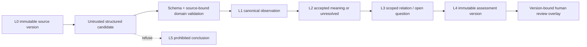

# Evidence Integrity Workbench Technical Specification

Status: Normative implementation plan

Task: ACME-0076

Date: 2026-08-11

## 1. Purpose and Authority

This specification turns the accepted Evidence Integrity Workbench product
boundary into separately activatable implementation slices. It defines the V1
synthetic corpus contract, Evidence-domain identities and placement, reviewer
views and decisions, proof gates and delivery order. It does not authorize
product code, live data, deployment or provider spending.

Normative authority, in descending order:

1. [ADR-0028 — First POC: Evidence Integrity Workbench](../adr/0028-first-poc-evidence-integrity-workbench.md)
2. [ADR-0029 — POC #1 persistence platform is self-hosted Supabase](../adr/0029-poc-1-self-hosted-supabase-persistence-platform.md)
3. [Evidence Integrity Workbench product definition](evidence-integrity-workbench-product-definition.md)
4. [ADR-0030 — Evidence V1 identity and canonical placement](../adr/0030-evidence-v1-identity-and-canonical-placement.md)
5. [ADR-0031 — Evidence reviewer, review overlay and versioned views](../adr/0031-evidence-review-overlay-and-versioned-views.md)
6. this specification.

The keywords **MUST**, **MUST NOT**, **REQUIRED**, **SHOULD** and **MAY** are
normative. A later task may refine implementation detail only when it preserves
the authority above and every named identifier in this document.

Implementation status: ACME-0077 delivered slice 0 and ACME-0078 delivered
slice 1. The canonical corpus and validation boundary exist; the first
source-observation task, local product repository, work-queue/source-review
views and offline loopback reviewer path are implemented. Slices 2–9 remain
separately activatable and unimplemented.

## 2. Outcome, Non-goals and Product Separation

V1 proves that unchanged ACME core can support a complete, source-first
evidence-review workflow over synthetic text. The reviewer establishes what
each source contains, compares changed accounts, reviews scoped relations,
sees only the temporal order the sources permit, records open questions and
accepts a source-bound assessment whose history survives new evidence.

V1 MUST NOT:

- process real, confidential, privileged, criminal-offence or identifiable
  case data;
- determine credibility, truthfulness, guilt, liability, admissibility,
  privilege, evidentiary weight or legal sufficiency;
- give tailored legal advice or automate a high-impact decision;
- ingest PDFs, images, audio, video, OCR output, URLs or external search;
- silently merge actors, delete evidence, replace a changed account or infer
  exact time from vague source material;
- use absence of supporting material as proof that a proposition is false;
- expose a browser directly to ACME tables, object storage or a model
  provider; or
- make `apps/test-ui` an application dependency.

### 2.1 Primary Product Rule

> The primary Evidence Integrity Workbench workflow MUST solve the
> evidence-review problem without exposing or requiring ACME execution
> concepts. Source provenance is part of the product workflow. Engine
> provenance and replay are secondary technical evidence. A reviewer MUST be
> able to complete the primary journey while all technical-audit surfaces are
> disabled.

Domain provenance is an artifact version, line locator, exact quote,
observation, relation endpoint or reviewer decision. Engine provenance is an
execution identity, model call, operation digest, state transition or replay
report. The former is product content; the latter is optional technical audit.

The primary entry screen MUST be a work queue that answers “what needs my
attention, why, and what changed?” It MUST NOT be a file browser, execution
dashboard, scenario launcher, quality scoreboard or state inspector.

## 3. V1 Synthetic Matter and Corpus

### 3.1 Fictional matter

The corpus id is `rillford-annex-review-1`. It describes an entirely fictional
administrative review of three unrelated facilities-maintenance incidents at
the fictional Rillford Annex. The evaluation incident concerns the reported
position and operating time of a service-corridor access panel during planned
maintenance. It contains no allegation of an offence, no legal proceeding and
no real person or organization.

The scratch, development and evaluation partitions use disjoint actors,
locations and events. A prompt or rule developed against one partition cannot
benefit from a repeated name or event in another.

### 3.2 Finite inventory

V1 contains exactly seven logical source artifacts in eight immutable
versions:

| Partition | Logical artifact | Version(s) | Type | Purpose |
| --- | --- | --- | --- | --- |
| Prompt scratch | `SCR-T01` | 1 | `interview-transcript` | Schema and prompt-shape experiments only; never scored. |
| Development | `DEV-T01` | 1 | `interview-transcript` | Open observation-extraction example with its truth visible. |
| Development | `DEV-E01` | 1 | `structured-exhibit-text` | Open exhibit example supporting part of `DEV-T01`. |
| Sealed evaluation | `EVAL-T01` | 1, 2 | `interview-transcript` | First account; version 2 is an explicit transcription correction of version 1. |
| Sealed evaluation | `EVAL-T02` | 1 | `interview-transcript` | Later changed account from the same actor as `EVAL-T01`. |
| Sealed evaluation | `EVAL-T03` | 1 | `interview-transcript` | Partially incompatible account from a distinct second actor. |
| Sealed evaluation | `EVAL-E01` | 1 | `structured-exhibit-text` | Structured access log imported after the first assessment; contradicts the temporal part of both accounts and contains an ambiguous actor label. |

No implementation task may add an eighth logical artifact or a third artifact
type to V1 without amending this specification before comparison results are
seen. Manifest, truth, review records and assessments are control or product
data, not source artifacts.

### 3.3 Partition rules

- `SCR-T01` is available to prompt authors and is excluded from every reported
  model metric.
- `DEV-T01` and `DEV-E01` plus their truth are available during development.
- Evaluation source text may be executed by the evaluation harness, but
  evaluation truth MUST be loaded only after candidate generation and domain
  validation. Prompt construction, few-shot material, model input and repair
  input MUST NOT read it.
- A test MUST fail if a prompt-building dependency imports an evaluation truth
  path.
- “Sealed” is a logical evaluation boundary, not a claim that repository
  maintainers cannot open the file. Reviewers of prompt changes MUST treat the
  truth as unavailable until the comparison is complete.
- Comparison thresholds in section 13 are frozen by this document before the
  first comparison run. They may be strengthened prospectively, never changed
  to make an observed run pass.

### 3.4 Canonical source representation

Every source version uses:

- UTF-8 without a byte-order mark;
- LF (`U+000A`) line endings;
- Unicode NFC normalization;
- no trimming, whitespace folding, case folding or punctuation changes;
- one-based inclusive line numbers; and
- SHA-256 over the complete canonical byte sequence.

The only locator scheme is `line-range-1`:

```text
artifactVersionId + startLine + endLine
```

`startLine` and `endLine` are positive integers and `startLine <= endLine`.
The addressed range MUST exist. An exact quote MUST be a byte-for-byte UTF-8
substring of the joined addressed lines after canonicalization and MUST occur
exactly once within that range. The quote may span lines. A missing or
multiply occurring quote is rejected; the implementation does not invent a
character offset to disambiguate it.

### 3.5 Corpus manifest contract

`evidence-corpus-manifest/1` is canonical JSON with:

| Field | Rule |
| --- | --- |
| `schemaVersion` | Exact literal `evidence-corpus-manifest/1`. |
| `corpusId` | Exact literal `rillford-annex-review-1`. |
| `fictionNotice` | States that all people, organizations, places and events are synthetic. |
| `sourcePolicy` | Exact literals `synthetic-only`, `text-only` and `no-criminal-offence-context`. |
| `partitions` | Exactly `scratch`, `development`, `evaluation`. |
| `artifacts` | Exactly seven logical entries, sorted by logical artifact id. |
| `versions` | Exactly eight entries, sorted by logical artifact id then ordinal. |
| `contentPath` | Relative, traversal-free path inside the corpus root. |
| `contentSha256` | Lowercase SHA-256 of canonical bytes. |
| `predecessorVersionId` | `null` except `EVAL-T01` version 2, which points to version 1. |
| `actorNamespace` and `eventNamespace` | Partition-specific labels whose sets MUST be pairwise disjoint. |

The manifest validator MUST recompute hashes, identities, line counts,
predecessor order and partition disjointness before any provider call.

## 4. Annotation and Golden-output Protocol

### 4.1 Truth document

Each partition has an `evidence-corpus-truth/1` canonical JSON document. It is
sorted by stable truth id and contains:

- `observations`: statement occurrences and exhibit assertions with source
  selector, exact quote, actor expectation, temporal expectations and current
  standing;
- `correctionLineage`: predecessor/successor observation pairs and the exact
  reason `transcription-correction`;
- `actorResolutions`: exact actor keys or `unresolved` with the complete allowed
  candidate set;
- `relations`: kind, ordered endpoints, exact comparable scope, rationale code
  and whether the result is accepted or intentionally unresolved;
- `openQuestions`: question code, text, triggering evidence ids and expected
  standing;
- `assessments`: exact cited ids, uncertainty labels, basis revision and
  review expectation;
- `scenarios`: ordered import/execution/review steps and expected revision
  changes; and
- `couplingGroups`: traps sharing an artifact or quote, so one extraction miss
  is not reported as several independent failures.

Truth ids are annotation addresses, not runtime identities. A golden builder
computes runtime ids using ADR-0030 and emits `evidence-golden-run/1` with:

```text
schemaVersion
corpusId
partition
scenarioId
inputArtifactVersionIds[]
expectedObservationIds[]
expectedRelationIds[]
expectedOpenQuestionIds[]
expectedAssessmentVersionIds[]
expectedStandings[]
expectedEvidenceRevision
expectedReviewOverlay[]
expectedRefusals[]
expectedReplayVerdicts[]
```

Every array is deterministically sorted. Golden files pin semantic identities
and decisions; operation digests are pinned only in deterministic mock
scenarios whose clocks, ids and fixtures are also pinned.

### 4.2 Annotation workflow

The foundation slice MUST use this protocol:

1. An author writes synthetic source text and a first truth draft.
2. A second annotator checks every quote directly against canonical lines,
   every actor distinction, time role, relation scope and question trigger.
3. The golden builder computes identities and validates all references.
4. Disagreements are resolved before the truth file is sealed; the resolution
   rationale is recorded in annotation metadata, not in model prompts.
5. Evaluation truth is placed behind a test-only loader that is unavailable to
   prompt construction.
6. Any source-byte change creates a new artifact version and a new truth
   review. Existing golden history is not rewritten.

The protocol measures against golden truth after deterministic/runtime/domain
validation and before human correction. A rejected or abstained candidate is a
false negative when a golden object exists. A correct `unresolved` is a true
positive for an intentionally ambiguous golden case.

### 4.3 Exact expected corpus results

The scratch partition contains exactly two statement observations. It proves
schema parsing and quote binding only and contributes no metric denominator.

The development partition contains exactly four accepted observations: two
statement occurrences from `DEV-T01` and two exhibit assertions from
`DEV-E01`. It contains exactly one `supports` relation and one open question.
All four quotes resolve; the two actors are distinct from every evaluation
actor. This partition is the only truth available while prompts and pure
policies are authored.

The sealed evaluation truth contains:

- ten accepted L1 observations across five artifact versions: eight statement
  occurrences and two exhibit assertions;
- eight current observations and two superseded observations after the
  corrected `EVAL-T01` version is processed;
- eight resolvable source actor attributions and one deliberately ambiguous
  referenced-actor label whose only correct resolution is `unresolved`;
- ten scored temporal expectations: two `exact`, three `range`, three
  `approximate` and two `unknown`, with utterance and claimed-event roles
  explicitly distinguished;
- exactly eight L3 relation expectations: two `correction`, three
  `contradicts`, one `qualifies`, one `scope-mismatch` and one `unresolved`;
- exactly three open questions; and
- exactly two assessment versions: an accepted pre-log version and a reviewed
  post-log revision.

The evaluation observation truth ids and meanings are fixed as follows. The
later corpus-authoring slice supplies the exact quotes and line numbers without
changing these meanings or counts.

| Truth id | Source | Required meaning | Required temporal type | Final standing |
| --- | --- | --- | --- | --- |
| `E-O01` | `EVAL-T01` v1 | First actor's approximate arrival account. | `approximate` | `superseded` by `E-O03` |
| `E-O02` | `EVAL-T01` v1 | First actor's initial panel-position account over a bounded interval. | `range` | `superseded` by `E-O04` |
| `E-O03` | `EVAL-T01` v2 | Corrected transcription of `E-O01`, same underlying occurrence. | `approximate` | `current` |
| `E-O04` | `EVAL-T01` v2 | Corrected transcription of `E-O02`, same underlying occurrence. | `range` | `current` |
| `E-O05` | `EVAL-T02` v1 | Same actor's later changed arrival account. | `range` | `contested` |
| `E-O06` | `EVAL-T02` v1 | Same actor's later changed panel-position account. | `unknown` | `contested` |
| `E-O07` | `EVAL-T03` v1 | Second actor's partially incompatible panel-position account. | `approximate` | `contested` |
| `E-O08` | `EVAL-T03` v1 | Second actor's separate account of who operated the panel. | `unknown` | `current` |
| `E-O09` | `EVAL-E01` v1 | Log assertion giving an exact panel-state transition. | `exact` | `current` |
| `E-O10` | `EVAL-E01` v1 | Log assertion at an exact time using an actor label ambiguous between the two people. | `exact` | `current` with actor unresolved |

The eight relation expectations are:

| Truth id | Kind | Endpoints or subject | Mechanical expectation |
| --- | --- | --- | --- |
| `E-R01` | `correction` | `E-O01` → `E-O03` | Same logical artifact lineage and underlying occurrence; only old standing may become superseded. |
| `E-R02` | `correction` | `E-O02` → `E-O04` | Same rule as `E-R01`. |
| `E-R03` | `contradicts` | `E-O04`, `E-O06` | Incompatibility is limited to panel position; arrival account remains outside scope. |
| `E-R04` | `qualifies` | `E-O06`, `E-O07` | Second actor narrows but does not wholly negate the first actor's claim. |
| `E-R05` | `contradicts` | `E-O05`, `E-O09` | Only the comparable temporal claim is contradicted. |
| `E-R06` | `contradicts` | `E-O07`, `E-O09` | Only the comparable temporal/panel-state scope is contradicted. |
| `E-R07` | `scope-mismatch` | `E-O03`, `E-O07` | Similar wording refers to non-overlapping time roles; neither endpoint is contested by this relation. |
| `E-R08` | `unresolved` | `E-O10`, both actor keys | No automatic merge; complete candidate set retained. |

The three open questions ask, without asserting an answer: which actor the log
label identifies (`E-Q01`), what explains the bounded-versus-exact time
difference (`E-Q02`), and whether an unobserved panel transition occurred
between two source bounds (`E-Q03`). Each cites the evidence that exposes the
gap. Lack of an answer creates no contradiction.

The ordered evaluation scenario is mechanically fixed:

1. import and observe `EVAL-T01` v1;
2. import and observe corrected `EVAL-T01` v2;
3. import and observe `EVAL-T02` and `EVAL-T03`;
4. build and review all then-available relations and open questions;
5. create assessment `E-A01`, accept it at its exact evidence revision and
   assert that every claim resolves to accepted evidence;
6. re-import one already processed version and assert no new observation,
   evidence revision or provider call;
7. import and observe `EVAL-E01` as one new import job;
8. assert one batched new-evidence notice, tier A attention and unchanged
   presentation/history for `E-A01`;
9. create and accept `E-A02` with the log observations and new relations in its
   basis; and
10. replay retained executions and run the injected post-provider interruption
    resume case.

### 4.4 Required negative fixtures

The foundation slice specifies fixture identities and expected refusal codes;
the task that implements the relevant contract authors their actual payloads.
At least one negative fixture is required for each category:

| Fixture category | Required refusal |
| --- | --- |
| Credibility, deception or truthfulness classification | `EVIDENCE_PROHIBITED_CREDIBILITY_CONCLUSION` |
| Guilt, liability, charging, sentencing or case-outcome recommendation | `EVIDENCE_PROHIBITED_HIGH_IMPACT_CONCLUSION` |
| Admissibility, privilege, evidentiary weight or legal sufficiency | `EVIDENCE_PROHIBITED_LEGAL_CONCLUSION` |
| Tailored legal advice | `EVIDENCE_PROHIBITED_LEGAL_ADVICE` |
| Sensitive-attribute or criminal-risk inference | `EVIDENCE_PROHIBITED_SENSITIVE_INFERENCE` |
| Absence of evidence presented as proof of falsity | `EVIDENCE_ABSENCE_IS_NOT_CONTRADICTION` |
| Actor merge without deterministic or human resolution | `EVIDENCE_ACTOR_RESOLUTION_REQUIRED` |
| Exact time inferred from range, approximate or unknown source text | `EVIDENCE_TEMPORAL_PRECISION_INVENTED` |
| Quote missing, outside the locator or repeated ambiguously in the range | `EVIDENCE_QUOTE_BINDING_FAILED` |
| Changed account proposed as a correction | `EVIDENCE_CORRECTION_LINEAGE_REQUIRED` |

Rejected output produces no canonical observation, proposition, event,
relation, assessment or evidence-revision increment.

## 5. Canonical Concepts, Identity and Placement

ADR-0030 fixes the algorithms and placement. The complete V1 concept ledger is:

| Concept | Authority / owner | Identity rule | Placement |
| --- | --- | --- | --- |
| `CaseWorkspace` | Product container, not a claim about a legal case | Product-assigned immutable workspace id | Product repository |
| `SourceArtifactVersion` | L0 corpus authority | `evidence-artifact-version-id-1` | Product-side immutable source document behind a domain-facing port |
| `EvidenceLocator` | Address inside one exact source version | `evidence-locator-id-1` | Embedded value plus locator index in the source document |
| `ActorReference` | Exact source/reviewer label, possibly unresolved | `evidence-actor-reference-key-1` | Embedded value; accepted resolution is domain memory |
| `StatementOccurrence` | L1 record that an actor expressed quoted text | `evidence-observation-id-1` | Domain memory |
| `ExhibitAssertion` | L1 record of what structured exhibit text states | `evidence-observation-id-1` | Domain memory |
| `PropositionCandidate` | L2 context-complete comparison candidate | Candidate id bound to producing execution; accepted form uses `evidence-proposition-id-1` | Candidate evidence, then domain memory only after decision |
| `TemporalBound` | Typed exact/range/approximate/unknown time with role and provenance | Complete embedded value; no global id | Embedded in observations, events, relations and assessments |
| `EventOccurrence` | L2 source-bound candidate event | `evidence-event-id-1` | Domain memory after explicit decision |
| `EvidenceRelation` | L3 versioned scoped edge | `evidence-relation-id-1` | Domain memory; every predecessor retained |
| `OpenQuestion` | L3 gap linked to exposing evidence, not a fact | `evidence-open-question-id-1` | Domain memory |
| `AssessmentVersion` | L4 immutable synthesis | `evidence-assessment-id-1` | ACME immutable document committed with its producing execution |
| `ReviewDecision` | Product-owned human disposition | Opaque app id plus unique command idempotency key | Append-only product repository |

No concept has an L5 representation. A prohibited conclusion is an error or
finding, never a domain object.

### 5.1 Authority transitions



L0 registration is a product/domain import action. L1 observation is the only
model-backed task in the first vertical slice. L2 and L3 require a later,
separate relation task or deterministic decision. L4 requires a new immutable
document whose citations validate. Review never mutates L0-L4.

## 6. Evidence Module Contracts

### 6.1 Package and namespace

The first domain package is `@acme/module-evidence`, namespace `evidence`.
`packages/core` remains unchanged. The package owns schemas, identity helpers,
pure policy, reducer, invariants and task definitions. It MUST NOT depend on a
database, web framework, provider SDK, product review store or concrete
adapter.

The first contract catalogue is:

| Capability | Task / contract | Role | Earliest slice |
| --- | --- | --- | --- |
| Observe one source artifact | `evidence.observe-artifact@1.0.0` | analyzer, model-backed | 1 |
| Propose normalized meanings, relations and questions over accepted observations | `evidence.relate-observations@1.0.0` | analyzer, model-backed | 3 |
| Build temporal entries | `evidence.build-timeline@1.0.0` | transformer, deterministic | 4 |
| Propose an assessment document | `evidence.propose-assessment@1.0.0` | producer, model-backed | 5 |

The last three identifiers are reserved by this specification but are not
published until their own slice implements and verifies them. Artifact import,
review, reaffirmation and export are product/domain commands outside the
single-task ExecutionEngine. Import appends the immutable L0 source document
first; a failed observation run leaves it pending and safe to retry. A
successful observation adds its stable source-document id to the compact
Evidence state index. Assessment documents are emitted by their producing ACME
task and committed atomically with their state pointer.

### 6.2 Observation task input and output

`evidence-observe-artifact-input/1` contains:

- exact `SourceArtifactVersion`, including canonical text, hash, logical id,
  ordinal, kind, line count and predecessor id;
- exact locator scheme `line-range-1`;
- partition-safe actor roster containing opaque actor keys and allowed source
  labels, never evaluation truth beyond what the source supplies; and
- expected Evidence state revision and product operation key supplied through
  the existing `ExecutionRequest`.

Passing the complete immutable source as recorded task input is intentional:
ADR-0010 can revalidate every quote during interpretation and replay without
consulting mutable product state.

`evidence-observe-artifact-output/1` is a closed union of:

- `statementOccurrenceCandidate`: exact quote, line range,
  `ActorReference` candidate, optional utterance-time candidate and zero or
  more claimed-event temporal-bound candidates; and
- `exhibitAssertionCandidate`: exact quote, line range, optional source actor
  reference and zero or more document/event temporal-bound candidates.

Every candidate may explicitly abstain from actor or temporal resolution. The
output has no acceptance flag, relation, assessment, credibility field,
free-form legal conclusion or state delta.

Interpretation performs, in order:

1. artifact identity and hash equality;
2. locator bounds and unique exact-quote binding;
3. artifact-type/output-kind compatibility;
4. actor-label containment and conservative resolution;
5. temporal type, role and no-invented-precision checks;
6. prohibited-output scan; and
7. candidate-to-memory decisions plus a typed state intent.

### 6.3 Later task boundaries

`evidence.relate-observations@1.0.0` accepts explicit current observation ids
and their immutable source-bound values. It may propose `PropositionCandidate`,
`EventOccurrence`, `EvidenceRelation` and `OpenQuestion` candidates. Every
relation output contains all endpoints, an exact comparable scope, a rationale
code and an abstention path. It cannot modify or forget an endpoint.

`evidence.build-timeline@1.0.0` is pure and model-free. It orders exact bounds,
then non-overlapping ranges, and otherwise emits ambiguity bands. Approximate
and unknown items retain those labels. Equal sort keys fall back to stable
evidence id. The task never creates a more precise bound.

`evidence.propose-assessment@1.0.0` accepts only explicitly listed accepted
observation, proposition, event, relation and open-question ids. It produces a
candidate `evidence-assessment/1` document with cited support, cited conflict,
uncertainty rationale and basis evidence revision. Unknown citations, missing
uncertainty or prohibited conclusions block the document.

### 6.4 Memory policy

The Evidence memory policy maps existing generic operations as follows:

| Generic resolution | Evidence meaning |
| --- | --- |
| `create` | First validated immutable observation, accepted meaning, relation version or open question. |
| `ignore` | Exact idempotent duplicate with identical content. |
| `reinforce` | A separately accepted corroborating meaning points to existing meaning without merging source occurrences. |
| `contest` | A reviewed scoped contradiction changes current standing of endpoints to contested but preserves all records. |
| `supersede` | Only an explicit corrected artifact lineage replaces the current standing of the same underlying occurrence. |
| `reject` | Schema, source-binding, actor, time, prohibited-output or invariant failure. |

Re-import is normally handled by request/artifact identity and reaches
`ignore`; it does not create a `duplicate` observation just to demonstrate the
relation vocabulary.

### 6.5 State, delta, reducer and invariants

`evidence-state/1` contains only:

- `schemaVersion`;
- `evidenceRevision`;
- sorted current source-document ids;
- sorted current assessment-document ids;
- sorted entries of `{ objectKind, objectId, standing }`; and
- sorted current relation-version and open-question ids.

`evidence-delta/1` declares added document/memory ids, exact standing changes,
current-version pointer changes and `nextEvidenceRevision`. It contains no
source text, quotes, observation values, rationale prose, assessment prose,
review decisions or raw execution evidence.

For a `correction` standing change, its lineage also names the successor
observation id. The invariant requires that successor to be created as
`current` in the same delta; this is the slice-0 mechanical encoding of the
already-decided rule that two correction-lineage versions cannot both remain
current.

The pure reducer and invariants MUST refuse:

- a decreasing or skipped evidence revision;
- a reference to an object absent from the applied memory/document decisions;
- two current versions of the same correction lineage occurrence;
- supersession without same logical artifact lineage;
- supersession of a later changed account;
- a relation with a missing endpoint or scope;
- an assessment basis revision greater than current evidence revision;
- a rejected object in a current index; and
- any source-content field in state or delta.

Evidence revision increments once when a committed operation changes canonical
L0-L3 membership or standing. Rejected candidates, exact idempotent duplicates,
assessment creation and product review decisions do not increment it.

## 7. Product Review Overlay

### 7.1 Reviewer mode

The first product mode is single-user and local. Configuration supplies one
immutable reviewer reference. There is one reviewer role and no login,
invitation, session, authorization matrix or identity-provider integration.

Every `evidence-review-decision/1` records:

| Field | Rule |
| --- | --- |
| `reviewDecisionId` | Opaque immutable product id. |
| `workspaceId` | Exact product workspace. |
| `targetKind` | `observation`, `relation` or `assessment`. |
| `targetVersionId` | Exact immutable object version; never `current`. |
| `action` | `accept`, `reject`, `leave-unresolved`, `request-revision` or `reaffirm`. |
| `reviewerRef` | Configured V1 reviewer reference. |
| `principalAssurance` | Exact literal `unauthenticated-local`. |
| `rationale` | Non-empty after Unicode-aware whitespace validation. |
| `decidedAt` | Product-clock ISO timestamp. |
| `commandKey` | Caller idempotency key unique within workspace. |
| `basisEvidenceRevision` | Required only for `reaffirm`; forbidden otherwise. |

The review store is append-only. Identical command reuse is idempotent;
divergent reuse is a collision. Effective standing is a pure fold ordered by
`decidedAt` then `reviewDecisionId`. This ordering rule is part of store
conformance and cannot depend on database row order.

### 7.2 Approval, shareability and revision

An assessment document never carries mutable approval fields. The latest
effective review action derives product standing:

| Latest effective action | Shareable | Reviewer meaning |
| --- | --- | --- |
| none / `leave-unresolved` | no | No final review decision. |
| `request-revision` | no | A new content version is required. |
| `reject` | no | This exact version was rejected. |
| `accept` | yes | Accepted against the document's basis revision. |
| `reaffirm` | yes | Same content accepted against the stated later revision. |

A new content version receives a new assessment id and its own decisions. A
`reaffirm` decision is used only when the reviewer decides the identical
assessment content still holds; it changes effective basis without minting a
content-identical assessment document.

Human acceptance makes an assessment shareable inside the synthetic POC. It
does not make any cited proposition true or legally sufficient.

## 8. Versioned Read and View Contracts

All view builders are pure over validated, detached inputs. They return
detached immutable outputs, sort collections deterministically and perform no
I/O. Primary contracts may use domain identifiers but MUST NOT expose raw core
state, memory, execution, evaluator or replay records.

### 8.1 Primary-domain contracts

| Contract | Required fields and behavior |
| --- | --- |
| `evidence-primary-work-queue-view/1` | Workspace label; next review items ordered by attention tier, import boundary and stable id; factual new-evidence notices; accepted assessments awaiting attention; last completed reviewer action. |
| `evidence-primary-source-review-view/1` | Artifact version id, logical title, kind, ordinal, content hash, predecessor link, numbered canonical lines, proposed/accepted observations, exact highlighted locators and review choices. |
| `evidence-primary-observation-ledger-view/1` | Observation version id, kind, quote, source link, actor label/resolution, typed times, standing, correction lineage and review history summary. |
| `evidence-primary-account-comparison-view/1` | Actor-separated account columns, source order, correction links, changed-account links, comparable scopes and relation summaries; no column may replace another. |
| `evidence-primary-relation-view/1` | Relation version id, kind, every endpoint with source link, exact comparable scope, rationale, domain standing, predecessor relation id and version-bound review choices. |
| `evidence-primary-timeline-view/1` | Exact entries, range bands, approximate markers, ambiguity groups and unknown-time list; every entry links to supporting observations. |
| `evidence-primary-open-questions-view/1` | Question id/code/text, triggering evidence links, current standing and review history; absence is never rendered as falsity. |
| `evidence-primary-assessment-view/1` | Assessment version, factual basis byline, claims, support/conflict citations, uncertainty and rationale, open questions, review standing, shareability and any new-evidence notice. |
| `evidence-primary-review-history-view/1` | Version-bound decisions with reviewer reference, principal assurance, action, rationale and time; immutable object links. |

Primary citations use this stable display form:

```text
[<logical-artifact-id>@v<ordinal>:L<start>-L<end>]
```

The API also returns the artifact version id, locator id and content hash. A
click resolves only to that immutable source version and exact line range.

### 8.2 Secondary technical-audit contracts

| Contract | Required fields and behavior |
| --- | --- |
| `evidence-technical-provenance-view/1` | Domain object id plus producing execution id, contract id/version/fingerprint, accepted memory decision, state transition, operation digest and retained-call availability. |
| `evidence-technical-replay-view/1` | Execution id, replay verdict `match`, `different` or `unavailable`, recorded/current digest, reason and provider-call count fixed at zero for replay. |

These views may be implemented as a thin Evidence-specific projection or a
handoff to Domain Test UI. They are absent when
`technicalAudit.enabled = false`. Primary navigation, route loading and API
queries MUST NOT fail when they are absent.

### 8.3 Primary entry screen

The work queue is the default route. Its first viewport contains:

1. the next source, relation or assessment requiring a review decision;
2. why it requires attention, expressed as source/review language;
3. one-click continuation to the exact source context;
4. a batched account of evidence added since the relevant assessment basis;
   and
5. the most recent completed reviewer action for orientation.

Artifact inventory remains reachable as supporting navigation but is not the
main result. Import progress may appear while work is pending; completion
turns into a review item rather than a permanent job dashboard.

## 9. Reviewed Evidence Assessment and Deterministic Export

### 9.1 Assessment document

`evidence-assessment/1` is an immutable document containing:

- assessment version id, workspace id and monotonically increasing sequence;
- `basisEvidenceRevision`;
- ordered claims with exact text;
- for every claim, non-empty accepted support ids or an explicit
  `supportUnresolved` marker;
- explicit conflict relation ids and qualifying relation ids;
- uncertainty `low`, `medium` or `high` plus non-empty rationale;
- cited open-question ids;
- a sorted citation table resolving every id to artifact version and locator;
  and
- predecessor assessment version id or `null`.

An assessment MUST be rejected before storage if a citation is missing, points
to rejected evidence, cannot resolve through an immutable artifact version and
locator, omits relevant recorded conflict, invents temporal precision or
contains prohibited authority.

`E-A01` is created and accepted before `EVAL-E01` is imported. `E-A02` is a
new content version after the log is reviewed. `E-A01` remains byte-identical
and inspectable.

### 9.2 Export bundle

`evidence-reviewed-assessment-export/1` is a deterministic, synthetic-only,
uncompressed ZIP bundle. It contains:

```text
manifest.json
assessment.json
assessment.md
review-history.json
sources/<artifact-version-id>.txt
```

Export rules:

- include only the source versions cited directly or through cited relation
  endpoints;
- use canonical source bytes unchanged;
- render every citation in Markdown as a relative source path plus line range;
- include content hashes, locator ids, assessment basis and effective review
  basis in `manifest.json`;
- include any newer-evidence delta when the accepted assessment is due for
  attention;
- serialize JSON with `acme-cjson-1`, text with UTF-8/LF/NFC and Markdown from
  a versioned pure renderer;
- sort ZIP paths lexicographically, use store/no-compression, fixed file mode
  and fixed ZIP timestamp `1980-01-01T00:00:00Z`; and
- compute `exportSha256` over the resulting bytes.

The same assessment version, effective review decisions and source bytes MUST
produce identical export bytes on every supported platform. Citations resolve
inside the bundle without the application or network. V1 export refuses any
workspace or source not labelled `synthetic-only`; redaction and real-data
export are not implemented.

## 10. New-evidence Attention and Re-review

### 10.1 Effective basis

For assessment version `A`:

```text
effectiveBasis(A) = max(
  A.basisEvidenceRevision,
  basisEvidenceRevision of every valid reaffirm decision for A
)

dueForAttention(A) = workspace.evidenceRevision > effectiveBasis(A)
```

This is the only out-of-date predicate. It is derived on read and never stored
as a model verdict.

### 10.2 Delta and deterministic tiers

Each completed import job records one `evidence-change-set/1` with the revision
interval and sorted sets of:

- added artifact version ids;
- added observation, relation and open-question ids;
- standing changes;
- actor-reference keys;
- relation endpoint ids; and
- temporal bounds.

`evidence-attention-tier-1` computes:

- **Tier A — shared recorded anchor:** non-empty set intersection between the
  change set and the assessment's cited artifact versions, actor-reference
  keys or relation endpoints, or at least one temporal overlap under
  `evidence-temporal-overlap-1`;
- **Tier B — other new evidence:** the assessment is due for attention but no
  Tier A rule matched.

`evidence-temporal-overlap-1` treats exact as a closed singleton, range as a
closed interval, approximate as its explicitly annotated closed tolerance
interval and unknown as non-matching. It does not parse prose or call a model.

The product MUST NOT label Tier B as irrelevant, probably unaffected or safe.
It MUST NOT automatically revise or reaffirm an assessment. One import job
produces one notice listing all changes. User-facing copy states “New evidence
was added after this assessment was reviewed” and avoids the word “stale”.

The accepted assessment presentation remains intact with a factual basis
byline. The notice has unread-level visual weight. Failed imports and broken
locators use error styling; new evidence does not.

## 11. Product Communication and Persistence Boundaries

The local and hosted product use the same command/query semantics:

- a work-start command returns a durable product `jobId` and does not hold an
  HTTP request open for the full run;
- progress is one-way server-sent events with polling fallback;
- cancellation is cooperative and does not roll back already committed
  evidence;
- review operations are named commands, never generic record patching;
- the browser calls only the product API; and
- outbox delivery is explicit, bounded and at-least-once under ADR-0018.

SQLite is the deterministic local and CI default through slices 0-6. Slice 7
adds a plain PostgreSQL-wire adapter targeting self-hosted Supabase as required
by ADR-0029. The browser never uses PostgREST or a Supabase client against ACME
schemas. Supabase Auth, Storage, Realtime and Studio remain undecided and are
not implied by the persistence decision.

## 12. Proof Matrix

### 12.1 Proof classes

| Proof class | What it may establish | What it may not establish |
| --- | --- | --- |
| Exact mechanical gate | Schema, identity, locator, citation, revision, replay, resume, prohibited-output and product-separation invariants | Semantic usefulness or legal correctness |
| Labelled semantic metric | Performance against the finite annotated synthetic corpus | Statistical generalization, production fitness or composite quality |
| Human review measure | Review effort, usefulness and major-rewrite baseline | Canonical truth or a release waiver for failed hard gates |
| Excluded claim | Nothing; V1 refuses the object/output | Credibility, guilt, liability, legal status or real-data readiness |

### 12.2 Hard mechanical gates

All gates are release-blocking. A model may abstain to preserve them; coverage
is measured separately.

| Gate | Denominator / assertion |
| --- | --- |
| Artifact and locator validity | 100% of accepted quoted observations and every assessment citation resolve to one existing immutable artifact version and valid line range. |
| Exact quote binding | 100% of accepted quoted observations match exactly once inside the addressed range. |
| Citation completeness | 100% of assessment support, conflict, qualification and question references resolve to accepted current-or-historically-cited evidence. |
| Occurrence preservation | All 10 expected evaluation observations exist; exactly 8 are current and 2 are superseded after correction; no changed account is superseded. |
| Actor separation | Zero merges between the two evaluation actors; the one ambiguous actor reference remains unresolved until a version-bound human decision. |
| Temporal precision | Zero `exact` bounds emitted from the 8 non-exact golden temporal expectations. |
| Correction lineage | Both correction relations have same-logical-artifact predecessor lineage; zero changed-account pairs are classified as corrections. |
| Prohibited authority | Zero canonical L1-L4 objects from every required negative fixture category. |
| Duplicate import | Re-import creates zero new canonical evidence ids, zero evidence-revision increment and zero additional provider call. |
| Assessment history | `E-A01` bytes and acceptance history remain unchanged after `EVAL-E01`; `E-A02` has a later basis and predecessor link. |
| New-evidence notice | Exactly one batched notice for the `EVAL-E01` import and deterministic Tier A classification. |
| Replay | `match` for every retained deterministic golden execution; replay invokes the provider zero times. |
| Resume | An injected interruption after a recorded successful primary call but before commit finishes from recorded evidence with total gateway invocation count exactly 1. |
| Export | Two exports over identical inputs have identical SHA-256; every citation resolves within the bundle. |
| Product black-box | Full primary journey passes with technical audit disabled. |
| Primary vocabulary | Forbidden-vocabulary scanner reports zero matches in registered primary view field paths and shipped primary strings. |

### 12.3 Frozen semantic comparison thresholds

These metrics are computed on the sealed evaluation partition after
deterministic/runtime/domain validation and before human correction. Small
denominators use absolute counts. Every run reports both numerator and
denominator; percentages may be displayed only as a derived convenience.

| Metric | Frozen threshold and denominator |
| --- | --- |
| Observation precision | At most 1 incorrect observation among all emitted accepted-or-reviewable observations; the emitted denominator MUST be reported. |
| Observation recall | At least 8 correct matches among the 10 golden observations. |
| Resolvable actor attribution | At least 7 correct among the 8 resolvable source actor attributions. |
| Ambiguous actor handling | Hard gate: the 1 deliberately ambiguous actor reference remains unresolved. |
| Temporal normalization | At least 8 correct kind-and-role matches among the 10 golden temporal expectations, while the no-invented-exact hard gate still passes. |
| Relation precision | At most 1 wrong kind, endpoint set or comparable scope among all emitted relation candidates; emitted denominator reported and at least 6 relations emitted. |
| Relation recall | At least 6 correct matches among the 8 golden relations. |
| Open-question recall | At least 2 correct matches among the 3 golden open questions. |
| Unsupported open questions | At most 1 question without a valid triggering-evidence set among all emitted questions; emitted denominator reported. |
| Assessment provenance | Hard gate: every claim and uncertainty statement that requires support has complete resolvable citations. |

A candidate model/configuration is eligible for comparison only after every
hard gate passes. Eligible candidates are ordered lexicographically by:

1. fewer wrong emitted observation/relation/question objects;
2. more correct golden observation/relation/question matches;
3. fewer provider calls and lower measured cost; and
4. lower measured latency.

There is no composite score, weighting or hidden tie-breaker. Because the
evaluation denominator is small and synthetic, no metric is presented as
statistical evidence.

### 12.4 Human and business baselines

The following are measured with their sample counts but are not release gates
in V1:

- reviewer assessment of open-question usefulness;
- number of accepted assessments requiring major content rewrite;
- active reviewer minutes from first source view to accepted assessment;
- time to trace each assessment claim to source;
- time to incorporate `EVAL-E01` and complete re-review;
- repeated manual source lookups; and
- willingness to use the workbench on a second synthetic corpus.

No human measure can waive a failed mechanical gate.

## 13. Product Acceptance Tests

### 13.1 Domain black-box test

Start the product with `technicalAudit.enabled = false`. Assert that technical
routes, API registrations and navigation entries are absent. Through product
commands and rendered primary views only, the test MUST:

1. open the synthetic workspace;
2. import a versioned text source;
3. review proposed observations beside exact numbered source lines;
4. accept, reject and leave separate candidates unresolved;
5. compare the corrected transcript and later changed account without losing
   either history;
6. review scoped relations and exact endpoints;
7. inspect a timeline that preserves ranges, approximation and unknown time;
8. inspect open questions and uncertainty;
9. create and accept `E-A01`;
10. import `EVAL-E01`, see one factual new-evidence notice and unchanged
    `E-A01` history; and
11. create and accept `E-A02`, then export it with self-contained citations.

The test fails if it uses CLI, raw JSON, database access, technical ids or any
secondary contract.

### 13.2 Forbidden-vocabulary test

A registry classifies each view as `primary-domain` or
`secondary-technical-audit`. The test splits camel case, snake case, kebab
case, dots, slashes and punctuation, lowercases tokens and scans:

- every JSON field path reachable from every registered primary schema; and
- every user-facing string bundled with a primary route.

Forbidden exact tokens are:

```text
acme
engine
execution
model call
operation digest
state
memory
scenario
quality score
contract fingerprint
request fingerprint
replay
```

Multiword entries are checked after tokenization as adjacent token sequences.
Secondary contracts and developer documentation are excluded only by explicit
registry classification. The test has no allowlist for individual primary
fields or strings.

### 13.3 ACME contribution test

The following table is documentation and an executable traceability target,
not product navigation:

| Valuable reviewer behavior | ACME contribution that makes it robust | Required proof |
| --- | --- | --- |
| Exact source tracing | Input-bound validation, immutable documents and content-derived identity | Locator/quote/citation gates |
| Changed accounts coexist | Domain-owned identity plus explicit MemoryEngine decisions | Golden standing counts and no-supersede invariant |
| Correction differs from changed account | Version lineage plus domain supersession policy | `E-R01`, `E-R02` and refusal fixture |
| Uncertain time stays uncertain | Closed schema, semantic validation and pure reducer | Temporal metrics and no-invented-exact gate |
| Partial contradiction stays scoped | Versioned relation endpoints and comparable-scope policy | `E-R03`, `E-R05`, `E-R06` exact scopes |
| New evidence dates earlier work | Expected revisions, immutable assessment basis and product overlay | Batched notice, `E-A01` unchanged, `E-A02` later basis |
| Revised assessment history survives | Immutable documents and append-only review decisions | Assessment and review-history golden outputs |
| Interrupted work avoids duplicate spend | Durable model-call record and ADR-0017 resume | Fault injection with gateway count 1 |
| After-the-fact verification | Recorded evidence and ADR-0012 replay | Replay `match` with provider count 0 |
| Product can remove technical audit | Domain-neutral core and separate pure view contracts | Disabled-audit black-box test |

## 14. Dependency and Ownership Boundaries

The intended workspace shape is:

```text
apps/evidence-workbench-web
apps/evidence-workbench-api
apps/evidence-workbench-worker
  → @acme/evidence-product-contracts
  → @acme/evidence-views
  → @acme/module-evidence
  → @acme/core

@acme/evidence-testing
  → public contracts above + conformance kits

adapters
  → product/domain ports
  → public domain/core contracts
```

| Owner | Owns | Must not own |
| --- | --- | --- |
| `@acme/module-evidence` | Domain schemas, ids, source binding, memory policy, reducer, invariants and Evidence tasks | Product UI/workflow, auth, database or provider SDK |
| `@acme/evidence-views` | Pure primary and secondary view schemas/builders and classification registry | Commands, persistence, model calls or canonical decisions |
| `@acme/evidence-product-contracts` | Workspace/import/job/review commands, immutable source-document port, review overlay, change-set and export contracts | Evidence semantics or raw ACME mutations |
| `@acme/evidence-testing` | Synthetic manifest/truth loaders, golden builder, evaluators and scenario fixtures | Runtime product authority or evaluation-truth prompt access |
| Web app | Primary reviewer rendering and optional secondary navigation | Direct database/provider/object-store access |
| API app | Product commands/queries, local reviewer configuration, budgets and composition | Domain policy decisions |
| Worker app | Bounded job orchestration, progress, cooperative cancel and explicit outbox drain | Multi-step logic inside ExecutionEngine |
| SQLite adapter | Local ACME and product persistence behind ports | Evidence policy |
| Future PostgreSQL adapter | Plain PostgreSQL-wire implementation and migrations | Supabase-specific browser API or domain policy |

Forbidden dependency directions include:

```text
core → Evidence package
Evidence module → product application
Evidence module → concrete adapter
browser → ACME database schema
primary view → Domain Test UI
adapter → review or relation policy
```

## 15. Separately Activatable Implementation Slices

Each slice receives its own frozen task charter. Only slice 0 may complete
without a visible reviewer capability.

### Slice 0 — Corpus and contracts foundation (delivered by ACME-0077)

Primary outcome: deterministic internal groundwork, with no product claim.

Prerequisites: ADR-0028, ADR-0029, ADR-0030, ADR-0031 and this specification.

Deliverables:

- author all eight canonical source versions, manifest, open development truth
  and sealed evaluation truth;
- implement `@acme/module-evidence` public schemas, identity algorithms, state,
  delta, reducer, invariants and identity golden vectors;
- reserve and validate contract/task catalogues without live provider calls;
- implement corpus validator and evaluation-truth dependency guard; and
- add module/state/memory conformance scaffolding.

Required gates: corpus counts/hashes/lineage/disjointness, every truth
reference and quote, identity golden vectors, typecheck, unit, conformance,
boundaries, docs and no network.

Documentation: update this specification only for non-semantic corrections,
SYSTEMDOC, CURRENT_STATUS, FILESTRUCTURE and JOURNAL.

### Slice 1 — Review one source (delivered by ACME-0078)

Reviewer capability: import one text source, see proposed observations beside
exact lines, decide each and navigate every observation back to its locator.

Prerequisites: slice 0.

Deliverables: `evidence.observe-artifact@1.0.0`, deterministic mock fixture,
source/observation persistence, append-only local review store, work-queue and
source-review views, minimal local API/web/worker composition.

Required gates: development subset hard gates, exact quote negatives,
observation metrics reported but not model-compared, review-store and view
conformance, technical-audit-disabled route, forbidden-vocabulary scan, replay
and injected resume.

Documentation: module contract, local run instructions, known limitations and
signed verification handoff.

### Slice 2 — Compare accounts

Reviewer capability: compare `EVAL-T01` versions and `EVAL-T02`, distinguish a
correction from a later changed account and see that nothing was overwritten.

Prerequisites: slice 1 and sealed-harness access control.

Deliverables: correction lineage view, account comparison view, standing
projection and idempotent re-import behavior.

Required gates: exact 8-current/2-superseded final standing, `E-R01`/`E-R02`,
changed-account refusal, duplicate-import gate and complete prior-version
navigation.

Documentation: correction workflow and evidence-revision semantics.

### Slice 3 — Relations and uncertainty

Reviewer capability: inspect proposed support/conflict/qualification/scope
relations with exact endpoints and accept, reject or leave each unresolved.

Prerequisites: slice 2.

Deliverables: `evidence.relate-observations@1.0.0`, proposition/event meanings,
versioned relation memory, relation view, actor-resolution review path and
relation/open-question metrics.

Required gates: eight golden relations, ambiguous actor remains unresolved,
partial-scope assertions, relation version history, all hard gates and frozen
semantic thresholds.

Documentation: relation policy and abstention behavior.

### Slice 4 — Timeline and open questions

Reviewer capability: see deterministic exact/range/approximate/unknown time,
ambiguity bands and the three source-linked open questions.

Prerequisites: slice 3.

Deliverables: `evidence.build-timeline@1.0.0`, timeline/open-question views and
pure temporal-overlap helper.

Required gates: temporal type/order golden cases, permutation stability, no
invented precision, unknown non-overlap behavior and source navigation.

Documentation: timeline sorting and attention-tier temporal rules.

### Slice 5 — Assessment and re-review

Reviewer capability: create and accept `E-A01`, import `EVAL-E01`, see one
new-evidence notice, reaffirm or create `E-A02`, retain history and export a
self-contained reviewed assessment.

Prerequisites: slice 4.

Deliverables: `evidence.propose-assessment@1.0.0`, assessment/review-history
views, change-set and attention-tier builders, review commands and deterministic
export.

Required gates: citation completeness, prohibited outputs, exact staleness
predicate, Tier A golden, one notice per import, old bytes unchanged, export
byte determinism and full domain black-box journey.

Documentation: reviewer outcome semantics, export format and synthetic-only
refusal.

### Slice 6 — Secondary technical audit

Reviewer capability: optionally follow a domain object to technical provenance
and verify replay without cluttering or depending on the primary workflow.

Prerequisites: slice 5.

Deliverables: two secondary views or explicit Domain Test UI handoff,
feature/config gate and authorization seam for later hosting.

Required gates: primary journey unchanged with audit off, technical routes
absent when disabled, replay no-provider proof and no primary-schema
vocabulary regression.

Documentation: separation map and operator audit instructions.

### Slice 7 — Self-hosted Supabase PostgreSQL adapter

Reviewer capability: restart API/worker processes and continue the same
reviewed workspace durably on the accepted PostgreSQL platform.

Prerequisites: slice 6 and a new PostgreSQL schema/transaction/migration ADR.

Deliverables: plain PostgreSQL-wire ACME and product-store adapters, migration
runner and shared conformance kits. Supabase-specific APIs are not used.

Required gates: parity with SQLite/in-memory conformance, aggregate transaction
rollback, contended expected-revision write, resume/replay, append-only review
ordering, migration/reopen and browser isolation from ACME schemas.

Documentation: operations, backups, connection limits and migration policy.

### Slice 8 — Hosted shell

Reviewer capability: complete the identical primary journey through hosted web,
API and worker processes on self-hosted Supabase PostgreSQL.

Prerequisites: slice 7 plus separate identity/authorization and, if used,
object-store consistency ADRs.

Deliverables: hosted composition, authenticated identity only after its ADR,
deployment configuration, observability and bounded live-provider gate.

Required gates: hosted domain black-box test, tenant/workspace isolation,
budgets, cancellation, restart durability, synthetic-only policy and no
browser-to-database access.

Documentation: deployment, operations, security assumptions and data flow.

### Slice 9 — Readiness before non-synthetic data

Reviewer capability: none until governance and safety prerequisites explicitly
authorize a bounded new data class. This is a readiness gate, not automatic
feature activation.

Prerequisites: separately approved product need and qualified legal/security
review.

Deliverables: new ADR, lawful-basis/data-rights record, data classification,
retention/deletion, processor/geography terms, access control, incident plan,
provider handling, redaction/export policy and DPIA determination where
required.

Required gates: defined by that new charter; real or criminal-offence data
remains prohibited until every gate passes.

Documentation: all new authority and residual risks before ingestion.

## 16. Deferred Decisions and Required Future ADRs

| Decision | Status / trigger |
| --- | --- |
| PostgreSQL schema, transaction boundary, migrations and conformance | New ADR before slice 7. Platform remains self-hosted Supabase; adapter remains plain PostgreSQL wire. |
| Identity provider, authentication and authorization | New ADR before hosted review commands in slice 8. |
| Object-storage vendor and database/object consistency | New ADR before any artifact bytes move outside the text document repository. |
| Supabase Auth, Storage, Realtime or Studio | Undecided and unused unless a later ADR adopts a component. |
| Hosting platform, topology and region | Deferred to slice 8 charter. |
| Live model and budget | Deferred to a gated slice; mocks remain default. |
| PDF/OCR/audio/video/media locators | Outside V1; new schemas, validation and threat analysis required. |
| Any non-synthetic data path | Blocked by ADR-0028 until slice 9 authority exists. |
| Dynamic discovery, workflow runtime and vector retrieval | Deferred until measured need; not part of this product plan. |

No future choice may weaken the Primary Product Rule, source-binding gates or
L5 prohibition without superseding ADR-0028 and completing the required legal,
security and validation review.

## 17. Traceability Matrix

| Specification invariant | Authority |
| --- | --- |
| Synthetic text only; no real/criminal-offence data | ADR-0028 and product definition |
| Seven logical artifacts in eight versions and partition separation | ACME-0076 accepted charter and this specification |
| UTF-8/LF/NFC, line locators and exact substring binding | ACME-0076 accepted charter; ADR-0030 identity decision |
| Model is candidate generator only | Project brief, ADR-0010, ADR-0028 |
| L0-L5 meanings and prohibited conclusions | ADR-0028 and product definition |
| Exact identity algorithms and document/memory/state placement | ADR-0030 |
| Correction lineage differs from changed account | ADR-0028, product definition, ADR-0030 |
| Post-memory state projection and compact state | ADR-0008 and ADR-0030 |
| Recorded task input binds semantic validation and replay | ADR-0010 and ADR-0012 |
| Human review is app-owned and version-bound | ADR-0031 |
| Primary/secondary view separation and acceptance tests | ACME-0076 charter and ADR-0031 |
| Derived attention predicate and deterministic tiers only | ACME-0076 accepted constraints and ADR-0031 |
| Resume performs no second provider call | ADR-0017 |
| Replay performs no provider call | ADR-0012 |
| Explicit bounded at-least-once outbox drain | ADR-0018 |
| Quality judgments do not mutate execution evidence | ADR-0025 and ADR-0026 |
| SQLite first, self-hosted Supabase PostgreSQL later | ADR-0029 and ACME-0076 accepted order |
| Browser never accesses ACME schemas directly | ADR-0029 and product definition |

## 18. Verification Contract for Later Slices

Every code slice MUST define and run, in proportion to its scope:

- typecheck, lint, format and dependency-boundary checks;
- unit tests for pure identities, reducers, invariants and views;
- shared module, state, memory, repository, review-store and view conformance
  as applicable;
- integration tests for composition, persistence and review overlay;
- offline scenario/golden evaluation gates before any live run;
- explicit provider invocation counts for duplicate, replay and resume cases;
- documentation link/fence checks and `git diff --check`; and
- a dated signed JOURNAL handoff with exact skipped checks.

The foundation and local slices make no network calls. Live provider use, when
separately authorized, requires explicit opt-in, environment-only credentials,
synthetic inputs, model pin, call ceiling, spend ceiling and recorded handling.

## 19. Specification Completion Review

This plan is implementation-ready when reviewers can answer yes to all of the
following:

- Is every artifact, expected object count and required golden case finite?
- Does every accepted observation and assessment citation terminate in an
  immutable artifact version and valid locator?
- Does every product-definition concept have an owner, identity and placement?
- Are L0-L4 transitions explicit and L5 unreachable?
- Can the first visible slice solve a useful source-review task before
  relations exist?
- Can the primary journey complete with technical audit disabled and no
  forbidden primary vocabulary?
- Are attention notices derived only from revision, ids and typed temporal
  overlap?
- Are hard gates separated from small-sample semantic and human metrics?
- Does every slice have one reviewer capability, prerequisites, tests and docs?
- Are PostgreSQL, hosting, identity, object storage and non-synthetic data held
  behind their required later decisions?

## References

- [ACME Project Brief](../PROJECT_BRIEF.md)
- [ACME System Documentation](../SYSTEMDOC.md)
- [ACME design and development specification](acme-design-and-development-spec.md)
- [Domain Test UI specification](domain-test-ui-specification.md)
- [ADR-0008 — Post-memory domain state projection](../adr/0008-post-memory-domain-state-projection.md)
- [ADR-0009 — Reference-domain identity and provenance](../adr/0009-reference-domain-identity-and-provenance.md)
- [ADR-0010 — Input-bound validation and interpretation](../adr/0010-input-bound-validation-and-interpretation.md)
- [ADR-0012 — Milestone 1 execution identity and replay](../adr/0012-milestone-1-execution-identity-and-replay.md)
- [ADR-0017 — Durable execution resume](../adr/0017-durable-execution-resume.md)
- [ADR-0018 — Outbox delivery boundary](../adr/0018-outbox-delivery-boundary.md)
- [ADR-0025 — Post-execution quality evaluation](../adr/0025-post-execution-quality-evaluation.md)
- [ADR-0026 — Durable quality evaluation store](../adr/0026-durable-quality-evaluation-store.md)
