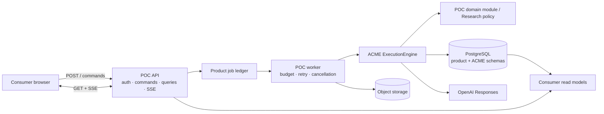

# First POC Application — Discovery and Architecture Recommendation

Date: 2026-08-09

Task: ACME-0073

Status: discovery recommendation — not an implementation charter or accepted
architecture decision

> **Decision update (2026-08-09):** ADR-0028 supersedes this memo's
> Research-first recommendation. ACME POC #1 is the
> [Evidence Integrity Workbench](evidence-integrity-workbench-product-definition.md),
> and Research Synthesis is the intended POC #2. The comparison and technology
> analysis below remain historical discovery evidence.

## Executive Summary

- **Recommended first product wedge:** an evidence-to-decision workbench for
  product, strategy and research teams. A user supplies a bounded source set;
  the product produces a source-linked brief with supported, contested and
  unresolved claims, preserves changes over time and requires human approval
  before publication.
- **Recommended stack:** keep ACME's TypeScript/pnpm/Node 24 LTS foundation;
  add a React + Vite web client, a Fastify API, a separate worker entry point,
  Zod contracts, the existing OpenAI Responses adapter, PostgreSQL and
  S3-compatible object storage. Start as a modular monolith with independently
  deployable API and worker processes.
- **Database decision:** SQLite is the strongest compatibility choice today
  because its ACME adapter already exists and is proven. Managed PostgreSQL is
  the stronger choice for a real hosted, multi-user pilot because it supports
  concurrent writers, stateless application replicas and product-grade
  operations. There is no database choice without tradeoffs. The recommended
  bridge is a conformant `@acme/adapter-postgres`, while SQLite remains the
  local/offline reference adapter.
- **Decision required before build:** confirm that the first POC is a hosted
  evidence-briefing pilot and identify its first consumer group. If the intent
  is instead Kids, Legal or a single-user local demonstration, product scope,
  risk controls and the database recommendation must be revisited.

## The Product Should Turn Sources Into an Auditable Decision Brief

### Purpose

The proposed product helps a knowledge worker answer a bounded question from a
known source set. It does not act as an autonomous decision-maker or a generic
chatbot. Its primary output is a versioned brief containing:

- the question and scope supplied by the user;
- claims tied to exact source evidence;
- corroborating and contradicting evidence;
- unresolved questions and confidence-relevant gaps;
- the changes introduced by newly added evidence; and
- a human approval record for the version that may be shared.

This wedge exercises ACME's strongest implemented properties: typed tasks,
input-bound validation, ResearchModule semantics, provenance, contest rather
than silent overwrite, durable resume, replay and post-execution quality.

### Intended Consumers

The first pilot should target one bounded team rather than “all researchers”:

- product discovery teams synthesizing customer and market material;
- strategy or operations teams preparing decision memos; or
- internal research teams reviewing a controlled document set.

The economic buyer may be a team lead, but the daily consumer is an analyst or
product manager. The approver remains a human with domain responsibility.

### Core User Journey

1. Create a project and state the decision question.
2. Add a controlled set of documents, URLs or pasted evidence with source
   metadata.
3. Start an analysis run with an explicit budget and contract version.
4. Follow durable progress without keeping the original request open.
5. Inspect claims, exact evidence, corroboration, contradictions and gaps.
6. Approve, reject or request revision with a rationale.
7. Export or share the approved brief.
8. Add new evidence and inspect what changed without losing prior versions.

### Explicit Non-goals for the First POC

- unrestricted autonomous web research;
- a general-purpose chat interface;
- legal, medical or financial decision automation;
- multi-agent workflow orchestration;
- a full collaborative document editor;
- vector retrieval as canonical memory; or
- autonomous publication without human approval.

## The Research Wedge Has the Best First-POC Risk/Value Balance

The following score is a working decision heuristic, not observed market data.
Each candidate is scored from 1 (weak) to 5 (strong).

| Criterion | Weight | Evidence briefing | Kids creative studio | Legal evidence |
| --- | ---: | ---: | ---: | ---: |
| Reuse of implemented ACME substrate | 30% | 5 | 3 | 3 |
| Time to a pilotable workflow | 20% | 5 | 2 | 2 |
| Clarity of business problem | 20% | 4 | 4 | 4 |
| Pilot safety / regulatory exposure | 15% | 4 | 3 | 1 |
| Strength of ACME differentiation | 15% | 4 | 5 | 5 |
| **Weighted fit** | **100%** | **4.5** | **3.3** | **3.0** |

**Interpretation:** evidence briefing reuses the implemented ResearchModule and
keeps the output reviewable. Kids is highly demonstrable but immediately adds
multimodal generation, safety, continuity, storage and commercial product
flows. Legal evidence is a strong eventual stress test, but privacy,
jurisdiction, consequential-use and human-approval requirements make it a poor
first external pilot.

The candidate descriptions under `docs/concepts_sandbox/` are used only as
comparison inputs. They remain explicitly non-authoritative.

## Business Value Is Faster Synthesis With Stronger Traceability

### Value Hypothesis

The product creates value if it reduces the active analyst time required to
produce and update a decision-ready brief while increasing the proportion of
important claims that can be traced to reviewed evidence.

The differentiation is not “the model writes faster.” It is that the system:

- records why a claim exists;
- retains contradictory evidence rather than silently replacing it;
- can resume safely after interruption;
- can replay the canonical result without a second provider call; and
- keeps human approval distinct from model generation.

### Pilot Metrics

Numeric targets should be set only after a baseline study with the selected
pilot team.

| Metric | Decision it supports |
| --- | --- |
| Median active analyst minutes from source set to approved brief | Whether the workflow saves material labor |
| Share of published claims with inspectable source evidence | Whether traceability improves |
| Share of high-impact claims with independent corroboration | Whether the product improves evidence discipline |
| Human acceptance without major rewrite | Whether output is useful, not merely complete |
| Contradiction precision from human review | Whether conflict handling creates signal rather than noise |
| Time to update a brief after new evidence | Whether durable memory/state reduces rework |
| Cost and provider calls per approved brief | Whether the unit economics are controllable |
| Replay success and duplicate-call count after retry | Whether ACME's operational promise survives product use |

### Value Ownership

The business owner defines the baseline, acceptable risk and success target.
The consumer owns the final decision. The product team owns whether the
workflow is usable and economically valuable. ACME proves execution behavior;
it cannot prove the business outcome by itself.

## Recommended Technology Stack

### Foundation

| Layer | Recommendation | Why |
| --- | --- | --- |
| Workspace | Existing pnpm monorepo and strict TypeScript | Maximum reuse of ACME packages, contracts, build and boundary checks |
| Runtime | Node.js 24 LTS | Matches the repository pin and remains an official LTS line suitable for production applications |
| Web client | React + Vite + TypeScript | The POC is an authenticated application, not an SEO-led site; Vite keeps the client independently deployable and avoids coupling engine work to an SSR framework |
| API | Fastify on Node | Small HTTP boundary, schema-oriented request handling, streaming support and a clear composition root around ACME |
| Validation | Existing Zod 4 contracts | Reuses current runtime schemas and keeps external input untrusted |
| Worker | Separate Node entry point in the same workspace | Long model-backed jobs do not block browser requests and can scale independently |
| Model | Existing OpenAI Responses adapter | Preserves ACME's transport port, strict structured output and recorded model-call semantics |
| Database | Managed PostgreSQL through a new conformant adapter | Hosted concurrency, transactions, connection pooling and a path to multiple API/worker replicas |
| Object storage | S3-compatible storage | Original PDFs and large artifacts stay outside transactional JSON rows; the database stores identity, hash, metadata and retention state |
| Delivery | Docker image(s), one region initially | Reproducible runtime and a simple path from one API/worker pair to separate replicas |
| Observability | Structured logs, traces and metrics keyed by request, job, execution and operation IDs | Product incidents remain correlated with ACME evidence without exposing payloads |

Node.js recommends Active or Maintenance LTS lines for production use, and the
repository's pinned Node 24 line is currently LTS. Vite is selected as a build
tool, not as an application architecture. Fastify and React remain replaceable
at the app boundary; ACME packages must not depend on either.

### Recommended Workspace Shape

```text
apps/
  poc-web/       consumer UI and read models
  poc-api/       authn/authz, commands, queries and SSE
  poc-worker/    job claim, ACME composition and outbox drain
packages/
  poc-application/       use cases and ownership boundaries
  poc-domain/            product-specific contracts and policies
  poc-read-model/        consumer-facing projections
  adapter-postgres/      conformant ACME repository
  adapter-object-store/  source and export payloads
```

The API, worker and web client may ship together at first, but their package
boundaries should allow separate processes without moving domain policy into
infrastructure.

## Product Architecture



The browser never calls the model provider or ACME repository directly. It
communicates with a product API that enforces tenant, authorization, budget and
workflow rules. The worker composes ACME and owns job-level orchestration.

## Database Decision: Best Compatibility and Best Product Fit Are Different

SQLite and PostgreSQL solve different operating problems. SQLite's own
guidance emphasizes local application storage, simplicity and low writer
concurrency; it supports many readers but one writer per database file and
recommends a client/server database for many concurrent writers or multi-server
websites. PostgreSQL uses multi-version concurrency control so readers and
writers can operate concurrently, and it provides row locks suitable for
queue-like consumers.

| Option | ACME compatibility today | Hosted multi-user fit | Main advantage | Main cost / risk | Disposition |
| --- | --- | --- | --- | --- | --- |
| Existing SQLite adapter | Excellent | Limited | Already proven for atomic commit, replay, resume, CAS and outbox | One writer per file, persistent-volume coupling and poor multi-replica fit | Keep for local/offline tests and a single-user demo |
| Managed PostgreSQL | Requires a new adapter | Excellent | Transactions, concurrent writers, pooling and standard operational tooling | Adapter implementation and a second durability proof | **Recommended database engine for a hosted POC** |
| Supabase Postgres | Same adapter work | Excellent | Adds Auth, Storage and RLS, reducing product-shell work | More platform surface and policy coupling; ACME tables must stay server-only | Preferred managed platform when auth and file storage are in POC scope |
| Neon Postgres | Same adapter work | Excellent | Plain Postgres, pooling, branching, autoscaling and scale-to-zero | Auth and object storage remain separate; cold activation and pool behavior require testing | Preferred when identity/storage already exist or provider neutrality is prioritized |
| Product Postgres + ACME SQLite | Immediate partial reuse | Poor long-term shape | Avoids writing the adapter before a demo | Two sources of truth, no cross-database transaction, persistent-disk requirement | Do not choose for the real hosted POC |
| NoSQL / vector database as primary | Poor | Use-case dependent | Specialized access patterns | Does not naturally preserve ACME's aggregate relational Unit of Work and revision CAS | Reject for POC primary storage |

### Recommended PostgreSQL Shape

- Keep product tables and ACME evidence in separate schemas in one database.
- Preserve ACME's aggregate Unit of Work in the PostgreSQL adapter.
- Store identifiers, revisions, statuses, timestamps and tenant/project keys in
  typed relational columns.
- Store versioned contract payloads in `jsonb`, which PostgreSQL can validate as
  JSON and index when query evidence justifies it.
- Keep source files and large exports in object storage; store hashes,
  provenance and retention metadata in PostgreSQL.
- Use explicit SQL migrations and direct transaction control inside the
  adapter; do not let an ORM redefine repository semantics.
- Apply the existing repository conformance kit unchanged, then add real
  PostgreSQL rollback, reopen, CAS, resume and outbox contention proofs.
- Keep ACME evidence schemas inaccessible from the browser. If Supabase is
  selected, expose only product read models and apply RLS as defense in depth.

### Provider Choice Is Conditional, Engine Choice Is Not

The database-engine recommendation can be made now: PostgreSQL for a hosted
pilot. The managed-provider choice should follow the product-shell scope:

- choose **Supabase** if authentication, object storage and tenant-facing read
  models would otherwise consume a large part of the POC schedule;
- choose **Neon** if the team wants a thinner managed-Postgres layer and already
  has identity and object storage; or
- choose another managed PostgreSQL provider if region, procurement or
  compliance requirements dominate.

This is a tradeoff, not a permanent lock. The application should depend on
PostgreSQL behavior and ACME ports, not on provider-specific APIs, except in
deliberately isolated auth/storage adapters.

## Communication With the Consumer

### Command, Progress and Result Are Separate Contracts

| Interaction | Contract | Behavior |
| --- | --- | --- |
| Start work | `POST /projects/{id}/runs` | Validates authorization, budget and idempotency key; returns `202` plus durable job ID |
| Observe progress | `GET /runs/{id}/events` via SSE | Sends stage, attempt and terminal events; reconnect uses event IDs |
| Read current state | `GET /runs/{id}` and project read-model endpoints | Returns versioned, redacted consumer views rather than repository rows |
| Cancel | `POST /runs/{id}/cancel` | Cooperative cancellation; already committed ACME evidence is not rolled back |
| Approve / reject | Explicit command with rationale | Human decision is product evidence, never inferred from model output |
| Integrate downstream | ACME/product outbox consumer | At-least-once delivery with idempotent consumers |

SSE is preferred over WebSockets for the first POC because progress is mainly
server-to-client and the browser already sends commands over HTTP. Browser SSE
supports named events, event IDs and reconnection. WebSockets should be added
only if later collaboration requires bidirectional low-latency messaging.

### What the Consumer Should See

- a durable job state, not an indefinite spinner;
- the current stage without exposing chain-of-thought or raw provider payloads;
- a concise brief first, with evidence and contradictions one level deeper;
- explicit “unresolved” and “insufficient evidence” states;
- source and contract versions;
- cost/budget status where relevant; and
- an approval action that explains what becomes shareable.

## Ownership Boundaries

| Owner | Owns | Explicitly does not own |
| --- | --- | --- |
| Consumer / approver | Question, supplied sources, contextual corrections and final decision | Provider behavior, retry semantics or canonical engine mutation |
| Business owner | Target segment, acceptable risk, value baseline and go/no-go | Technical truth inferred from a demo |
| Product application | Identity, tenants, authorization, projects, jobs, budgets, UX, approvals, retention and billing | Generic memory/state mechanics or provider SDK details |
| Product domain module | Schemas, claim identity, corroboration/contest policy, reducers and invariants | Database, HTTP, auth vendor or queue implementation |
| ACME core | Typed execution, trust transitions, generic memory/state mechanics, idempotency, evidence, replay and outbox contract | Product workflow, tenant policy, user roles or business KPIs |
| Adapters | Translate PostgreSQL, object storage and model-provider behavior behind ports | Domain policy or final business decisions |
| OpenAI provider | Candidate model output under the requested contract | Canonical product truth or human approval |
| Operations | Deployment, monitoring, incident response, backup/restore and key lifecycle | Domain meaning |

The shortest ownership rule is:

```text
ACME executes and records mechanics.
The domain decides what evidence means.
The product decides who may do what next.
The human owns the consequential decision.
```

## Scaling Path

### Stage 0 — Product proof

- one region;
- one API process and one worker process;
- managed PostgreSQL with a bounded connection pool;
- one object-storage bucket;
- per-tenant concurrency and budget limits;
- SSE progress and pollable read models; and
- no Redis, Kafka, vector store or workflow platform.

The primary risks are product usefulness, provider latency/cost and domain
quality—not database throughput.

### Stage 1 — Pilot concurrency

- stateless API replicas;
- multiple worker replicas claiming durable jobs;
- deterministic ordering and `FOR UPDATE SKIP LOCKED` only for queue-like job
  claims;
- idempotent outbox consumers;
- database connection pooling and measured indexes; and
- object-storage lifecycle rules.

### Stage 2 — Operational growth

- split read-heavy projections from write paths;
- introduce a managed queue only when database job claims or required delivery
  semantics become the measured bottleneck;
- independently autoscale workers by model class and tenant budget;
- archive cold payloads while retaining hashes and replay evidence; and
- add read replicas for read-model traffic if measured.

### Stage 3 — Product specialization

- tenant/time partitioning when table growth and maintenance justify it;
- dedicated retrieval index only after evaluation proves keyword/relational
  retrieval is insufficient;
- regional data placement when customer or legal requirements demand it; and
- a durable workflow runtime only if product flows require branching, timers or
  human waits beyond the bounded job orchestrator.

### Scaling Triggers

Do not add infrastructure by calendar date. Add it when evidence crosses a
defined trigger:

- API latency or SSE connection count requires another stateless replica;
- queued-job age breaches the pilot service objective;
- worker concurrency is limited by process capacity rather than provider
  budget;
- database lock/transaction latency or connection saturation becomes material;
- read-model traffic competes with canonical writes; or
- retention volume makes hot-storage cost or backup time unacceptable.

## Data Protection and Provider Communication

- All model calls originate on the server through the existing ACME adapter.
- Secrets remain environment or secret-manager configuration.
- The product records source consent, tenant, retention class and deletion
  status outside domain-neutral core.
- ACME's encrypted-payload port is useful but does not replace KMS rotation,
  privacy deletion or a product retention policy; those remain explicit gaps.
- OpenAI Responses storage and background-mode choices must be configured from
  the customer's retention requirements. Official OpenAI documentation notes
  default Responses application-state retention and a background-mode storage
  window, so no background/store behavior should be assumed safe for a
  zero-retention customer.
- UI progress must expose stage/status, not hidden reasoning or sensitive raw
  prompts.

## Recommended Build Sequence After Product Confirmation

1. **Discovery baseline:** interview 3–5 target users and capture the current
   source-to-brief workflow, time, failure modes and approval standard.
2. **Product charter:** freeze one user, one question type, one source set, one
   shareable output and explicit non-goals.
3. **PostgreSQL decision ADR:** define adapter semantics, schema ownership,
   migrations, tenant keys and proof obligations.
4. **Adapter proof:** implement `@acme/adapter-postgres` and pass unchanged
   conformance plus PostgreSQL-specific rollback/CAS/resume/outbox tests.
5. **Vertical slice:** one project, source ingest, one ACME task, SSE progress,
   evidence inspection and human approval.
6. **Pilot instrumentation:** capture business, quality, cost and reliability
   metrics before adding broader workflows.

## Decisions Required Before an Implementation Charter

1. **Product wedge:** confirm or reject the evidence-to-decision workbench.
2. **First consumer:** name the team, role and decision they make.
3. **Pilot mode:** internal single-organization or external multi-tenant.
4. **Source types:** pasted text only, or PDF/URL ingestion in the first slice.
5. **Data classification:** whether personal, confidential or regulated data is
   allowed.
6. **Human authority:** who may approve and what “approved” permits.
7. **Managed platform:** Supabase, Neon or another PostgreSQL provider after
   auth/storage/region requirements are known.
8. **Success threshold:** baseline and target for time saved, evidence coverage,
   human acceptance, cost and reliability.

The first question dominates the rest. No implementation charter should be
frozen until the product wedge and first consumer are confirmed.

## Caveats and Assumptions

- The product recommendation is a working hypothesis based on current ACME
  reuse, engineering risk and auditability. It is not market validation.
- The candidate score is deliberately heuristic and sensitive to weights.
- Concepts-sandbox documents are comparison material only.
- No load test has been run against PostgreSQL because the adapter does not yet
  exist.
- No production hosting, database provider, auth provider or object-storage
  vendor is selected by this discovery task.
- Regulatory and procurement requirements may override the managed-provider
  recommendation.

## Sources

### Repository authority

- [`PROJECT_BRIEF.md`](../PROJECT_BRIEF.md)
- [`CURRENT_STATUS.md`](../CURRENT_STATUS.md)
- [`SYSTEMDOC.md`](../SYSTEMDOC.md)
- [`gap-resolution-plan.md`](gap-resolution-plan.md)
- [`ADR-0003`](../adr/0003-sqlite-revisioned-unit-of-work.md)
- [`ADR-0017`](../adr/0017-durable-execution-resume.md)
- [`ADR-0018`](../adr/0018-outbox-delivery-boundary.md)
- [`ADR-0027`](../adr/0027-async-launch-job-progress-cancellation.md)

### Non-authoritative comparison inputs

- [`research-paper-composer-on-acme`](../concepts_sandbox/research-paper-composer-on-acme/README.md)
- [`audioleaf-kids-on-acme`](../concepts_sandbox/audioleaf-kids-on-acme/README.md)
- [`legal-evidence-on-acme`](../concepts_sandbox/legal-evidence-on-acme/README.md)

### Current primary technology sources

- [Node.js release status](https://nodejs.org/en/about/previous-releases)
- [SQLite: Appropriate Uses](https://www.sqlite.org/whentouse.html)
- [PostgreSQL MVCC glossary](https://www.postgresql.org/docs/current/glossary.html)
- [PostgreSQL JSON types](https://www.postgresql.org/docs/current/datatype-json.html)
- [PostgreSQL row locking and `SKIP LOCKED`](https://www.postgresql.org/docs/current/sql-select.html)
- [OpenAI developer quickstart and streaming](https://platform.openai.com/docs/quickstart/make-your-first-api-request)
- [OpenAI platform data controls](https://platform.openai.com/docs/models/default-usage-policies-by-endpoint)
- [MDN Server-sent events](https://developer.mozilla.org/en-US/docs/Web/API/Server-sent_events)
- [Vite design rationale](https://vite.dev/guide/why.html)
- [Fastify TypeScript reference](https://fastify.dev/docs/latest/Reference/TypeScript/)
- [Docker Node.js guide](https://docs.docker.com/guides/nodejs/)
- [Supabase Auth architecture](https://supabase.com/docs/guides/auth/architecture)
- [Supabase Row Level Security](https://supabase.com/docs/guides/database/postgres/row-level-security)
- [Neon compute, pooling and autoscaling](https://neon.com/docs/manage/endpoints/)
