# NarrativeModule — Build and Test Plan

Status: Team implementation guide  
Audience: ACME maintainers, domain engineers and test engineers  
Prepared: 2026-07-30

## Executive summary

NarrativeModule is ACME's first reference domain. Its job is to analyze a
source document, extract narrative observations and prepare domain-owned
documents, memories and state changes without owning model transport,
persistence or orchestration.

The first implementation target is:

- namespace: `narrative`
- task: `observe-document`
- role: `analyzer`
- contract: `narrative.observe-document@1.0.0`
- package: `@acme/module-narrative`

The module proves that story continuity can be implemented entirely through
the shared `PromptContract`, `DomainModule`, `MemoryEngine`, `StateEngine` and
`ExecutionRepository` boundaries. It must never introduce narrative branches
in `@acme/core`.

> **Presentation takeaway:** the module owns narrative meaning; core owns
> deterministic mechanics. Model output remains a candidate until schemas,
> semantic validation, memory policy, state invariants and the atomic Unit of
> Work all accept it.

## How to read this guide

- **Approved baseline** restates the normative ACME specification and current
  core contracts.
- **Recommended implementation** translates that baseline into package and
  component work without changing public contracts.
- **Decision gate** marks an unresolved boundary that must be approved before
  the affected implementation begins.

## Outcome and boundaries

### The module owns

- narrative input, contract-input and output schemas
- prompt semantics for `observe-document`
- interpretation of validated output
- character, relationship and world-rule identity/equivalence policy
- contradiction, reinforcement, relevance and lifecycle policy
- narrative state, delta, initialization, reducer and invariants
- narrative fixtures and module-specific tests

### The module does not own

- provider or model selection
- network calls, retries, cancellation or timeout scheduling
- execution acceptance, ledger or replay orchestration
- memory IDs, timestamps, provenance append or record versions
- state revisions, transition IDs or compare-and-swap
- persistence transactions or outbox delivery
- ScenarioRunner or CLI behavior

## Component architecture

```mermaid
flowchart LR
  request["NarrativeObserveInput"] --> task["observe-document task"]
  context["ExecutionReadContext<NarrativeState>"] --> project["project()"]
  task --> project
  project --> contract["narrative.observe-document@1.0.0"]
  contract --> gateway["ModelGateway"]
  gateway --> pipeline["ResponsePipeline"]
  pipeline --> interpret["interpret()"]
  interpret --> result["ModuleResult<NarrativeDelta>"]
  result --> memory["Narrative memory policy + MemoryEngine"]
  result --> projection["projectState()"]
  memory --> projection
  projection --> state["Narrative reducer/invariants + StateEngine"]
  memory --> commit["ExecutionRepository Unit of Work"]
  state --> commit
```



The module supplies the domain-owned boxes. The future ExecutionEngine
coordinates the arrows and commits all accepted effects atomically.

## Proposed package structure

```text
packages/module-narrative/
├── package.json
├── tsconfig.json
├── src/
│   ├── index.ts
│   ├── module.ts
│   ├── schemas.ts
│   ├── state.ts
│   ├── memory-policy.ts
│   ├── contracts/
│   │   └── observe-document.ts
│   └── tasks/
│       └── observe-document.ts
├── test/
│   ├── schemas.test.ts
│   ├── state.test.ts
│   ├── memory-policy.test.ts
│   ├── observe-document.test.ts
│   └── module-conformance.test.ts
├── test-d/
│   └── task-inference.test-d.ts
└── fixtures/
    ├── chapter-alpha.ts
    ├── responses.ts
    └── expected.ts
```

The package should depend on `@acme/core` and its direct schema runtime only.
It must not import `@acme/adapter-memory`, `@acme/adapter-model-mock`, a
provider SDK, database library or application package.

## Required components

| Component | Responsibility | Primary verification |
| --- | --- | --- |
| `schemas.ts` | Strict runtime schemas for task input, contract input/output, state, delta and domain values | Accept valid fixtures; reject extra, malformed and non-finite values |
| `contracts/observe-document.ts` | Immutable prompt contract, required capabilities, request construction and semantic validation | Golden request hash; schema/semantic failure tests |
| `tasks/observe-document.ts` | `project()` context into contract input, `interpret(output, input, context)` into source-backed candidates/state intent and `projectState()` applied decisions into the final delta | Deterministic contract/state projection and exact result fixtures |
| `memory-policy.ts` | Validate, identify, retrieve, resolve and lifecycle-manage narrative memories | Identity, equivalence, contradiction, merge, ranking and lifecycle tests |
| `state.ts` | State/delta types, initial state, pure reducer and invariants | Revision-zero initialization, reducer purity and invariant matrix |
| `module.ts` | Assemble namespace, schema versions, tasks and policy with `defineModule()` | Registry/conformance and immutable task map |
| `fixtures/` | Explicit source, response and expected-result fixtures | No clock, random, network or mutable golden updates |
| `test-d/` | Compile-time task-name/input/output inference | Valid task infers; invalid task fails typecheck |

## Domain contracts

### Approved task input

```ts
interface NarrativeObserveInput {
  documentKey: string;
  title?: string;
  text: string;
}
```

The input schema should require non-empty `documentKey` and `text`, reject
unknown fields and place an explicit size limit on text once the
ExecutionEngine budget contract is available.

### Approved contract input

`project()` should produce a purpose-built value rather than pass the whole
execution context:

- source document key, optional title and text
- current scene and outline progress
- `windowPolicyVersion: "narrative-window-1"`
- the bounded two-summary narrative window in oldest-to-newest order
- a `PreviousDocumentTail` derived with `previous-document-tail-1`
- relevant active/contested narrative memories already selected by core
- explicit contract/schema versions

Ordering must be stable. Do not pass repository records, state envelopes or
provider details into the prompt.

`PreviousDocumentTail` is a discriminated union:

```ts
type PreviousDocumentTail =
  | {
      algorithm: "previous-document-tail-1";
      source: "initial";
      text: "";
    }
  | {
      algorithm: "previous-document-tail-1";
      source: "document-content";
      documentKey: string;
      sourceContentHash: string;
      text: string;
      truncated: boolean;
    };
```

For a non-initial document, `project()` resolves the newest window entry to
the corresponding loaded `narrative.source` document. It normalizes only
Unicode whitespace, applies ADR-0011's fixed sentence splitter, selects the
last at most two sentences and retains the last at most 320 Unicode code
points. Missing or mismatched source evidence fails projection. A summary is
never substituted for the source tail.

### Approved contract output

The versioned output contains:

- observations of type `character-fact`, `relationship` or `world-rule`
- optional correction evidence on a character fact: target identity, exact
  prior value, exact source quote and optional source locator
- a non-empty scene summary with optional location/time
- optional monotonic outline progress

Every confidence is finite and in `[0, 1]`. Semantic validation rejects empty
subjects, predicates, relationship endpoints, world rules and scene summaries.
Correction fields are closed and non-empty. Input-bound contract semantics
verify the quote as an exact code-point substring of the projected source, and
interpretation binds the validated task input before retaining a
`correctionEvidenceValidated: true` fact in the candidate value; prompt output
cannot set that validation fact.

### Document, memory and state mapping

| Output/effect | Domain representation | Rule |
| --- | --- | --- |
| Source text | Document kind `narrative.source` | Stored as a candidate document with deterministic content hash |
| Character fact | Memory candidate `narrative.character-fact` | Never copied raw into canonical state |
| Relationship | Memory candidate/record `narrative.relationship` | Memory is the sole canonical owner; direction and endpoint identity are explicit |
| World rule | Memory candidate/record `narrative.world-rule` | Memory is the sole canonical owner; contradictions remain auditable |
| Entity registry | `NarrativeState.characters` | Stable entity key and display name only; no character-fact attributes |
| Alias authority | `NarrativeState.entityAliases` | Sole normalized-alias → entity-key authority |
| Correction evidence | Character-fact candidate/record value plus generic provenance | Retain target, prior value, quote, locator and source document link |
| Scene | `NarrativeDelta.scene` | Reducer replaces the current scene after validation |
| Window entry | `NarrativeDelta.appendWindow` | `narrative-window-1` appends and retains the last two summaries |
| Previous document tail | Projected contract input only | Derived from the immutable source document; never stored as state or memory |
| Outline progress | `NarrativeDelta.outlineProgress` | Progress may advance but never regress |
| Events | Not fixed by the baseline | Add only through a separately reviewed event schema |

## Narrative state and reducer

The approved state contains:

- `windowPolicyVersion: "narrative-window-1"`
- `characters` as entity key and display name only
- `entityAliases`
- current `scene`
- `narrativeWindow` with at most two summaries ordered oldest to newest
- `outlineProgress`

Character facts, relationships, world rules, contradictions and evidence
exist only in memory. The v1 state has no read-optimized relationship or
world-rule memory-ID projection.

### Initial state

`initialState({ entityId, now })` returns empty collections and `scene: null`.
It sets `windowPolicyVersion: "narrative-window-1"`. It may validate inputs but
must not read a store, provider, clock or random source. The supplied `now`
must not be replaced with current time.

### Reducer responsibilities

- create a new state value without mutating inputs
- apply only the validated `NarrativeDelta`
- add entity assignments only from applied memory decisions
- add normalized alias assignments only when post-memory projection received
  an applied create, reinforce or merge decision
- replace the scene
- append one window summary and retain the last two
- advance outline beats monotonically
- apply accepted resolved memory decisions through the ADR-0008
  `projectState()` boundary

### Invariants

At minimum, reject:

- empty scene summaries
- normalized alias collisions or aliases targeting unknown character keys
- unknown outline beats when an outline is configured
- outline regressions such as `resolved → advanced`
- a narrative window exceeding two entries

Relationship endpoint, duplicate identity and world-rule contradiction checks
belong to candidate validation and the Narrative memory policy, not state
invariants.

## Narrative memory policy

### Recommended identity families

- character fact:
  `character:<canonical-subject>:<canonical-predicate>`
- relationship:
  `relationship:<canonical-subject>:<canonical-relation>:<canonical-object>`
- world rule:
  `world-rule:<canonical-rule-key>`

ADR-0009 fixes `reference-text-normalization-1` and
`narrative-entity-key-1`. `NarrativeState.entityAliases` is the only alias
authority. Interpretation resolves normalized labels through that state
projection and derives `narrative_entity_<sha256>` only for an unknown label.
The candidate retains both observed label and resolved entity key. Prompt
output and immutable module configuration cannot author a competing alias
map, and the memory policy must not call a model or store.

### Resolution behavior

- first valid observation → `create`
- equivalent observation → `reinforce`
- compatible richer value → `merge`
- contradictory character fact → `contest` by default
- accepted explicit correction → `supersede-existing`
- low-value/duplicate noise → `ignore`

Supersession additionally requires the candidate identity to match the
declared target, an active/contested record to contain the exact declared
prior value and interpretation to have verified the exact quote against the
source document. Missing or failed evidence can contest or reject the
candidate but can never supersede.

The policy supplies the complete resulting value and strength. Core owns IDs,
timestamps, provenance, versions and mutation mechanics.

### Retrieval behavior

Rank by task relevance, recency/strength represented in the supplied record,
status and stable identity. Core performs the final deterministic tie ordering
and limit. Contested memories may be retrieved with an explicit reason but
must not be presented as settled truth.

## Ordered implementation plan

### Phase 1 — Package and schemas

1. Add `@acme/module-narrative` workspace/project references.
2. Add dependency rules proving module → core only.
3. Define strict schemas and compile-time types.
4. Add valid/invalid schema fixtures.

**Exit:** typecheck, schema tests and boundary checks pass.

### Phase 2 — Pure state and memory policy

1. Implement initial state and reducer.
2. Implement invariants.
3. Implement deterministic identity and resolution policy.
4. Add retrieval and lifecycle behavior.

**Exit:** all pure tests pass without adapters or model calls.

### Phase 3 — Contract and task

1. Implement `narrative.observe-document@1.0.0`.
2. Golden-test request construction and request hash.
3. Implement deterministic `project()`.
4. Implement `interpret()` into documents, memories, state intent and
   diagnostics.
5. Implement pure `projectState()` from state intent and applied memory
   decisions into the final delta.

**Exit:** fixed inputs/context/output produce byte-equivalent module results.

### Phase 4 — Module assembly and conformance

1. Assemble with `defineTask()` and `defineModule()`.
2. Register the contract and module statically.
3. Run type-inference and module-conformance suites.
4. Prove returned inputs/results are detached and immutable.

**Exit:** the package satisfies the shared module contract.

### Phase 5 — Offline acceptance

After ExecutionEngine exists:

1. run revision-zero fixture chapter through the model mock
2. commit source document, three memory decisions and revision one
3. repeat the request key and prove zero additional effects
4. replay-verify equal candidate/state hashes

**Exit:** the approved Narrative acceptance scenario passes entirely offline.

## Test strategy

### Unit test matrix

| Area | Required cases |
| --- | --- |
| Input/output schemas | valid minimal/full values; missing text; extra keys; invalid confidence; empty scene |
| Contract request | stable message ordering; exact schema; capability declaration; request-hash golden; fixed context policy |
| Semantic validation | empty identifiers; self/duplicate relationship policy; invalid outline status |
| Projection | revision zero; populated state; bounded memories/documents; stable ordering; previous-tail golden vectors; no summary fallback; no mutation |
| Interpretation | exact document kind/hash; three candidate kinds; correction quote validation; provenance; optional progress; diagnostics |
| Identity | ADR-0009 golden vector; aliases; collision/unknown target; case/spacing; directional relationships; stable world-rule key |
| Resolution | create, reinforce, merge, contest; reject wrong identity/prior value/quote; accepted supersede; ignore |
| Retrieval/lifecycle | relevance, contested handling, ties, limit, retain/update/forget |
| Reducer | initial state, entity/alias assignment, scene replacement, two-summary window trimming, outline monotonicity, purity |
| Invariants | alias ownership, unknown entity targets, empty scene, window policy/limit, outline regression |

### Type and conformance tests

- task name `observe-document` infers `NarrativeObserveInput`
- invalid task names fail compile-time examples
- namespace and schema versions are stable
- task map and registry ordering are deterministic
- all `ModuleResult` keys are unique
- results validate through core schemas and remain immutable
- module source has no adapter/provider/database dependency
- the core vocabulary guard remains green

### Negative-path execution tests

- invalid request performs no model call and no write
- stale expected revision performs no model call and no write
- invalid/semantic model output leaves only ledger evidence
- unsupported capability and pre-call cancellation consume no mock script
- evaluator block commits no narrative effects
- memory/state conflict rolls back the complete Unit of Work

### Deterministic scenario fixtures

Use explicit:

- execution IDs, timestamps and memory/document/event IDs
- exact source document and normalized response
- model selection/profile and request hash
- initial state revision and expected final snapshot hash
- expected memory decisions, not just final records
- expected retry/replay evidence

Fixture updates require human review and a before/after digest rationale.

## Decision gates before implementation

1. **Memory decisions → state delta — resolved.** ADR-0008 and
   `buildStateProjectionInput()` define the post-memory, task-owned bridge.
   Narrative must project only applied decisions; ignored/rejected candidates
   remain audit evidence and cannot drive memory-derived state.
2. **Correction provenance — resolved.** ADR-0009 adds target identity, exact
   prior value, exact source quote and optional locator to character-fact
   output, then requires interpretation and policy checks before
   supersession.
3. **Alias authority — resolved.** ADR-0009 makes canonical
   `NarrativeState.entityAliases` the sole authority and freezes
   `narrative-entity-key-1`.
4. **Shared module conformance — resolved.**
   [`domainModuleConformance()`](../../packages/testing/src/domain-module-conformance.ts)
   is the public-core-only executable suite. Narrative must run it unchanged
   with Narrative-owned fixtures in addition to its policy-specific unit
   tests.
5. **Knowledge/state ownership — resolved.** ADR-0011 makes memory the sole
   canonical owner of character facts, relationships, world rules,
   contradictions and evidence. State owns entity/alias authority and the
   revisioned working position; v1 adds no relationship/world-rule cache.
6. **Short-range context — resolved.** ADR-0011 fixes
   `narrative-window-1` at two summaries and defines the source-backed,
   bounded `previous-document-tail-1` handoff without summary fallback.

The resolved projection, identity/provenance and conformance decisions are
[ADR-0008](../adr/0008-post-memory-domain-state-projection.md) and
[ADR-0009](../adr/0009-reference-domain-identity-and-provenance.md), plus the
[ADR-0011](../adr/0011-narrative-knowledge-and-context-ownership.md) context
decision and the ACME-0015 conformance implementation.

## Team review checklist

- [x] Do the state and memory ownership boundaries match the intended product?
- [x] Is the v1 alias/correction policy precise enough to golden-test?
- [ ] Are all prompt-contract semantics immutable under version `1.0.0`?
- [x] Is the narrative window limit versioned and fingerprinted?
- [ ] Does every contradiction remain visible in audit evidence?
- [ ] Can the full acceptance scenario run with no network or wall clock?
- [ ] Can ResearchModule use the same engine path with no core branch?

## References

- [ACME project brief](../PROJECT_BRIEF.md)
- [ACME specification, task-typed modules](acme-design-and-development-spec.md#10-task-typed-domain-modules)
- [ACME specification, NarrativeModule](acme-design-and-development-spec.md#16-reference-vertical-slice-narrativemodule)
- [ADR-0002 — Static task-typed composition](../adr/0002-static-task-typed-module-composition.md)
- [ADR-0004 — Deterministic transition identity](../adr/0004-deterministic-transition-identity.md)
- [ADR-0005 — Pure memory decision application](../adr/0005-pure-memory-decision-application.md)
- [ADR-0009 — Reference-domain identity and provenance](../adr/0009-reference-domain-identity-and-provenance.md)
- [ADR-0011 — Narrative knowledge and context ownership](../adr/0011-narrative-knowledge-and-context-ownership.md)
