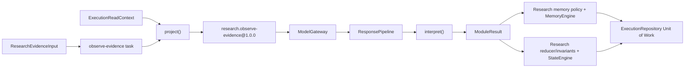

# ResearchModule — Build and Test Plan

Status: Team implementation guide  
Audience: ACME maintainers, domain engineers and test engineers  
Prepared: 2026-07-30

## Executive summary

ResearchModule is ACME's second reference domain. It analyzes source evidence,
extracts claims and open questions, tracks corroboration and contradiction,
and prepares research-owned documents, memories and state changes.

The first implementation target is:

- namespace: `research`
- task: `observe-evidence`
- role: `analyzer`
- contract: `research.observe-evidence@1.0.0`
- package: `@acme/module-research`

The module is deliberately different from NarrativeModule: truth status
depends on source independence, corroboration and contradiction rather than
story continuity. Passing both domains through the same core is ACME's minimum
proof that memory meaning and promotion policy are domain-owned.

> **Presentation takeaway:** a model can propose a claim, but it cannot make
> the claim verified. Verification emerges only from validated evidence,
> source-aware memory policy, state invariants and an atomic commit.

## How to read this guide

- **Approved baseline** restates the normative ACME specification and current
  core contracts.
- **Recommended implementation** translates that baseline into package and
  component work without changing public contracts.
- **Decision gate** marks an unresolved boundary that must be approved before
  the affected implementation begins.

## Outcome and boundaries

### The module owns

- evidence input, contract-input and output schemas
- prompt semantics for `observe-evidence`
- interpretation of validated claims/questions
- claim, source, evidence and question identity policy
- source independence, corroboration, contradiction and promotion rules
- research state, delta, initialization, reducer and invariants
- research fixtures and module-specific tests

### The module does not own

- provider/model selection or source retrieval over the network
- retry, cancellation, timeouts or execution budgets
- ledger, replay orchestration or canonical persistence
- memory IDs, timestamps, provenance mechanics or record versions
- state revision/transition identity or compare-and-swap
- factual truth by model assertion alone
- ScenarioRunner, CLI or outbox delivery

## Component architecture



The module supplies the domain-owned boxes. The same future ExecutionEngine,
gateway and repository used by NarrativeModule coordinate the full flow.

## Proposed package structure

```text
packages/module-research/
├── package.json
├── tsconfig.json
├── src/
│   ├── index.ts
│   ├── module.ts
│   ├── schemas.ts
│   ├── state.ts
│   ├── memory-policy.ts
│   ├── contracts/
│   │   └── observe-evidence.ts
│   └── tasks/
│       └── observe-evidence.ts
├── test/
│   ├── schemas.test.ts
│   ├── state.test.ts
│   ├── memory-policy.test.ts
│   ├── observe-evidence.test.ts
│   └── module-conformance.test.ts
├── test-d/
│   └── task-inference.test-d.ts
└── fixtures/
    ├── sources.ts
    ├── responses.ts
    └── expected.ts
```

The package should depend on `@acme/core` and its direct schema runtime only.
It must not fetch sources or import a concrete adapter, provider SDK, database
library or application package.

## Required components

| Component | Responsibility | Primary verification |
| --- | --- | --- |
| `schemas.ts` | Strict schemas for evidence input, contract input/output, source metadata, claims, state and delta | Valid/invalid evidence and closed-shape tests |
| `contracts/observe-evidence.ts` | Immutable prompt contract and semantic validation | Golden request hash and claim/locator validation |
| `tasks/observe-evidence.ts` | Project evidence/context and interpret output into auditable candidates | Deterministic source/claim/question result fixtures |
| `memory-policy.ts` | Identity, independence, corroboration, contradiction, retrieval and lifecycle | Multi-source policy matrix |
| `state.ts` | Initial research state, pure reducer and invariants | Promotion/contest/question tests |
| `module.ts` | Assemble namespace, versions, task and policy | Registry/conformance and immutable task map |
| `fixtures/` | Three explicit independent/contradictory source cases | No network, current time or automatic fixture capture |
| `test-d/` | Compile-time task inference | Valid task infers; invalid task fails typecheck |

## Domain contracts

### Approved task input

```ts
interface ResearchEvidenceInput {
  documentKey: string;
  source: {
    uri: string;
    title?: string;
    retrievedAt: string;
    publisher?: string;
  };
  text: string;
}
```

The schema should require a non-empty document key, absolute supported URI,
canonical recorded timestamp and non-empty evidence text. Retrieval happens
before ACME execution; the module must never dereference the URI.

### Recommended contract input

`project()` should provide:

- source document key, immutable source metadata and evidence text
- relevant active/contested claims and their source summaries
- open questions relevant to the evidence
- the verification threshold and identity-policy version as explicit,
  immutable configuration facts
- contract/schema versions

Do not expose repository envelopes, protected payloads or provider details.
Order claims/sources/questions deterministically.

### Approved contract output

The output contains:

- claim statements with optional evidence quote and source locator
- finite confidence in `[0, 1]`
- open questions

Semantic validation rejects empty statements/questions, locators without a
source, quotes not present in the supplied evidence when exact quote checking
is enabled, and duplicate output entries under the selected normalization.

### Document, memory and state mapping

| Input/output/effect | Domain representation | Rule |
| --- | --- | --- |
| Source evidence | Document kind `research.evidence` | Persist exact supplied evidence and metadata |
| Source identity | Recommended memory `research.source` | Derived from immutable source metadata, never fetched |
| Claim | Memory candidate `research.claim` | Includes source document/locator evidence |
| Open question | Memory candidate `research.question` | Deduplicated by deterministic question identity |
| Corroboration | Claim memory resolution | Independent sources reinforce and may promote |
| Contradiction | Contested claim memories/state | Never overwrites earlier evidence silently |
| Verified/contested claims | `ResearchDelta.claimDecisions` | Reducer applies only approved decisions |
| Questions | `ResearchDelta.questions` | Reducer deduplicates by policy identity |
| Events | Not fixed by the baseline | Add only through a reviewed event schema |

## Research state and reducer

The approved state contains:

- `verifiedClaims`
- `contestedClaims`
- `openQuestions`

### Initial state

Return empty collections. Use only supplied context and never current time,
randomness, storage or network access.

### Reducer responsibilities

- apply `verify`, `contest` and `defer` decisions without mutation
- keep claim identity unique within each collection
- remove or move a verified claim when it becomes contested according to the
  approved transition rule
- maintain source counts from approved policy decisions
- deduplicate open questions by deterministic identity
- preserve stable ordering for hash/replay behavior

### Invariants

At minimum, reject:

- a claim identity in both verified and contested collections
- duplicate claim/question identities
- verified claims below the configured independent-source threshold
- non-positive source counts
- contested claims without at least two distinct variants/evidence positions
- empty statements, variants or questions

## Research memory policy

### Recommended memory value families

- source: normalized URI, publisher/authority key, retrieval timestamp and
  document key
- claim: proposition identity, statement variants, evidence references,
  independent-source keys and domain status
- question: normalized question identity and provenance

Source metadata and source locator must remain attached to every claim memory
as domain value and/or document-key provenance. Core's generic
`ProvenanceRef` alone does not contain publisher, URI or locator semantics.

### Identity and independence

- source identity uses a versioned normalized URI/source key
- question identity uses deterministic lexical normalization
- claim identity requires a versioned proposition-key strategy
- source independence uses an explicit versioned key, not merely different
  document IDs

The policy cannot call a model to decide equivalence. If semantic claim
identity cannot be derived deterministically from the approved output, the
contract must be revised before implementation.

### Resolution behavior

1. First source creates or merges a deferred claim; it cannot verify.
2. Equivalent evidence from an independent source reinforces the claim.
3. Meeting the configured threshold produces an explicit verified decision.
4. Contradictory evidence contests affected claims and preserves all variants.
5. Duplicate evidence from the same independence key does not increase source
   count.
6. Unsupported/noisy claims may be ignored but candidate evidence remains.

The policy supplies resulting values and strengths. Core supplies generic
mutation mechanics.

### Retrieval and lifecycle

Rank by task relevance, status, evidence coverage, source diversity and
strength. Retrieval reasons must make contested/verified status clear. A
lifecycle rule may lower strength or forget stale low-value questions only at
an explicit recorded hook; verified evidence must not decay through wall
clock background behavior.

## Ordered implementation plan

### Phase 1 — Package and schemas

1. Add `@acme/module-research` workspace/project references.
2. Add module → core-only boundary rules.
3. Define strict input/output/source/state/delta schemas.
4. Add source A/B/C fixtures and invalid cases.

**Exit:** typecheck, schema and dependency gates pass.

### Phase 2 — Pure state and memory policy

1. Define identity and source-independence policy versions.
2. Implement deferred, corroborated and contested resolution.
3. Implement initial state, reducer and invariants.
4. Implement retrieval and explicit lifecycle behavior.

**Exit:** multi-source policy tests and reducer tests pass without adapters.

### Phase 3 — Contract and task

1. Implement `research.observe-evidence@1.0.0`.
2. Golden-test request construction and request hash.
3. Implement deterministic evidence/context projection.
4. Interpret validated output into source document, claim/question memories,
   delta and diagnostics.

**Exit:** fixed evidence/context/output produces byte-equivalent results.

### Phase 4 — Module assembly and conformance

1. Assemble with `defineTask()` and `defineModule()`.
2. Register the contract/module statically.
3. Run type-inference and shared module-conformance suites.
4. Prove inputs/results are detached and immutable.

**Exit:** the package satisfies the same module contract as NarrativeModule.

### Phase 5 — Offline acceptance

After ExecutionEngine exists:

1. observe source A and retain a deferred claim
2. observe independent source B and promote the claim
3. observe source C with a contradiction and mark it contested
4. inject stale expected revision and prove no model call/write
5. replay every execution offline with matching digests

**Exit:** the approved Research acceptance scenario passes through the same
engine and stores as Narrative.

## Test strategy

### Unit test matrix

| Area | Required cases |
| --- | --- |
| Input/output schemas | valid minimal/full source; invalid URI/timestamp; empty text/claim/question; confidence bounds; extra keys |
| Contract request | stable ordering; exact evidence/source fields; capability declaration; request-hash golden |
| Semantic validation | quote/locator validation; duplicate claims/questions; unsupported source metadata |
| Projection | revision zero; existing verified/contested claims; bounded context; stable order; no mutation |
| Interpretation | exact document kind/hash; source/claim/question candidates; locator/provenance; diagnostics |
| Source identity | URI normalization; publisher/source key; duplicate document vs independent source |
| Claim identity | lexical variants; equivalent proposition key; distinct claims; version sensitivity |
| Resolution | first-source defer; same-source duplicate; independent reinforce; threshold verify; contradiction contest; ignore |
| Retrieval/lifecycle | verified/contested reasons; source diversity; ties/limit; retain/update/forget |
| Reducer/invariants | verify/contest/defer; source counts; question dedupe; dual-status rejection; purity |

### Type and conformance tests

- task name `observe-evidence` infers `ResearchEvidenceInput`
- invalid task names fail compile-time examples
- namespace and schema versions are stable
- task and registry ordering are deterministic
- document/memory/event keys are unique
- source metadata remains attached to claim evidence
- results validate through core and remain immutable
- module has no network/adapter/provider/database dependency
- core forbidden-vocabulary guard remains green

### Negative-path execution tests

- invalid evidence input performs no model call/write
- stale expected revision performs no model call/write
- invalid/semantic model output cannot verify a claim
- one source cannot create verified state
- duplicate same-source evidence cannot increase independent source count
- capability rejection/cancellation consumes no model script
- evaluator block and memory/state conflicts commit no research effects

### Deterministic scenario fixtures

For sources A, B and C, explicitly script:

- execution IDs, timestamps and deterministic IDs
- source URI, publisher/independence key, document key and evidence
- normalized model responses and request hashes
- expected candidate identities and memory decisions
- expected state revisions/hashes after defer, verify and contest
- expected ledger, idempotency and replay evidence

No fixture may fetch its URI or regenerate expected output automatically.

## Decision gates before implementation

1. **Memory decisions → state delta.** Promotion/contest decisions arise in
   `MemoryEngine.prepare()`, after task interpretation currently returns its
   state delta. Define the domain-owned bridge before reducer implementation.
2. **Claim proposition identity.** The approved output contains a statement
   but no stable proposition key. Semantic equivalence cannot rely on a model
   call inside the pure memory policy.
3. **Source independence.** Define a versioned independence key and how
   publisher, URI/domain and document identity contribute.
4. **Evidence/provenance shape.** Decide where source locator, quote and
   independence metadata live so they remain queryable and auditable.
5. **Shared module conformance.** Define the same core-port-only suite used by
   NarrativeModule.

See the bounded backlog proposals:

- [Domain memory decisions to state projection](../backlog/domain-memory-decisions-to-state-projection.md)
- [Reference-module identity and provenance fields](../backlog/reference-module-identity-and-provenance-fields.md)
- [Reusable DomainModule conformance kit](../backlog/reusable-domain-module-conformance-kit.md)

## Team review checklist

- [ ] What is the v1 proposition identity algorithm?
- [ ] What makes two sources independent?
- [ ] Is the verification threshold immutable and versioned?
- [ ] Can every verified/contested state entry be traced to source documents?
- [ ] Does contradictory evidence preserve all earlier variants?
- [ ] Can the three-source scenario replay with no network or wall clock?
- [ ] Does the exact same engine path also satisfy NarrativeModule?

## References

- [ACME project brief](../PROJECT_BRIEF.md)
- [ACME specification, task-typed modules](acme-design-and-development-spec.md#10-task-typed-domain-modules)
- [ACME specification, ResearchModule](acme-design-and-development-spec.md#17-reference-vertical-slice-researchmodule)
- [ADR-0002 — Static task-typed composition](../adr/0002-static-task-typed-module-composition.md)
- [ADR-0004 — Deterministic transition identity](../adr/0004-deterministic-transition-identity.md)
- [ADR-0005 — Pure memory decision application](../adr/0005-pure-memory-decision-application.md)

