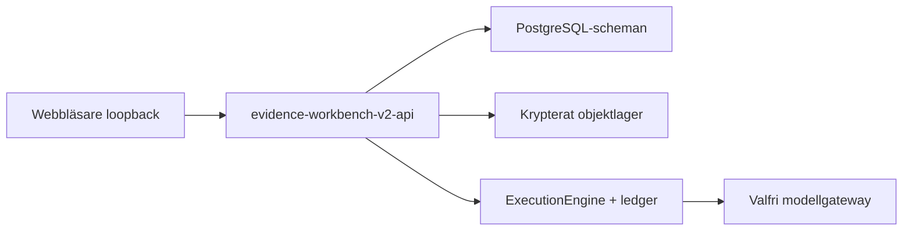
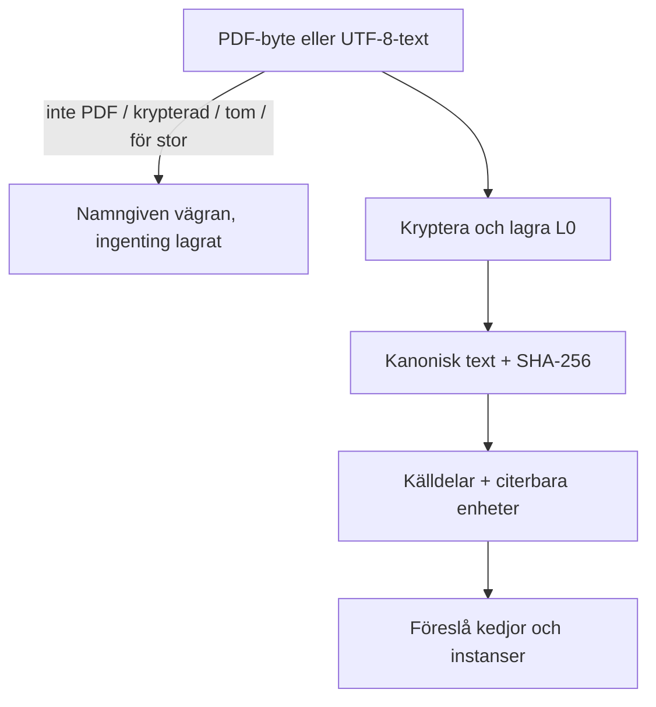

# Teknisk översikt — POC #1

Dokumentet säger vad POC:n är till för, hur den frysta V2-arbetsbänken
är sammansatt, och hur arbetet rör sig genom den. Det ersätter inte
ADR:erna.

## 1. Syfte

ACME (Adaptive Context Memory Engine) är en domänneutral, replaybar
exekveringsmotor. **POC #1** är den första riktiga produkten på den
motorn: **Evidence Integrity Workbench**.

Tes: en språkmodell kan föreslå struktur, men får inte bli auktoriteten
som tyst gör ett förslag till faktum. Arbetsbänken sänker kostnaden för
att hitta varje källa bakom ett påstående, jämföra redogörelser utan
att skriva över någon av dem, och återskapa varför en vy fanns vid en
given revision.

Differentieringen är **granskningsbar evidensavstämning under
förändring**, inte ”AI läser juridiska filer”.

### Vad framgång ser ut som

En granskare kan gå från en konsensusrad, en relation eller en
tidslinjepost till de exakta källraderna som bär den, och se
beslutsloggen som gav den aktuella ställningen.

### Vad POC:n inte är

- Inte ett avgörande om sanning, trovärdighet, skuld eller ansvar
- Inte juridisk rådgivning, tillåtlighet eller tillräcklighet
- Inte SKL / NFC / ett domstolssystem
- Inte auktorisation att behandla riktiga, konfidentiella eller
  privilegierade brottmålspersonuppgifter utöver redan beslutade klasser
- Inte POC #2 (Research Synthesis)

V1 i *produktdefinitionen* använde ett syntetiskt korpus. V2-applikationen
implementerar dessutom två avgränsade importklasser: operatorförberedd
Stage A-anonymiserad juridisk text, och `stage-a-pdf-extracted-text/1`.
Båda är fail-closed. Stage B är stängd.

## 2. Auktoritetsstege

| Nivå | Objekt | Regel |
| --- | --- | --- |
| L0 | Artifact-version | Oföränderliga mottagna byte och/eller kanonisk text |
| L1 | ObservationOccurrence | Källbundet citat + locator. Inte sanningen i propositionen |
| L2 | Claim | Grupperingsmål. Slår aldrig ihop och äger aldrig förekomster |
| L3 | Relation / Consensus | Typad relation eller en vikning över accepterat material |
| L4 | Assessment | Utanför den här frysningen |
| L5 | Trovärdighet / skuld / rättslig slutsats | Uteslutet. Produkten får inte producera det |

Modellutdata är en otillförlitlig kandidat tills runtime- och
semantisk validering gått igenom. Citat och locator tas från den
citerade enheten, aldrig från svaret.

## 3. Arkitektur

Beroenderiktning:

```text
apps / composition root
  → adapters
    → modules
      → core
```

`packages/core` är domänneutralt. Evidensvokabulär ligger i
`@acme/module-evidence-v2`. Leverantörs-SDK:er och PostgreSQL sitter
bakom portar.

### Vad som körs

En Node-process: `apps/evidence-workbench-v2-api`. Den serverar JSON
och HTML. `apps/evidence-workbench-v2-web` är ett renderbibliotek, inte
en andra server.



Webbläsaren når aldrig PostgreSQL eller objektlagret.

### Persistens

| Schema | Innehåller |
| --- | --- |
| `evidence_v2` | Ärenden, artefakter, delar, kedjor, förekomster, granskningar, påståenden, relationer, fönster |
| `evidence_v2_identity` | Principaler, medlemskap, sessioner |
| `acme_v2_ledger` | Motorkörningar och modellanrop — bara om live är konfigurerat |

Artefakter är applikationskrypterade. Nycklar stannar i monterade filer.

### Auktorisation

Varje ärendeavgränsad rutt är autentiserad. En principal utan
medlemskap får **404**, inte 403 (ADR-0036). I den här frysningen kommer
uppgifter från en utvecklingskontofil.

### Exekvering

Motorn kör **en uppgift**. Observation (J3) och jämförelse (J4) är
separata moduler och namnrymder så att compare inte kan förorena
extract.

Varje fönster har en innehållshärledd request-nyckel. Ett betalt
fönster betalas inte två gånger. Ett misslyckat fönster faller ensamt.
Ett nödtak skyddar mot skenande körning; det är inte den
användarvända bounden. Sidan anger det härledda anropsantalet före
spend.

## 4. Domänobjekt i den här frysningen

| Objekt | Roll |
| --- | --- |
| Case | Åtkomstgräns |
| Artifact | L0-version: mottagen PDF och/eller kanonisk text |
| SourcePart | Deterministiskt radintervall |
| Chain / ChainInstance | Longitudinell organisation, ingen evidensauktoritet |
| ObservationOccurrence | L1 källbunden post |
| Review / Standing | Endast-tillägg-logg; ställning viks |
| Claim | L2-gruppering |
| Relation | L3 typad utsaga, fyra verb |
| ConsensusProjection | Ren läsning; lagras aldrig som sanning |

## 5. Flöden

### 5.1 Import (ingen modell)



Struktur och kedjeförslag är rena och totala. En titel är en etikett
med egen proveniens.

### 5.2 Extract — J3 (live, valfritt)

En instans → planeraren härleder fönster (högst 24 enheter, ca 800
ord) → sidan visar `N` anrop → en motorkörning per utestående fönster
→ förekomster committas tillsammans med fönstret.

Indata är bara den instansens källa. Pass 1: ingen granne, ingen
aktörslista, inget tidigare förhör.

### 5.3 Granskning

Accept / reject / revise lägger till ett beslut. Senaste effektiva
ställning vinner; historiken finns kvar. Granskarskrivning citerar ett
unit-id; produkten sätter ihop citatet.

### 5.4 Compare — J4 (live, valfritt)

Bara efter att den aktuella instansen är granskad. Planerare: aktuell
accepterad × tidigare accepterad, i batchar. Separat motornamnrymd.
Modellen citerar förekomst-id:n. Tomt svar är giltigt.

### 5.5 Påståenden och relationer (ingen modell krävs)

Människor skapar påståenden och relationer. J4 kan föreslå relationer;
de börjar som pending. `contradicts` kräver jämförbar aktör och tid.

### 5.6 Tidslinje och konsensus (ingen modell, ingenting lagras)

Båda räknas om från en ögonblicksbild av lagrade rader vid en
**innehållshärledd ärenderevision** (digest av indata-id:n, inte
motorrevisionen).

- Timeline: alla förekomster + påståenden. Okänd tid är unordered.
- Consensus: bara accepterade medlemmar och accepterade relationer.
  Fem domar. Ingen ärendedom. `adds` är material, inte ståndpunkt.

## 6. Ytor

En lista, `EVIDENCE_V2_SURFACES`, driver sidomenyn och statusytan så
att de inte kan säga emot varandra (R-07). I den här frysningen är
gap-kartan tom: varje namngiven yta serveras.

Vägrat på varje yta: diagram, mätare, poäng, obegränsade listor (R-08)
och varje påstående med L5-auktoritet.

## 7. Spend-policy

| Operation | Spenderar |
| --- | --- |
| Import, granskning, påståenden, mänskliga relationer, tidslinje, konsensus | Ingenting |
| Extract observations | Utestående J3-fönster |
| Compare with earlier instances | Utestående J4-fönster |

Saknad usage- eller kostnadsdata förblir okänd. Den visas aldrig som noll.

## 8. Vad den här frysningen avsiktligt lämnar utanför

- Bedömningshandlingar, export, case integrity report
- Grafvisualisering, aktörslista
- Supabase Auth (utvecklingskonton kvarstår)
- Fjärröppning
- Stage B och varje odeklarerad importklass

Det kräver en ny charter. Det är inte saknade knappar.

## 9. Var koden ligger

| Sökväg | Roll |
| --- | --- |
| `apps/evidence-workbench-v2-api` | Komposition, HTTP, extract, compare, import |
| `apps/evidence-workbench-v2-web` | HTML-renderare |
| `packages/module-evidence-v2` | Domän: struktur, kedja, observe, review, claim, relation, timeline, consensus |
| `packages/evidence-v2-contracts` | Lagrade poster och repositoryporten |
| `packages/adapter-evidence-v2-postgres` | PostgreSQL-adapter |
| `packages/adapter-evidence-v2-pdf` | PDF → kanonisk text |
| `packages/core` | Motor, validering, identitet |

Den frysta V1-applikationen under `apps/evidence-workbench-*` är bara
diagnostik.
