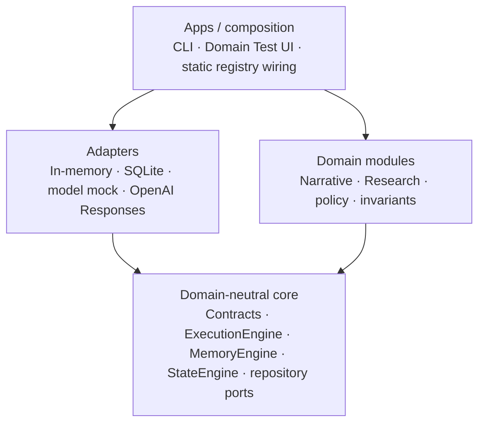
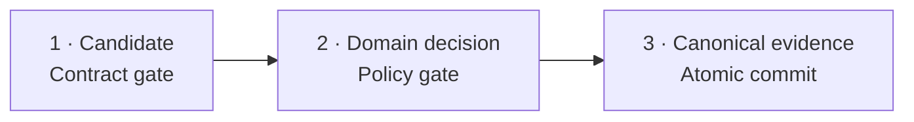

# ACME — Adaptive Context Memory Engine

> A domain-neutral, replayable execution system for trustworthy AI workflows

**Author:** Rickard Zakrisson  
**Audience:** OpenAI Forward Deployed Engineer application  
**Project status represented:** 2026-08-09  
**Repository:** [github.com/zackemannen81/acme-engine](https://github.com/zackemannen81/acme-engine)

Companion artifacts: [PowerPoint](ACME-OpenAI-FDE-project-presentation.pptx)
and [PDF](ACME-OpenAI-FDE-project-presentation.pdf).

ACME is not a prompt library. It is an execution architecture that makes
model-backed work typed, inspectable and replayable.

## 1. The risk starts when one service owns everything

Prompt construction, provider calls, domain interpretation, memory, state
mutation and persistence often collapse into one service layer. In that
design, a model response can drift from candidate evidence into canonical
state without an explicit trust boundary. Domain changes, provider changes and
recovery logic become entangled.

The consequences are practical:

- executions become difficult to audit or replay safely after failure;
- domain policy is hard to replace independently;
- provider integration and recovery behavior cannot be isolated; and
- operational claims become difficult to prove.

ACME exists to separate these responsibilities and make their boundaries
executable.

## 2. Model output is a candidate, never truth

A probabilistic model may propose structured work. Deterministic contracts,
domain policy and recorded evidence decide whether anything becomes
canonical.

The process has three gates:

1. **Validate.** Parse the output, apply runtime-schema checks and perform
   semantic validation against the input.
2. **Interpret.** Let a task-typed domain module convert validated output into
   memory candidates and explicit state intent.
3. **Commit.** Apply memory policy, a domain reducer and invariants, then
   prepare one atomic, revision-checked Unit of Work.

Malformed, schema-invalid or input-inconsistent output is rejected before it
can affect canonical state.

## 3. Architecture and dependency direction

ACME uses ports and adapters with a domain-neutral core. Composition selects
concrete adapters and domain modules; dependencies point inward toward public
core contracts.

Provider SDKs, databases, transports and domain vocabulary stay outside the
core. The forbidden directions are equally important: core does not depend on
modules, provider SDKs or database SDKs; modules do not depend on concrete
adapters; and adapters do not own domain policy.

## 4. One execution crosses three trust stages

### Candidate — contract gate

The system constructs an input-bound request, calls the provider, parses the
response and applies schema and semantic validation. The result is still only
a candidate.

### Domain decision — policy gate

The selected module performs interpretation, memory resolution,
post-memory projection, reduction and invariant checking. These steps express
domain intent without bypassing the transaction boundary.

### Canonical evidence — atomic commit

Ledger entries, documents, memory, state and outbox records commit together.
Replay later recomputes the operation digest offline and never calls the
provider.

## 5. The workspace mirrors the architecture

ACME is a docs-first pnpm monorepo. Its folder map is part of the engineering
proof rather than a cosmetic arrangement.

| Layer | Responsibility |
| --- | --- |
| `packages/core` | Contracts, deterministic identities, `ExecutionEngine`, `MemoryEngine`, `StateEngine` and repository ports |
| Domain modules | Narrative and Research schemas, interpretation, memory policy, reducers and invariants |
| Adapters | In-memory and SQLite persistence, deterministic model mock and OpenAI Responses mapping |
| Apps and testing | CLI composition root, local Domain Test UI, reusable conformance kits and `ScenarioRunner` |

Public entry points mirror ownership. Dependency-cruiser rules, vocabulary
guards and negative fixtures mechanically reject forbidden shortcuts.

## 6. Two domains prove the core is domain-neutral

### NarrativeModule

NarrativeModule observes documents, preserves character facts, relationships
and world rules in memory, and projects scene, alias and outline progress
through a pure reducer.

### ResearchModule

ResearchModule observes evidence, tracks claims, sources, independence and
contradictions, verifies claims only after corroboration, and contests prior
claims rather than silently overwriting them.

The domains deliberately differ in vocabulary and policy. Both use the same
execution, memory, state, repository and replay mechanics without a
domain-specific branch in core.

## 7. Durability is proven behavior

Milestone 2 focuses on failure evidence rather than assumptions.

- **Atomic commit:** documents, memory, state, events and the terminal result
  commit as one SQLite Unit of Work.
- **Safe concurrency:** revision compare-and-swap lets exactly one contended
  writer commit; the losing writer records no partial mutation.
- **Resume without re-calling:** an interrupted execution can complete from a
  recorded successful model call with zero additional provider calls.
- **Replay:** the engine recomputes the operation digest from stored evidence
  without provider access or canonical writes.
- **Outbox:** committed events leave through an explicit bounded drain with
  at-least-once delivery semantics.

Injected faults prove rollback, two connections prove compare-and-swap, and a
post-call interruption proves that resume does not call the provider twice.

## 8. Quality is separated into different questions

ACME avoids one overloaded quality score. Different questions have different
authority and lifecycle:

| Mechanism | Question |
| --- | --- |
| Exact assertion | Did a required fact hold? |
| Population metric | How did a set of runs behave? |
| Pre-commit gate | May this candidate become canonical? |
| Post-execution quality | How good was one evidence-bound result? |
| Fixture approval | May a proposed reference change be accepted? |

Each result remains attributable to the evidence and versioned contract that
produced it. A failed quality verdict is still a successfully recorded
assessment; only an explicit scenario assertion fails a scenario.

Post-execution evaluation is a sibling layer with its own append-only store.
It cannot mutate execution evidence.

## 9. Development history

ACME evolved through bounded proofs rather than unstructured feature
accumulation.

| Period | Proof slice | Delivered |
| --- | --- | --- |
| 29–31 July 2026 | Foundation | Docs-first chartering, typed contracts, pure state and memory engines, repositories, two reference domains and the bounded `ExecutionEngine` |
| 1 August 2026 | Live and durable | OpenAI Responses mapping, schema lowering, CLI, replay, encrypted retention, durable resume, rollback, compare-and-swap and outbox |
| 2–9 August 2026 | Workbench and quality | Domain Test UI S1–S10, S11 quality view, durable quality store, live-model judge and asynchronous launch with cancellation |

Each slice had a frozen charter, proportionate verification and a journal
handoff before the next capability was activated.

## 10. Delivered developer and operator surface

- **Single execution:** typed task execution with idempotency and bounded model
  calls.
- **ScenarioRunner:** deterministic and opt-in live multi-step scenarios.
- **SQLite ledger:** durable evidence, state, memory and replay sidecars.
- **Outbox operations:** inspect, drain, redrive and file delivery.
- **Domain Test UI:** local S1–S10 workbench with progress and cooperative
  cancellation.
- **Quality:** list, inspect and live-judge stored assessments.
- **Provider path:** OpenAI Responses mapping behind an injected transport.
- **Conformance:** reusable suites for repositories, gateways, modules and
  quality stores.

Live paths remain explicit opt-in behavior. Credentials stay in environment
configuration at the composition root and are not written into browser or
workspace artifacts.

## 11. Verification evidence

The observed offline, secret-free baseline on 2026-08-09 was:

| Layer | Tests | Files |
| --- | ---: | ---: |
| Unit | 603 | 73 |
| Conformance | 64 | 9 |
| Integration | 56 | 10 |
| Scenario | 24 | 5 |

The layers allow local logic, port interchangeability, package integration and
domain scenarios to fail independently. Separate operator-run live tests also
confirmed both reference contracts and a multi-step scenario.

## 12. Current project status

As of 2026-08-09, ACME is a proven prototype rather than a production
platform. Milestones 1 and 2 are delivered. The experimental live path, the
complete local S1–S10 workbench, the pure S11 quality view, the durable quality
store and the asynchronous job path are implemented.

### Delivered

- domain-neutral core with two different domain proofs;
- durable SQLite persistence, replay, resume and outbox behavior;
- CLI, local Domain Test UI and quality evaluation; and
- an opt-in OpenAI Responses path with strict structured-output schema
  lowering.

### Not claimed

- no published package or deployment;
- no production hosting or production database decision; and
- no claim that the live provider path is production-ready.

The distinction is intentional: the project proves architecture and failure
behavior locally without overstating product maturity.

## 13. Remaining work is intentionally bounded

Open work is recorded as evidence gaps, interface residuals or deliberately
deferred product choices. Each item requires a new frozen charter before
implementation.

- **Finer trust evidence:** record the exact failing substage inside memory,
  projection and state preparation instead of reporting only that the stage
  was reached.
- **UI residuals:** optional plan measurements, adapter declaration policy and
  browser CI smoke remain separate choices.
- **Provider and security:** ambiguous-call reconciliation, KMS/key rotation
  and privacy deletion remain deferred behind evidence and ADRs.
- **Productization:** production hosting and database choices, dynamic
  discovery, vector retrieval and a workflow runtime beyond `ScenarioRunner`
  have not been selected.

## 14. Field deployment takeaway

ACME turns model behavior into inspectable system behavior.

The transferable approach is straightforward:

1. translate domain rules into typed contracts and explicit policies;
2. integrate providers and persistence behind testable ports; and
3. prove failure modes before scaling the surface.

That combination supports the core work of field deployment: understand a
domain, make its trust assumptions explicit, connect model capability to real
systems, and leave behind evidence that the resulting behavior is correct,
recoverable and operable.

## Repository source map

This document is a derived explanation. The following repository documents
and accepted architecture decisions remain authoritative:

- [AGENTS.md](../AGENTS.md) — project identity, guardrails and dependency
  direction
- [Project Brief](../docs/PROJECT_BRIEF.md) — problem, goals and reference
  domains
- [Current Status](../docs/CURRENT_STATUS.md) — implemented reality, test
  evidence, gaps and maturity
- [System Documentation](../docs/SYSTEMDOC.md) — long-lived system boundaries
  and behavior
- [Repository Structure](../docs/FILESTRUCTURE.md) — workspace map
- [Task Workflow](../docs/TASK_WORKFLOW.md) — frozen charters and handoffs
- [Gap-resolution plan](../docs/design/gap-resolution-plan.md) — bounded open
  work
- [ADR-0002](../docs/adr/0002-static-task-typed-module-composition.md) — static,
  task-typed module composition
- [ADR-0003](../docs/adr/0003-sqlite-revisioned-unit-of-work.md) — SQLite
  revisioned Unit of Work
- [ADR-0008](../docs/adr/0008-post-memory-domain-state-projection.md) —
  post-memory domain state projection
- [ADR-0012](../docs/adr/0012-milestone-1-execution-identity-and-replay.md) —
  execution identity and replay
- [ADR-0017](../docs/adr/0017-durable-execution-resume.md) — durable execution
  resume
- [ADR-0018](../docs/adr/0018-outbox-delivery-boundary.md) — outbox delivery
  boundary
- [ADR-0019](../docs/adr/0019-domain-test-ui-boundary-and-view-contracts.md) —
  Domain Test UI boundary and view contracts
- [ADR-0022](../docs/adr/0022-measurement-and-fixture-approval.md) — measurement
  and fixture approval
- [ADR-0025](../docs/adr/0025-post-execution-quality-evaluation.md) —
  post-execution quality evaluation
- [ADR-0026](../docs/adr/0026-durable-quality-evaluation-store.md) — durable
  quality evaluation storage
- [ADR-0027](../docs/adr/0027-async-launch-job-progress-cancellation.md) —
  asynchronous launch, progress and cancellation
